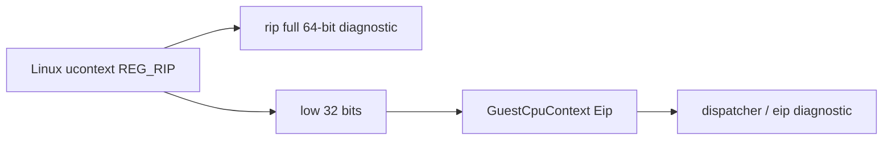

# 설계 20260905-588 — Linux x64 미처리 fault의 full RIP 기록

상위 작업: [20260905-587](20260905-587-linux-x64-segment-push-hle.md)

## 배경

Task 587 뒤 Linux x64 `pumpit2a`는 guest `0x010F4A96`의 `push es` HLE을 통과한
뒤 `eip=0x402AAE46` SIGTRAP와 `eip=0x402AAE47` SIGILL을 기록했습니다. 현재 로그의
`eip`는 `GuestCpuContext::Eip`의 하위 32비트뿐입니다.

x64의 `GuestCpuContext`는 32-bit ABI 계약입니다. AOT cache가 4 GiB 아래일 때
`REG_RIP`의 하위 32비트를 EIP로 쓰는 것은 안전하지만, signal return 전에 engine이
guest EIP나 host helper 주소를 기록한 경우에는 원래 RIP의 상위 절반과 결합될 수
있습니다. 이 가능성은 기존 설계에도 알려져 있었지만, 이번 fault의 실제 64-bit RIP는
아직 관측되지 않았습니다.

## 결정

Linux fault handler의 미처리 fault 한 줄에 kernel `ucontext_t`에서 읽은 **full host
RIP**를 `rip=` 필드로 추가합니다.

```text
[repiu-fault] unhandled signal=0x5 rip=0x... eip=0x... access=0x...
```

`eip`는 기존처럼 dispatcher가 사용한 32-bit `GuestCpuContext::Eip`를 유지합니다.
따라서 두 필드는 서로 다른 질문에 답합니다.

| 필드 | 의미 |
|---|---|
| `rip` | signal delivery 시점 kernel context의 실제 host instruction pointer |
| `eip` | 32-bit engine fault ABI로 투영된 instruction pointer |

이 진단은 signal handler에서 `write`와 스택 버퍼만 사용하는 기존 안전 조건을
보존합니다. `FaultEvent` ABI, cache/guest 주소 변환, signal resume 동작은 바꾸지
않습니다.



## 검증

1. Linux x64 `repiu`를 다시 링크한다.
2. `REPIU_GUEST_WATCH=0x010F4A96`로 `pumpit2a`를 실행한다.
3. 후속 미처리 fault가 `rip=`과 `eip=`을 모두 출력하는지 확인하고, full RIP가
   low AOT cache인지, guest-address alias인지, 또는 host text인지 분류한다.

---

# Design 20260905-588 — Full RIP attribution for unhandled Linux x64 faults

Parent task: [20260905-587](20260905-587-linux-x64-segment-push-hle.md)

## Background

After Task 587, Linux x64 `pumpit2a` passes the guest `push es` HLE at
`0x010F4A96`, then records SIGTRAP at `eip=0x402AAE46` and SIGILL at
`eip=0x402AAE47`. The current log contains only the low 32 bits from
`GuestCpuContext::Eip`.

`GuestCpuContext` is a 32-bit ABI contract on x64. Reading the low 32 bits of
`REG_RIP` into EIP is safe when RIP is a below-4-GiB AOT-cache address, but
mixing a guest EIP or host-helper address with the original RIP upper half at
signal return is a different case. That possibility was already known in an
earlier design, but the actual 64-bit RIP of this fault has not been observed.

## Decision

Add the full host RIP read from Linux's `ucontext_t` as `rip=` to the existing
async-signal-safe unhandled-fault line. Keep `eip=` unchanged as the engine's
32-bit fault ABI projection. This is attribution only: it changes neither the
`FaultEvent` ABI nor fault resumption, cache translation, or guest logic.

## Verification

Re-link Linux x64 `repiu`, run `pumpit2a` with the guest watch at `0x010F4A96`,
and classify the resulting full RIP as a cache address, a guest-address alias,
or host text.
