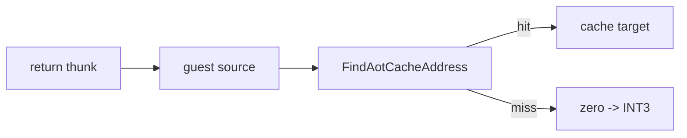

# 설계 20260905-589 — Linux x64 return resolver trace

상위 작업: [20260905-588](20260905-588-linux-x64-full-rip-attribution.md)

## 결정

`REPIU_LINUX_X64_RETURN_TRACE` opt-in일 때 `LinuxX64EngineResolver`가 return thunk의
guest source와 cache lookup 결과를 한 줄로 기록한다. resolver는 정상 C++ 호출 경로이므로
signal-safe logger가 아니라 `stderr`를 사용한다. 기본 실행에는 출력·상태·제어 흐름 변화가
없다.

## 검증

Linux x64 `pumpit2a`를 trace 환경 변수로 실행해 source와 `hit` 또는 `miss`를 확인한다.

---

# Design 20260905-589 — Linux x64 return-resolver trace

Parent task: [20260905-588](20260905-588-linux-x64-full-rip-attribution.md)

## Decision

When `REPIU_LINUX_X64_RETURN_TRACE` is set, `LinuxX64EngineResolver` writes the
return thunk's guest source and cache lookup result. It is opt-in only and does
not change control flow. Verify by running watched Linux x64 `pumpit2a`.
