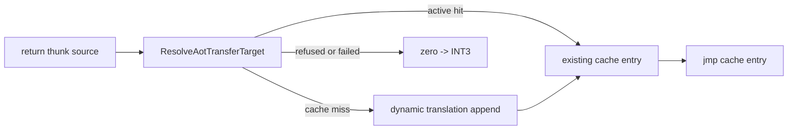

# 설계 20260905-590 — Linux x64 return cache-miss 재진입

상위 작업: [20260905-589](20260905-589-linux-x64-return-resolver-trace.md)

## 배경

Linux x64 return thunk은 guest `0x010F4AD1`을 resolver에 전달했지만, 기존
`LinuxX64EngineResolver`는 `FindAotCacheAddress`만 호출하여 initial address map에 없는
block 내부 continuation을 즉시 zero/INT3으로 처리했습니다. `0x010F4AD1`은 `call eax`
뒤의 `pop edx`이므로 원본 guest byte를 long mode에서 실행해 복귀할 수 없습니다.

공용 `ResolveAotTransferTarget`은 active cache hit을 먼저 사용하고, miss면 guest thread에서
`RequestAotDynamicTranslation`으로 target부터 새 AOT image를 append한 뒤 cache entry를
반환하는 기존 정책입니다.

## 결정

Linux x64 return resolver가 직접 `FindAotCacheAddress` 대신
`ResolveAotTransferTarget`을 호출합니다. 성공 시 thunk는 새/기존 low AOT cache address로
`jmp`하며, translation 실패·excluded range·quarantine 등 공용 resolver가 거절한 경우에만
기존 zero → INT3 fail-closed 계약을 유지합니다.

## 검증

1. Linux x64 `repiu`를 빌드한다.
2. `REPIU_LINUX_X64_RETURN_TRACE=1`로 `pumpit2a`를 실행한다.
3. `0x010F4AD1`가 `cache-hit` 또는 새 cache target으로 재진입하고, 이전 return-thunk
   INT3가 사라지거나 다음 frontier로 이동하는지 확인한다.

---

# Design 20260905-590 — Linux x64 return cache-miss reentry

Parent task: [20260905-589](20260905-589-linux-x64-return-resolver-trace.md)

## Decision

Replace the Linux x64 return resolver's direct `FindAotCacheAddress` lookup with
the shared `ResolveAotTransferTarget` policy. It uses an existing cache entry or
appends a dynamic translation for a valid miss. Rejected or failed targets retain
the zero-to-INT3 fail-closed contract; raw guest bytes are never resumed.

## Verification

Build Linux x64 `repiu` and run watched `pumpit2a` with return tracing, verifying
that `0x010F4AD1` resolves or that the frontier advances safely.
