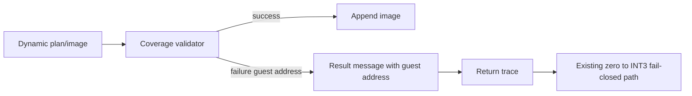

# 설계 20260905-591 — Dynamic AOT coverage 실패 주소 귀속

상위 작업: [20260905-590](20260905-590-linux-x64-return-cache-miss-reentry.md)

## 배경

Task 590에서 Linux x64 return continuation `0x010F4AD1`의 dynamic AOT append가
coverage validator에 의해 안전하게 거절됐습니다. validator는 실패한 HLE/selector-guard
instruction의 guest 주소를 out-parameter로 이미 계산하지만, append 결과는 일반적인 실패
문자열만 보존합니다. 따라서 다음 planner 또는 emitter 수정의 대상 주소를 실행 로그만으로
판별할 수 없습니다.

## 결정

`AppendDynamicAotTranslation`은 coverage 검증 실패 시 기존의 거절 동작을 바꾸지 않고,
`failure_guest_address`를 8자리 16진수로 result message에 포함합니다. 주소가 0이면 기존
일반 메시지를 유지합니다.

이 변경은 validator를 우회하거나 image를 append하지 않으며, raw guest code 재개도 허용하지
않습니다. 실패 주소는 다음 작업에서 해당 planner/emitter coverage를 고치기 위한 관측값일
뿐입니다.

## 검증

1. Linux x64 `repiu`를 빌드합니다.
2. `REPIU_LINUX_X64_RETURN_TRACE=1`로 watched `pumpit2a`를 실행합니다.
3. `source=0x010F4AD1`의 `translation-failed` detail에 실패 guest 주소가 있는지 확인하고,
   기존 INT3 fail-closed 종료를 확인합니다.

---

# Design 20260905-591 — Dynamic AOT coverage failure attribution

Parent task: [20260905-590](20260905-590-linux-x64-return-cache-miss-reentry.md)

## Decision

When dynamic AOT coverage validation fails, preserve the validator's nonzero
failing guest address in the append-result message as eight-digit hexadecimal.
The validation outcome and all fail-closed behavior remain unchanged; no image is
appended and no raw guest code is resumed.

## Verification

Build Linux x64 `repiu`, run watched `pumpit2a` with return tracing, and verify
that the failed `0x010F4AD1` append reports its exact coverage address while the
existing zero-to-INT3 path remains in force.
