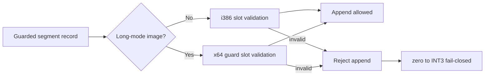

# 설계 20260905-592 — Linux x64 long-mode segment guard coverage

상위 작업: [20260905-591](20260905-591-dynamic-aot-coverage-attribution.md)

## 배경

Task 591의 watched 실행은 `0x010F4AD1` dynamic plan이 `0x010F4ACD`에서 coverage
검증에 실패함을 확인했습니다. 이 주소는 `pop es` (`0x07`)로 분류된
`kGuardedSegmentPop` record입니다.

Linux x64 long-mode emitter는 selector를 host segment register에 설치하지 않는 전용
guard를 생성합니다. 이 guard는 guest stack word와 shadow selector를 비교하고, 일치하면
guest ESP를 4 증가시켜 fallthrough로 jump하며, 불일치하면 flags를 복원한 뒤 INT3 HLE
boundary로 갑니다. 그러나 coverage validator는 기존 i386 guard slot의 46-byte layout과
counter operands만 검사합니다. 그러므로 유효한 long-mode guard image를 잘못 거절합니다.

## 결정

`ValidateAotCodeCacheHleCoverage`가 `image.long_mode_emission_enabled`일 때
`kGuardedSegmentPop`의 long-mode slot 계약을 검사합니다. 검사 항목은 address-map 길이와
site offsets, lowered guest-flags save/restore sequence, shadow immediate 위치, fallback
INT3, fallthrough fixup 및 guest-stack 갱신입니다.

기존 i386 검사는 변경하지 않습니다. long-mode guard의 바이트나 런타임 의미도 변경하지
않으며, 손상된 image는 계속 false/append 거절로 처리합니다.

## 검증

1. long-mode segment-pop synthetic image가 coverage 검증을 통과하는 probe를 추가합니다.
2. fallback INT3 또는 guest-stack 갱신 바이트를 손상하면 같은 guest 주소로 reject되는지
   확인합니다.
3. Linux x64 `repiu_aot_probe`와 `repiu`를 빌드합니다.
4. watched `pumpit2a`에서 `0x010F4AD1` dynamic append가 더 이상 `0x010F4ACD` coverage로
   거절되지 않고, raw guest code 없이 다음 frontier로 이동하는지 확인합니다.

---

# Design 20260905-592 — Linux x64 long-mode segment-guard coverage

Parent task: [20260905-591](20260905-591-dynamic-aot-coverage-attribution.md)

## Decision

For long-mode images, validate the dedicated guarded-segment-pop slot contract
rather than the i386 slot layout. Validate the address map, site offsets,
lowered guest-flags save/restore sequence, shadow-selector access, fallback
INT3, guest-stack update, and fallthrough fixup. Keep i386 validation unchanged
and reject malformed images exactly as before.

## Verification

Add portable synthetic long-mode guard coverage probes, build Linux x64 probes
and `repiu`, then verify the watched return continuation no longer fails solely
at `0x010F4ACD` and never resumes raw guest bytes.
