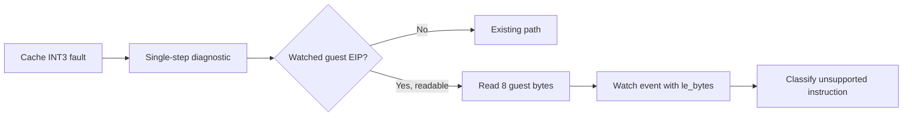

# 설계 20260905-593 — Linux x64 raw single-step byte 귀속

상위 작업: [20260905-592](20260905-592-linux-x64-long-mode-guard-coverage.md)

## 배경

Task 592 뒤 watched 실행은 return continuation을 cache로 resolve했지만, `0x010F010C`에서
cache INT3 fault 후 single-step raw guest 실행으로 전환되어 `SIGSEGV`가 발생했습니다.
현재 address watch는 event, cache/guest address, 일부 register만 기록하므로 해당 주소의
원본 opcode를 로그 하나로 판별할 수 없습니다.

## 결정

`RecordSingleStepDiagnostics`는 watch가 현재 guest EIP와 일치하고 guest range에서 8바이트를
안전하게 읽을 수 있을 때만 원본 bytes를 읽습니다. `RecordGuestAddressWatch`는 optional
little-endian 8-byte word를 받아 single-step event에 `le_bytes`로 출력합니다. cache fault
event의 `at`은 cache address를 계속 가리키며, 다른 watch event와 watch가 꺼진 경로는 기존
출력·동작을 유지합니다.

진단은 guest registers, memory, EIP, flags, dispatch 정책을 변경하지 않습니다. 읽을 수 없는
range에서는 bytes field를 생략합니다.

## 검증

1. Linux x64 `repiu`를 빌드합니다.
2. `REPIU_GUEST_WATCH=0x010F010C`로 watched `pumpit2a`를 실행합니다.
3. `fault`와 `step` 이벤트가 같은 watched guest address를 가리키고, `step` 이벤트가
   `le_bytes`를 출력하며 기존 raw `SIGSEGV` frontier가 재현되는지 확인합니다.

---

# Design 20260905-593 — Linux x64 raw single-step byte attribution

Parent task: [20260905-592](20260905-592-linux-x64-long-mode-guard-coverage.md)

## Decision

Only when the watched EIP is readable in the guest range, capture its first
eight original bytes during single-step diagnostics and print them as an
optional little-endian word on the single-step watch event. Cache-fault `at`
continues to report the cache address, and all other state, control flow, and
non-watched output remain unchanged.

## Verification

Build Linux x64 `repiu`, run watched `pumpit2a` at `0x010F010C`, and verify
that the fault and single-step events identify the same watched guest address,
that the single-step event prints `le_bytes`, and that the same raw `SIGSEGV`
frontier is reproduced.
