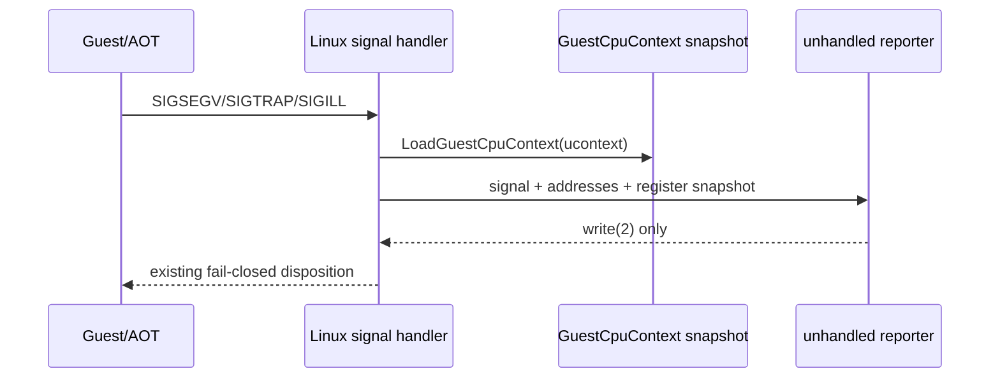

# 설계 20260905-594 — Linux x64 INT 31h fault 레지스터 귀속

## 목적

Task 593에서 Linux x64 실행의 새 frontier가 원본 guest `0x010F010C`의
`INT 31h`임을 확인했습니다. 정적 명령열은 직전에 `EAX=7`을 설정하지만,
현재 `[repiu-fault]` 출력에는 미처리 fault 시점의 guest 레지스터가 없어
DPMI HLE이 실제로 어떤 요청을 받았는지 확인할 수 없습니다.

이번 단위의 목적은 미처리 Linux fault가 발생했을 때 signal handler가 읽은
32-bit guest register snapshot을 직접 기록하는 것입니다. 이 정보로
`AX=0007` 요청의 HLE 진입 여부와 AOT 재진입 중 레지스터 손실 여부를
구분할 수 있어야 합니다.

## 설계 결정

1. Linux의 기존 async-signal-safe `ReportUnhandledFault`에
   `GuestCpuContext` snapshot을 전달합니다.
2. 기존 `signal`, host `rip`, guest `eip`, fault `access` 필드는 유지하고,
   `eax`, `ebx`, `ecx`, `edx`, `esi`, `edi`, `esp`, `eflags`를 같은 줄에
   32-bit hex 값으로 추가합니다.
3. 값은 `SignalHandler`가 `LoadGuestCpuContext`로 성공적으로 읽은 로컬
   snapshot에서 가져옵니다. signal handler 안에서 새 메모리 조회, logger,
   동적 할당은 수행하지 않습니다.
4. fault 처리 정책과 resume 여부는 변경하지 않습니다. 이 단위는
   관측성 변경이며, AX 값이 확인되기 전까지 DPMI 서비스를 추측하거나
   원본 guest `INT 31h`를 장시간 실행시키는 우회를 추가하지 않습니다.
5. Linux x64뿐 아니라 동일한 reporter를 사용하는 i386에서도 필드를
   출력할 수 있게 공통 `GuestCpuContext` 필드를 사용합니다. 기존 i386
   실행 의미는 바뀌지 않습니다.

## 범위와 비범위

범위는 `src/platform/linux/fault_handler.cpp`의 reporter 인자와 출력,
그리고 호출부 연결입니다. DPMI HLE 구현, AOT emitter, Linux x64 guest
entry, fault disposition은 이번 단위에서 수정하지 않습니다.

## 검증 전략

* Linux x64 `repiu`를 빌드합니다.
* `repiu_core_probe`를 실행해 공통 회귀를 확인합니다.
* `REPIU_GUEST_WATCH=0x010F010C` 실행에서 `[repiu-fault]`에 레지스터가
  출력되는지 확인합니다.
* `EAX`, `EBX`, `ECX`, `EDX`, `ESP`, `EFLAGS`를 원본 명령열과 대조해 다음
  구현 단위의 DPMI/AOT 경계를 결정합니다.

---

# Design 20260905-594 — Linux x64 INT 31h fault register attribution

## Purpose

Task 593 established that the new Linux x64 execution frontier is the original
guest `INT 31h` at `0x010F010C`. Static disassembly shows that the preceding
path sets `EAX=7`, but the current `[repiu-fault]` line does not include the
guest registers at the unhandled fault. That leaves it unknown which DPMI HLE
request was actually presented.

This unit records the 32-bit guest register snapshot read by the signal handler
when an unhandled Linux fault is reported. The result must distinguish whether
the `AX=0007` request reached the HLE boundary and whether AOT re-entry changed
the registers.

## Decisions

1. Pass the `GuestCpuContext` snapshot to Linux's existing async-signal-safe
   `ReportUnhandledFault`.
2. Keep the existing `signal`, host `rip`, guest `eip`, and fault `access`
   fields, and append `eax`, `ebx`, `ecx`, `edx`, `esi`, `edi`, `esp`, and
   `eflags` as 32-bit hexadecimal values on the same line.
3. Use the local snapshot already loaded by `SignalHandler`. Do not add memory
   queries, a logger, or allocation to the signal-handler path.
4. Do not change fault disposition or resume behavior. This is an observability
   unit; until AX is confirmed, it must not guess a DPMI service or add a
   workaround that executes the original guest `INT 31h` for an extended path.
5. Use the common `GuestCpuContext` fields so i386, which shares this reporter,
   gains only diagnostic output and no execution-policy change.

## Scope and non-scope

The scope is the reporter signature/output in
`src/platform/linux/fault_handler.cpp` and its call site. The DPMI HLE
implementation, AOT emitter, Linux x64 guest entry, and fault disposition are
out of scope for this unit.

## Verification

* Build Linux x64 `repiu`.
* Run `repiu_core_probe` for common regressions.
* Reproduce with `REPIU_GUEST_WATCH=0x010F010C` and verify registers appear on
  `[repiu-fault]`.
* Compare `EAX`, `EBX`, `ECX`, `EDX`, `ESP`, and `EFLAGS` with the original
  instruction sequence to choose the next DPMI/AOT boundary implementation.
