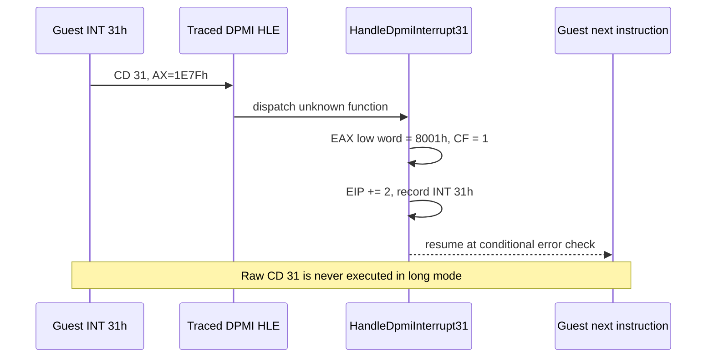

# 설계 20260905-595 — Linux x64 INT 31h 미지원 함수 HLE

## 발견

Task 594 변경을 포함한 최신 Linux x64 바이너리로 `pumpit2a`를 다시
실행한 결과, raw frontier `0x010F010C`의 fault 시점 레지스터는 다음과
같았습니다.

```text
[repiu-fault] unhandled signal=0xb rip=0x10f010c eip=0x10f010c access=0x0 eax=0x1e7f ebx=0x11a7aec ecx=0x0 edx=0x0 esi=0x11a7b28 edi=0x11a7b28 esp=0x158cc5c eflags=0x210396
```

따라서 정적 역어셈블리의 인접한 `mov eax, 7`은 이 동적 경로가 실제로
실행한 직전 명령이라고 볼 수 없습니다. 실제 호출 함수 번호는 `AX=1E7F`이며,
현재 HLE의 `HandleDpmiInterrupt31`은 이를 미지원 분기로 보내고 `false`를
반환합니다. 그 결과 Linux x64에서 원본 `CD 31`이 재개되어 SIGSEGV가
발생합니다.

## 결정

1. `HandleDpmiInterrupt31`의 미지원 함수 분기를 HLE 처리 경로로 전환합니다.
2. 미지원 함수에는 DPMI 표준의 unsupported function 오류인 `AX=8001h`를
   반환하고 Carry Flag를 설정합니다.
3. `EIP`를 `INT 31h` 다음 바이트로 2 증가시키고 `true`를 반환합니다.
4. `RecordHandledDosInterrupt`로 실제 요청 `INT 31h AX=1E7F`를 기록합니다.
5. 기존의 `hle_message` 설정은 보존하지 않습니다. 미지원 함수가 guest에
   표준 오류로 반환되므로 raw guest `INT 31h`를 실행하지 않는 것이 이
   경계의 fail-closed 동작입니다.
6. 기존에 구현된 서비스와 i386 경로의 동작은 변경하지 않습니다.

DPMI 1.0은 정의되지 않은 함수에 `8001h`(unsupported function)를 반환하도록
규정합니다. 참고: [Open Watcom DPMI 1.0 specification](https://downloads.openwatcom.org/ftp/devel/docs/dpmi10.pdf),
[DPMI error codes](https://www.gedasymbols.org/djgpp/doc/dpmi/api/errors.html).

## 흐름



## 범위

변경 대상은 `src/engine/dos/dpmi_mscdex_services.cpp`의
`HandleDpmiInterrupt31` 미지원 분기와 관련 테스트/문서입니다. DPMI의
구체적인 `AX=1E7F` 사설 의미를 추측하거나 성공 동작을 재구현하지 않습니다.

## 검증

* Linux x64 `repiu` 및 `repiu_core_probe` 재빌드
* Linux x64 `repiu_core_probe` 전체 통과 확인
* `REPIU_GUEST_WATCH=0x010F010C REPIU_DOS_INT_TRACE=1`로 `pumpit2a` 실행
* `INT 31h AX=1E7F` trace, raw SIGSEGV 소멸, 다음 guest frontier를 확인

## English

# Design 20260905-595 — Linux x64 INT 31h unsupported-function HLE

## Finding

With the Task 594 instrumentation included, a fresh Linux x64 `pumpit2a` run
reported these registers at the raw frontier `0x010F010C`:

```text
[repiu-fault] unhandled signal=0xb rip=0x10f010c eip=0x10f010c access=0x0 eax=0x1e7f ebx=0x11a7aec ecx=0x0 edx=0x0 esi=0x11a7b28 edi=0x11a7b28 esp=0x158cc5c eflags=0x210396
```

The adjacent static `mov eax, 7` must therefore not be treated as the
immediately executed instruction for this dynamic path. The actual function
number is `AX=1E7F`. The current `HandleDpmiInterrupt31` falls through to its
unsupported branch, returns `false`, and lets the raw `CD 31` resume on Linux
x64, producing SIGSEGV.

## Decision

1. Make the unsupported-function branch of `HandleDpmiInterrupt31` an HLE-handled path.
2. Return the DPMI unsupported-function error `AX=8001h` and set Carry Flag.
3. Advance `EIP` by two bytes past `INT 31h` and return `true`.
4. Record the actual request as `INT 31h AX=1E7F` through `RecordHandledDosInterrupt`.
5. Do not preserve the old `hle_message`-and-`false` behavior. Returning the
   standard error to the guest, without executing raw `INT 31h` in long mode,
   is the fail-closed boundary behavior.
6. Leave implemented services and the i386 path unchanged.

DPMI 1.0 specifies `8001h` (unsupported function) for an undefined function.
References: [Open Watcom DPMI 1.0 specification](https://downloads.openwatcom.org/ftp/devel/docs/dpmi10.pdf),
[DPMI error codes](https://www.gedasymbols.org/djgpp/doc/dpmi/api/errors.html).

## Scope

Change `HandleDpmiInterrupt31` in
`src/engine/dos/dpmi_mscdex_services.cpp`, plus the corresponding tests and
documentation. Do not guess a private meaning for `AX=1E7F` or reimplement a
success path without evidence.

## Verification

* Rebuild Linux x64 `repiu` and `repiu_core_probe`.
* Confirm the complete Linux x64 core probe passes.
* Run `pumpit2a` with `REPIU_GUEST_WATCH=0x010F010C REPIU_DOS_INT_TRACE=1`.
* Confirm the `INT 31h AX=1E7F` trace, disappearance of the raw SIGSEGV, and the next guest frontier.
