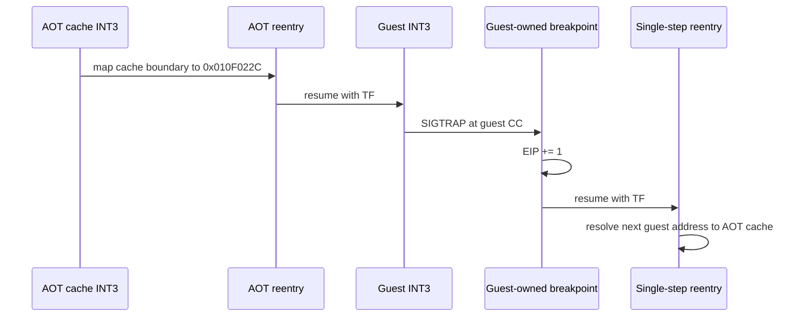

# 설계 20260905-596 — Linux x64 게스트 INT3 재진입 처리

## 발견

Task 595의 Linux x64 재빌드 실행에서 `INT 31h AX=1E7F`는 HLE로 처리되어
기존 `SIGSEGV`가 사라졌습니다. 이후 AOT 캐시 경계가 게스트
`0x010F022C`로 복귀했고, 해당 게스트 메모리는 다음 바이트를 가집니다.

```text
CC B8 0D F0 AD 8B 07 5B
```

첫 바이트 `CC`는 게스트가 소유한 INT3입니다. 그러나 캐시 경계 처리 직후
`aot_reentry_pending=true`와 single-step trace가 활성화되어,
`DispatchGuestFault`의 `HandleSingleStepTrace` 조건이
`HandleGuestOwnedBreakpoint`보다 먼저 참이 됩니다. 게스트 INT3는 한 바이트
전진하지 못하고 같은 게스트 주소에서 반복됩니다.

## 결정

1. AOT transfer chain 이후, 단일 스텝 trace 진입 전에
   `HandleGuestOwnedBreakpoint`를 먼저 호출합니다.
2. 이 호출은 기존 `fault.instruction_address`를 사용하므로, 캐시 경계가
   같은 dispatch 안에서 게스트 EIP를 바꾼 경우에는 캐시 INT3를 게스트 INT3로
   오인하지 않습니다. 다음 Linux SIGTRAP에서 게스트 주소가 이벤트 주소로
   들어왔을 때만 게스트 INT3를 소비합니다.
3. trace sentinel은 `HandleGuestOwnedBreakpoint` 내부의 기존 제외 조건을
   그대로 적용하므로 엔진이 설치한 게스트 메모리 sentinel의 의미는
   변경하지 않습니다.
4. 게스트 INT3는 기존 정책대로 `EIP += 1`만 수행합니다. 이후 TF가 만든
   single-step에서 AOT reentry가 다음 게스트 주소를 다시 cache로 resolve할
   수 있습니다.

## 흐름



## 범위 및 검증

변경 범위는 `DispatchGuestFault`의 breakpoint 소비 순서와 관련 문서입니다.
원본 게스트 코드나 `INT 31h` 서비스 의미는 변경하지 않습니다.

검증은 Linux x64 `repiu`/`repiu_core_probe` 재빌드, core probe 전체 통과,
`pumpit2a` 짧은 실행에서 `[repiu-guest-int3]` 관측 및
`last_eip=0x010F022C` 반복 해소 여부 확인으로 수행합니다.

## English

# Design 20260905-596 — Linux x64 guest INT3 reentry handling

## Finding

The Task 595 Linux x64 rebuild handled `INT 31h AX=1E7F` through HLE and
removed the former `SIGSEGV`. The AOT cache boundary then returned to guest
`0x010F022C`, whose bytes in guest memory were:

```text
CC B8 0D F0 AD 8B 07 5B
```

The first byte is a guest-owned INT3. Immediately after the cache boundary,
however, `aot_reentry_pending=true` and single-step tracing are enabled, so the
`DispatchGuestFault` condition for `HandleSingleStepTrace` wins over
`HandleGuestOwnedBreakpoint`. The guest INT3 never advances and the same guest
address repeats.

## Decision

1. Call `HandleGuestOwnedBreakpoint` after the AOT transfer chain and before
   entering the single-step trace path.
2. Keep the existing `fault.instruction_address` input. If the cache boundary
   rewrites guest EIP during the same dispatch, the cache INT3 is not mistaken
   for a guest INT3. The next Linux SIGTRAP is consumed only when its event
   address is the guest address.
3. Preserve the existing trace-sentinel exclusions inside
   `HandleGuestOwnedBreakpoint`, so engine-installed guest-memory sentinels
   retain their meaning.
4. Keep the guest INT3 policy as `EIP += 1`. The TF-driven single-step can then
   resolve the next guest address back into the AOT cache.

## Flow


## Scope and verification

The change is limited to breakpoint-consumption order in `DispatchGuestFault`
and the related documentation. It does not modify original guest bytes or
invent semantics for the `INT 31h` service.

Verification consists of rebuilding Linux x64 `repiu` and
`repiu_core_probe`, confirming the complete core probe, and running a short
`pumpit2a` sample that observes `[repiu-guest-int3]` and no longer repeats
`last_eip=0x010F022C`.
