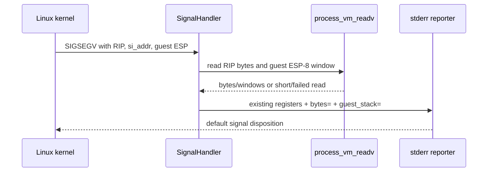
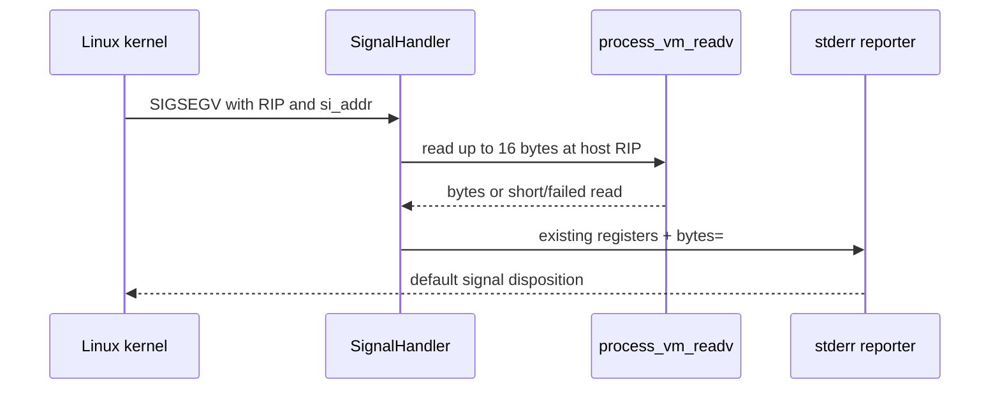

# 설계 20260905-597 — Linux x64 unhandled AOT fault opcode 진단

## 배경

Task 596 이후 `pumpit2a`는 게스트 소유 `INT3`를 한 번 소비하고
`0x010F0232` AOT frontier까지 진행합니다. 그 다음 실행은
`RIP/EIP=0x2004FB6B`, `SIGSEGV`, `si_addr=0`으로 종료되지만 현재 Linux
fault reporter는 GPR과 주소만 출력합니다. 따라서 faulting AOT slot의 실제
opcode와 null 참조 명령인지 여부를 실행 로그만으로 판별할 수 없습니다.

## 결정

1. 처리되지 않은 Linux access fault의 종료 진단에 faulting host RIP의
   최대 16바이트를 추가합니다.
2. signal handler에서 임의 포인터를 직접 역참조하지 않습니다. Linux의
   `process_vm_readv` system call을 사용해 읽기 실패를 반환값으로 받습니다.
   코드 페이지가 유효하지 않은 instruction-fetch fault에서도 handler가
   재귀 SIGSEGV를 일으키지 않아야 합니다.
3. 기존 `write(2, ...)` 기반 수동 formatting을 유지하고, 바이트는
   `bytes=` 필드로 hexadecimal 문자열에 기록합니다. 정상 fault 처리 경로와
   guest context 구조는 변경하지 않습니다.
4. 이 변경은 진단 전용입니다. opcode를 근거로 AOT 실행 의미를 추정하거나
   원본 guest bytes를 수정하지 않습니다.
5. `REPIU_AOT_FAULT_TRACE=1`을 지정한 경우에만 execution dispatcher가
   faulting cache offset의 reverse address-map 결과, 현재 cache size, map
   count를 한 줄로 출력합니다. signal reporter와 분리하여, cache 바이트가
   등록된 guest instruction 범위 안인지도 확인합니다.
6. unhandled access fault에서는 guest `ESP-8`부터 4개의 dword를 같은
   안전한 read 방식으로 함께 기록합니다. 이 window는 fault 직전 guest
   stack 상태와 앞선 pop의 입력을 대조하는 증거로 사용하되, faulting
   명령이 어느 pop의 뒤에 있는지 확인하기 전에는 `POP EBX`의 입력으로
   단정하지 않습니다. 이 값은 관측 전용이며 guest stack을 복구하거나
   수정하지 않습니다.

## 흐름

## 검증 전략

* `repiu`와 `repiu_core_probe`를 Linux x64에서 다시 빌드합니다.
* `repiu_core_probe`의 failure count가 0인지 확인합니다.
* `pumpit2a`를 짧게 실행하여 unhandled fault line에 `bytes=`가 출력되고,
  `RIP=0x2004FB6B`의 실제 opcode를 기록합니다.
* `REPIU_AOT_FAULT_TRACE=1` 실행에서 해당 cache 위치의 map 등록 상태를
  함께 확인합니다.
* guest stack window를 faulting guest instruction과 대조하여 `EBX=0`의
  upstream 상태에 대해 확인된 범위와 미확정 범위를 분리합니다.

## English

# Design 20260905-597 — Linux x64 unhandled AOT fault opcode diagnostics

## Background

After Task 596, `pumpit2a` consumes the guest-owned `INT3` once and reaches the
`0x010F0232` AOT frontier. It then terminates with `RIP/EIP=0x2004FB6B`,
`SIGSEGV`, and `si_addr=0`, but the Linux fault reporter currently prints only
registers and addresses. The runtime log therefore cannot identify the actual
opcode at the faulting AOT slot or distinguish a null-reference instruction.

## Decision

1. Add up to 16 bytes at the faulting host RIP to the unhandled Linux access
   fault line.
2. Do not directly dereference an arbitrary pointer in the signal handler. Use
   Linux's `process_vm_readv` system call so an invalid code address becomes a
   failed read rather than a recursive SIGSEGV in the reporter. This is a
   diagnostic path that is about to restore the default signal disposition.
3. Keep the existing hand-written `write(2, ...)` formatting and add the bytes
   as a hexadecimal `bytes=` field. Do not alter normal fault recovery or the
   guest context structure.
4. Keep this diagnostic-only. It must not infer execution semantics from the
   opcode or modify original guest bytes.
5. With `REPIU_AOT_FAULT_TRACE=1`, the execution dispatcher additionally
   prints the reverse address-map result for the faulting cache offset, the
   current cache size, and the map count. This stays outside the signal
   reporter so it can establish whether the cache bytes lie inside a registered
   guest-instruction range.
6. On an unhandled access fault, also read and print four dwords starting at
   guest `ESP-8` through the same guarded mechanism. Use this as a nearby
   guest-stack evidence window and correlate it with the actual faulting
   instruction before attributing any word to a particular `POP`. This is
   observational only and never repairs or changes guest memory.

## Flow

## Verification strategy

* Rebuild `repiu` and `repiu_core_probe` on Linux x64.
* Confirm the core probe reports zero failures.
* Run a short `pumpit2a` sample and confirm `bytes=` appears on the unhandled
  fault line, recording the actual opcode at `RIP=0x2004FB6B`.
* Repeat with `REPIU_AOT_FAULT_TRACE=1` and record whether the cache address is
  present in the reverse address map.
* Correlate the guest stack window with the faulting instruction and record
  which part of the upstream source of `EBX=0` remains unresolved.
