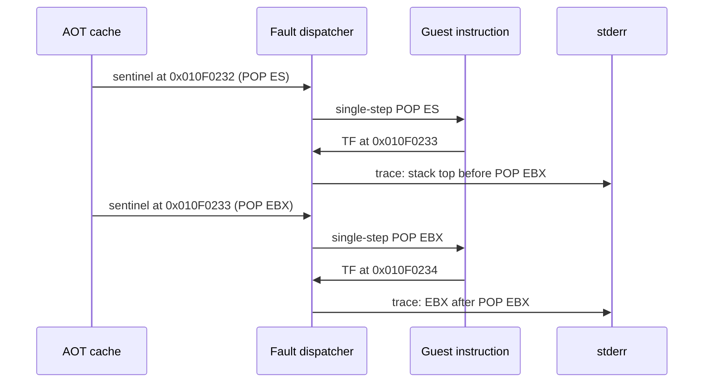

# 설계 20260905-598 — Linux x64 AOT `POP EBX` 직전/직후 trace 출력

## 배경

Task 597은 AOT cache `0x2004FB6B`가 guest `0x010F4AD2`의
`MOV byte ptr [EBX],02h`로 등록돼 있고, fault 시 `EBX=0`임을 확인했다.
동일 fault의 stack window는 직전 `0x010F4AD1` `POP EDX`의 입력
`0x000000FF`를 확인했지만, 더 이른 `0x010F0233` `POP EBX`의 입력은
terminal fault 시점만으로 복원할 수 없다.

기존 execution trace는 AOT cache entry에 `INT3` sentinel을 설치하고 해당 guest
instruction 한 개를 TF single-step으로 실행한 뒤, 다음 guest EIP·ESP·stack 값을
ring에 기록한다. 그러나 Linux x64의 terminal `SIGSEGV`는 attempt summary 이전에
프로세스를 종료하므로, ring의 내용이 host logger까지 전달되지 않는다.

## 결정

1. 기존 `REPIU_EXECUTION_TRACE_START/END/ESP_OFFSET` 및 optional
   `REPIU_EXECUTION_TRACE_SENTINEL2`의 sentinel/reentry 의미를 변경하지 않는다.
2. 새 opt-in `REPIU_EXECUTION_TRACE_LOG=1`일 때만 `RecordExecutionTrace`가
   capture 직후 `WriteHostErrorStream`으로 한 줄을 기록한다. 따라서 terminal
   fault 뒤에도 이미 저장된 trace evidence가 stderr에 남는다.
3. 출력에는 sequence, post-step guest EIP, guest ESP, `value_at_esp_offset`,
   EAX/EBX/EDX, EFLAGS를 포함한다. 첫 sentinel을 `0x000F0232` (`POP ES`)에
   설치하고 ESP offset을 0으로 설정하면, post-step EIP `0x010F0233` line의
   stack value가 아직 실행되지 않은 `POP EBX`의 입력이다. 두 번째 sentinel을
   `0x000F0233`에 설치하면 post-step EIP `0x010F0234` line이 `POP EBX` 직후
   EBX를 보여 준다.
4. 이 경로는 진단 전용이다. guest instruction, stack 값, AOT map, sentinel의
   기존 reentry 정책을 수정하지 않는다.



## 검증 전략

* Linux x64 `repiu`와 `repiu_core_probe`를 빌드하고 core probe failure가 0인지
  확인한다.
* 기본 환경에서 trace log가 출력되지 않는지 확인한다.
* `pumpit2a`에 아래 설정으로 실행한다.

```text
REPIU_EXECUTION_TRACE_START=0x000F0232
REPIU_EXECUTION_TRACE_END=0x000F0234
REPIU_EXECUTION_TRACE_ESP_OFFSET=0
REPIU_EXECUTION_TRACE_SENTINEL2=0x000F0233
REPIU_EXECUTION_TRACE_LOG=1
```

* `0x010F0233` post-step line의 stack input과 `0x010F0234` post-step line의
  EBX를 비교한다. 두 번째 sentinel이 address map에서 설치되지 않거나 실행 경로가
  도달하지 않으면 그 제한을 기록하고, 관측된 첫 line만으로 결론을 과장하지 않는다.

## English

# Design 20260905-598 — Linux x64 AOT `POP EBX` pre/post trace output

## Background

Task 597 established that AOT cache `0x2004FB6B` is registered for guest
`0x010F4AD2`, `MOV byte ptr [EBX],02h`, and that `EBX=0` at the fault. Its
fault-time stack window confirmed the `0x000000FF` input of the immediately
preceding `POP EDX` at `0x010F4AD1`, but cannot reconstruct the input of the
earlier `POP EBX` at `0x010F0233`.

The existing execution trace installs an `INT3` sentinel at an AOT cache entry,
single-steps one guest instruction with TF, and stores the next guest EIP, ESP,
and stack value in a ring. A terminal Linux x64 `SIGSEGV` ends the process before
the attempt summary can print that ring.

## Decision

1. Do not change the sentinel or reentry semantics of the existing
   `REPIU_EXECUTION_TRACE_START/END/ESP_OFFSET` and optional
   `REPIU_EXECUTION_TRACE_SENTINEL2` controls.
2. Only with new opt-in `REPIU_EXECUTION_TRACE_LOG=1`, have
   `RecordExecutionTrace` write one line through `WriteHostErrorStream`
   immediately after capture. The evidence then survives the terminal fault.
3. Include sequence, post-step guest EIP, guest ESP, `value_at_esp_offset`,
   EAX/EBX/EDX, and EFLAGS. With the first sentinel at `0x000F0232` (`POP ES`)
   and ESP offset zero, the post-step `0x010F0233` line contains the not-yet-
   consumed input of `POP EBX`. A second sentinel at `0x000F0233` produces a
   post-step `0x010F0234` line showing EBX after `POP EBX`.
4. This is diagnostic-only: it must not modify guest instructions, stack data,
   AOT mappings, or the sentinel's existing reentry policy.

## Verification strategy

* Build Linux x64 `repiu` and `repiu_core_probe`, confirming zero core-probe
  failures.
* Confirm no trace line is emitted with the log toggle unset.
* Run `pumpit2a` with:

```text
REPIU_EXECUTION_TRACE_START=0x000F0232
REPIU_EXECUTION_TRACE_END=0x000F0234
REPIU_EXECUTION_TRACE_ESP_OFFSET=0
REPIU_EXECUTION_TRACE_SENTINEL2=0x000F0233
REPIU_EXECUTION_TRACE_LOG=1
```

* Compare the stack input on the post-step `0x010F0233` line with EBX on the
  post-step `0x010F0234` line. If the second sentinel cannot be installed from
  the address map or its path is not reached, record that limitation and do not
  overstate the first-line evidence.
