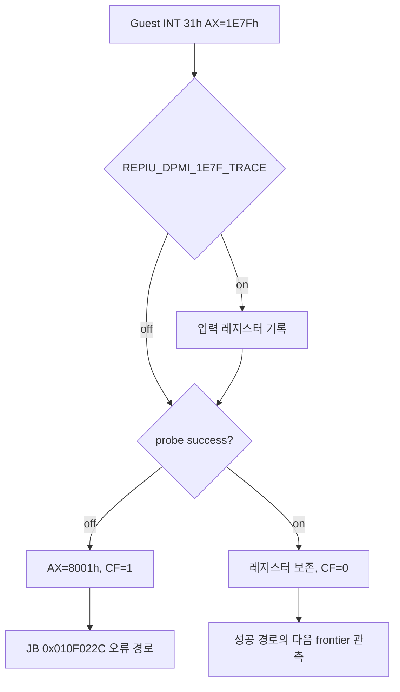

# 설계 20260905-599 — Linux x64 DPMI `1E7Fh` 계약 탐침

## 목적

Task 598의 실행 추적은 `INT 31h AX=1E7Fh`에 대해 현재 HLE가 반환하는
`AX=8001h`, CF=1이 guest의 `JB`를 정확히 `0x010F022C` 오류 경로로
분기시킨다는 사실을 확인했습니다. 그 경로의 `POP EBX` 입력은 실제로 0이며,
뒤따르는 `MOV byte ptr [EBX], 2`가 널 주소에 기록하여 종료합니다.

`1E7Fh`는 공개 DPMI 1.0 함수가 아니며, 로컬 OpenWatcom 배포본과 공개 검색으로
계약을 확인하지 못했습니다. 따라서 성공 값을 임의로 제품 동작으로 채택하지
않습니다. 이 작업은 호출 입력을 가시화하고, 명시적으로 opt-in한 한 번의
**진단 탐침**에서 레지스터를 보존한 채 CF만 clear하여 성공 경로의 다음
frontier를 식별합니다.

## 설계 결정

1. 기본 동작은 Task 595와 동일하게 `AX=8001h`, CF=1을 반환합니다.
2. `REPIU_DPMI_1E7F_TRACE=1`일 때 `1E7Fh` 진입의 `EIP`, 범용 레지스터,
   `ESP`, `EFLAGS`를 stderr에 출력합니다. 이 출력은 진입 레지스터를 바꾸지
   않습니다.
3. `REPIU_DPMI_1E7F_PROBE_SUCCESS=1`일 때에만, `1E7Fh` 호출을 진단용으로
   성공 처리합니다. 이 경우 EAX를 포함한 범용 레지스터를 보존하고 CF만
   clear한 뒤 `EIP`를 `INT 31h` 다음으로 진행합니다.
4. probe 출력은 항상 `probe-success` 표기를 포함합니다. 이 모드는 실제
   DOS4GW 사설 서비스 구현도, 기본 호환성 동작도 아닙니다.
5. `JB`의 target 및 결과 frontier를 기록해, 다음 작업에서 필요한 실제 output
   레지스터/메모리 효과를 좁힙니다.

## 범위와 비범위

범위는 `dpmi_mscdex_services.cpp`의 `1E7Fh` 관측 및 opt-in 탐침과, 해당
분석 기록입니다. AOT emitter, guest 코드, 일반 DPMI 오류 반환은 변경하지
않습니다. 문서로 확인된 사설 ABI가 생기기 전에는 이 환경 변수를 기본 활성화하거나
런타임 설정으로 노출하지 않습니다.

## 검증

* Linux x64 `repiu`와 `repiu_core_probe`를 빌드·실행합니다.
* 기본 실행에서 기존 `AX=8001h`, CF=1 오류 경로와 널 쓰기가 유지되는지
  확인합니다.
* trace만 켠 실행에서 입력 레지스터를 기록합니다.
* probe-success 실행에서 오류 분기 대신 다음 guest frontier가 관측되는지
  확인합니다. 성공으로 보이는 결과만으로 서비스 구현을 확정하지 않습니다.

---

# Design 20260905-599 — Linux x64 DPMI `1E7Fh` contract probe

## Purpose

Task 598 established that the current HLE response to `INT 31h AX=1E7Fh`,
`AX=8001h` with CF set, sends the guest's `JB` exactly to its
`0x010F022C` error path. That path consumes a real zero input at `POP EBX` and
then terminates on `MOV byte ptr [EBX], 2` at the null address.

`1E7Fh` is not a public DPMI 1.0 function. Neither the local OpenWatcom
distribution nor public searches established its contract. This unit therefore
does not adopt an invented successful response as product behavior. It records
the call inputs and, only in an explicit opt-in **diagnostic probe**, clears CF
while preserving registers to identify the next frontier on the success path.

## Decisions

1. Default behavior remains the Task 595 `AX=8001h`, CF-set response.
2. With `REPIU_DPMI_1E7F_TRACE=1`, print the entry EIP, general registers,
   ESP, and EFLAGS to stderr without changing them.
3. Only with `REPIU_DPMI_1E7F_PROBE_SUCCESS=1`, treat the call as a diagnostic
   success: preserve all general registers including EAX, clear CF, and advance
   EIP past `INT 31h`.
4. Probe output always labels itself `probe-success`; it is neither a DOS4GW
   private-service implementation nor the default compatibility behavior.
5. Record the `JB` target and the resulting frontier to constrain the actual
   required output register or memory effects in the next task.

## Scope and non-scope

The scope is `1E7Fh` observation and an opt-in probe in
`dpmi_mscdex_services.cpp`, plus its analysis record. The AOT emitter, guest
code, and ordinary DPMI error response remain unchanged. Until a documented
private ABI is established, this environment variable is neither enabled by
default nor exposed as a runtime feature.

## Verification

* Build and run Linux x64 `repiu` and `repiu_core_probe`.
* Confirm the default run retains `AX=8001h`, CF=1 and the existing null-write
  error path.
* Capture entry registers with trace only.
* Run the probe-success variant and determine whether the next guest frontier
  is observed instead of the error branch. A seemingly successful result alone
  must not establish a service implementation.
