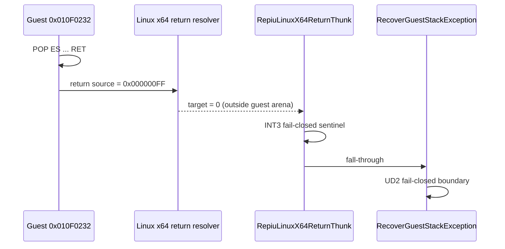

# 설계 20260905-602 — Linux x64 미해결 반환 주소 provenance 확정

## 목적

Task 601에서 `66 EA 04 00 2C 00` far jump HLE가 정상 동작한 뒤에도
`SIGTRAP/SIGILL`이 남았습니다. 이번 단위의 목적은 이 신호가 guest 원본
명령의 미지원 실행인지, AOT 반환 경계의 의도된 fail-closed sentinel인지
실행 trace와 host 심볼을 연결하여 확정하는 것입니다.

이번 단위는 `INT 31h AX=1E7Fh`의 실제 사설 ABI를 추정하거나 구현하지 않습니다.

## 관측 경로



## 설계 결정

1. `0x010F0232`의 `07 5B 5E 5F 5D C3`를 실제 guest `POP ES`,
   `POP EBX`, `POP ESI`, `POP EDI`, `POP EBP`, `RET` 경계로 기록합니다.
2. `RET` 직후 resolver 입력 `0x000000FF`를 guest arena 밖의 invalid return
   address로 분류합니다.
3. `0x402AD3DC`의 host `INT3`와 `0x402AD3DD`의
   `RecoverGuestStackException` `UD2`를 AOT 반환 실패의 fail-closed 경계로
   분류합니다.
4. resolver가 0을 반환했을 때 임의의 guest target을 만들거나 `0xFF`를
   무시하여 실행을 계속하지 않습니다. 이는 원본 guest control flow와
   `1E7Fh` ABI를 훼손할 수 있습니다.
5. 다음 구현 단위는 `1E7Fh` 성공 시 생성되어야 하는 반환 frame 또는
   upstream writer의 계약을 원본 바이너리 흐름에서 확인한 뒤에만 시작합니다.

## 완료 시 확인할 질문

| 질문 | 결과 기준 |
|---|---|
| far jump HLE가 이 frontier의 직접 원인인가 | 아니오: `002C:0004` 및 guest INT3 통과 증거 |
| `RET`가 읽은 반환 주소는 무엇인가 | `0x000000FF` |
| `0x402AD3DC`의 정체는 무엇인가 | `RepiuLinuxX64ReturnThunk`의 resolver 실패 sentinel |
| `0x402AD3DD`의 정체는 무엇인가 | x64 guest-stack recovery fail-closed `UD2` |
| `1E7Fh` ABI가 확정되었는가 | 아니오 |

---

# Design 20260905-602 — Linux x64 unresolved return-address provenance

## Purpose

Task 601's `66 EA 04 00 2C 00` far-jump HLE worked, but
`SIGTRAP/SIGILL` remained afterward. This unit connects the runtime trace to
host symbols and confirms whether the signal is an unsupported original guest
instruction or an intentional fail-closed sentinel at the AOT return boundary.

This unit does not infer or implement the private ABI of `INT 31h AX=1E7Fh`.

## Observed path

The sequence is the same as the Korean diagram above:

```text
guest 0x010F0232 RET
  -> resolver source 0x000000FF
  -> resolver target 0 (outside guest arena)
  -> RepiuLinuxX64ReturnThunk INT3
  -> RecoverGuestStackException UD2
```

## Design decisions

1. Record `07 5B 5E 5F 5D C3` at `0x010F0232` as guest
   `POP ES`, `POP EBX`, `POP ESI`, `POP EDI`, `POP EBP`, `RET`.
2. Classify resolver input `0x000000FF` after `RET` as an invalid return
   address outside the guest arena.
3. Classify host `INT3` at `0x402AD3DC` and the following
   `RecoverGuestStackException` `UD2` at `0x402AD3DD` as the fail-closed
   boundary for an unresolved AOT return.
4. Do not fabricate a guest target or ignore `0xFF` when the resolver returns
   zero. Doing so could corrupt the original guest control flow and the
   unknown `1E7Fh` ABI.
5. Begin implementation of the next unit only after the original binary flow
   establishes the return frame expected from `1E7Fh` or identifies the
   upstream writer of the invalid frame.

## Completion questions

| Question | Completion result |
|---|---|
| Is far-jump HLE the direct cause of this frontier? | No; `002C:0004` and the guest INT3 are passed. |
| What return address did `RET` consume? | `0x000000FF`. |
| What is `0x402AD3DC`? | Resolver-failure sentinel in `RepiuLinuxX64ReturnThunk`. |
| What is `0x402AD3DD`? | x64 guest-stack-recovery fail-closed `UD2`. |
| Is the `1E7Fh` ABI established? | No. |
