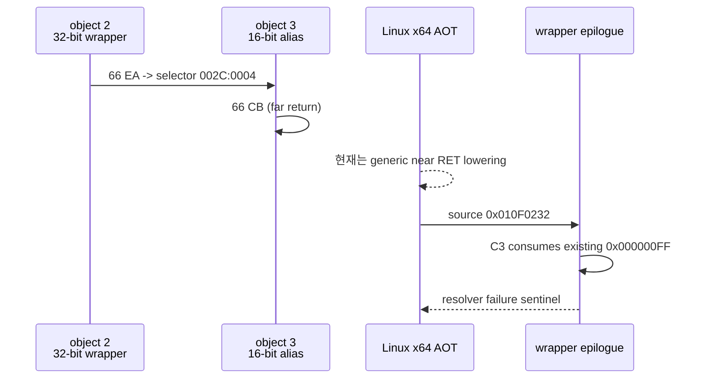

# 설계 20260905-603 — Linux x64 혼합 모드 far return 경계

## 목적

Task 602에서 `0x000000FF`가 `INT 31h AX=1E7Fh` HLE가 기록한 값이 아니라,
wrapper의 near `RET`가 소비한 기존 stack word임을 확인했습니다. 그보다 앞서
object 3의 `66 CB`가 현재 AOT에서 일반 near `RET`와 같은 x64 resolver 슬롯으로
내려가고 있었습니다.

LE object flags와 원본 명령을 함께 보면 object 2는 `0x2045`(`OBJBIGDEF`),
object 3은 `0x1045`(`OBJALIAS16`, `OBJBIGDEF` 없음)입니다. LE 사양상 code object의
big/default bit는 code-segment D-bit와 기본 명령어 폭을 결정하므로 object 3은
16-bit code object입니다. 따라서 object 3의 `66 CB`는 32-bit offset과 16-bit
selector를 사용하는 protected-mode far return입니다.

이번 단위의 목표는 아직 반환 ABI를 추정하여 실행하는 것이 아닙니다. 혼합 모드
far return을 near return 슬롯으로 잘못 처리하지 않도록 별도 계획 종류로 분리하고,
Linux x64에서 현재는 fail-closed 경계로 남기는 것입니다.

## 관찰된 인과관계

## 설계 결정

1. `ZYDIS_CATEGORY_RET` 중 `instruction.meta.branch_type == ZYDIS_BRANCH_TYPE_FAR`
   인 명령을 near `kReturn`과 별도의 `kFarReturn`으로 기록합니다.
2. long-mode emitter는 `kFarReturn`을 현재 generic near-return thunk에 연결하지
   않고 `INT3` boundary로 내보냅니다. 이 경계는 원본 guest 제어 흐름을 추정하지
   않으며, 잘못된 stack 폭이나 selector 소비를 숨기지 않습니다.
3. 이번 단위에서는 `ESP += 6`, selector 무시, absolute target 재사용과 같은
   반환 프레임 가정을 구현하지 않습니다. object 3의 D-bit와 SS의 B-bit,
   selector base/limit를 함께 반영하는 별도 HLE 단위의 입력으로 남깁니다.
4. `0x000000FF`를 유효한 반환 주소로 바꾸거나 `1E7Fh` 성공 ABI를 보정하는
   변경은 하지 않습니다.
5. i386/default emitter도 far return을 near return inline-cache slot으로
   만들지 않습니다. 현재 의미가 확정되지 않은 far return은 기존 fail-closed
   boundary 정책을 따릅니다.

## 영향 범위

* AOT planner의 명령 종류와 통계에 `far_return_count`를 추가합니다.
* long-mode emission probe에 `66 CB`가 generic return slot이 아니라 boundary로
  남는지 검증을 추가합니다.
* `selector_table`과 `INT 31h` 서비스 구현은 변경하지 않습니다.

## 검증 기준

* Linux x64 `repiu`와 `repiu_core_probe`가 빌드됩니다.
* `core_probe_all=true`가 유지됩니다.
* probe-success runtime에서 기존 `source=0x000000FF` return resolver 로그 대신
  guest `0x01100040`의 far-return boundary가 먼저 관찰됩니다.
* 실제 far-return frame ABI는 미확정 상태로 문서에 남습니다.

---

# Design 20260905-603 — Linux x64 mixed-mode far-return boundary

## Purpose

Task 602 established that `0x000000FF` was not written by the
`INT 31h AX=1E7Fh` HLE. It was an existing stack word consumed by the wrapper's
near `RET`. Before that near return, object 3's `66 CB` was being emitted through
the same x64 resolver slot as an ordinary near `RET`.

The LE object flags and original instruction provide the missing mode evidence.
Object 2 has `0x2045` (`OBJBIGDEF`), while object 3 has `0x1045`
(`OBJALIAS16` without `OBJBIGDEF`). The LE specification says that the
big/default bit controls the code-segment D-bit and therefore the default
instruction width. Object 3 is consequently a 16-bit code object, so its
`66 CB` is a protected-mode far return with a 32-bit offset and a 16-bit
selector.

This unit does not guess the return ABI. It separates mixed-mode far returns from
near returns and leaves them as a fail-closed boundary on Linux x64 instead of
feeding them to the generic near-return resolver slot.

## Observed causality

The sequence is shown in the Korean diagram above: the 32-bit wrapper transfers
to the 16-bit object, the object's `66 CB` reaches the generic near-return
lowering, the wrapper epilogue then consumes the pre-existing `0x000000FF`, and
the resolver reaches its fail-closed sentinel.

## Design decisions

1. Record `ZYDIS_CATEGORY_RET` instructions whose
   `instruction.meta.branch_type` is `ZYDIS_BRANCH_TYPE_FAR` as a distinct
   `kFarReturn`, not as near `kReturn`.
2. The long-mode emitter emits `kFarReturn` as an `INT3` boundary rather than
   connecting it to the generic near-return thunk. This keeps unknown selector
   consumption and stack-width semantics visible and fail-closed.
3. Do not implement assumptions such as `ESP += 6`, ignoring the selector, or
   reusing an absolute target. The future HLE must account for object D-bit,
   stack-segment B-bit, and selector base/limit together.
4. Do not turn `0x000000FF` into a valid return address or alter the private
   `1E7Fh` success ABI.
5. The i386/default emitter also keeps far returns out of the near-return inline
   cache slot. An unresolved far return follows the existing fail-closed boundary
   policy.

## Impact

* Add `far_return_count` to AOT plan statistics and a distinct instruction kind.
* Extend the long-mode emission probe to assert that `66 CB` becomes a boundary,
  not a generic return slot.
* Leave the selector table and `INT 31h` service implementation unchanged.

## Verification criteria

* Linux x64 `repiu` and `repiu_core_probe` build successfully.
* `core_probe_all=true` remains true.
* The probe-success runtime reaches a far-return boundary at guest
  `0x01100040` before producing the former `source=0x000000FF` return-resolver
  failure.
* The actual far-return frame ABI remains explicitly unresolved.

References: [Open Watcom LE flag definitions](https://github.com/open-watcom/open-watcom-v2/blob/master/bld/watcom/h/exeflat.h#L1186-L1243), [IBM LE/LX object table specification](https://komh.github.io/os2books/os2tk45/lxref.htm#37).
