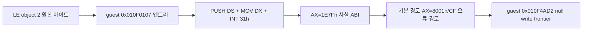
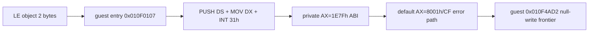

# 설계: Linux x64 사설 INT 31h 중첩 엔트리 판별

> Task 606 정정: 아래의 의도적 진입·사설 ABI 가설은 반환주소 손상으로 설명됩니다.
> `66 PUSH/POP` lowering 수정 후 `0x010F4B7E` 정상 복귀와 `1E7Fh` 호출 소멸을
> 확인했습니다. [수정 설계](20260905-606-x64-word-stack-lowering.md)를 우선합니다.
>
> Task 606 correction: return-address corruption explains the intentional-entry/private-ABI
> hypothesis below. Word-stack lowering restores return to `0x010F4B7E` and removes
> the `1E7Fh` call. The linked Task 606 design supersedes this conclusion.

## 목적

Task 604 이후 남은 실행 정지 지점의 원인이 AOT 코드 정렬 오류인지, 원본 LE 코드의 중첩 엔트리인지, 또는 사설 `INT 31h AX=1E7Fh` ABI 미구현인지 판별합니다. 원본 guest 바이트와 게임 로직은 수정하지 않습니다.

## 확인 범위

재구성한 `PIU.EXE` object 2와 Linux x64 실행 trace를 다음 순서로 대조합니다.

판정 기준은 다음과 같습니다.

1. AOT cache가 `0x010F0107`을 정확히 등록·매핑하는지 확인합니다.
2. 순차 디코드의 displacement 바이트와 엔트리 시작 바이트가 겹치는지 확인합니다.
3. `INT 31h` 직전의 `EAX`가 호출자가 준비한 값인지 확인합니다.
4. 사설 ABI의 실제 성공 출력이 확인되지 않은 상태에서는 성공 결과를 추정하지 않습니다.

## 안전 경계

* AOT reverse map, guest 원본 바이트, 일반 `RET` 처리, `0x010F4AD2` null write를 변경하지 않습니다.
* `REPIU_DPMI_1E7F_PROBE_SUCCESS=1`은 진단용 관찰 변수로만 취급합니다.
* 기본 `1E7Fh` 경로는 기존의 fail-closed `AX=8001h` 및 carry 설정을 유지합니다.
* 실제 성공 ABI는 원본 호출자와 서비스 구현의 추가 증거가 확보된 뒤 별도 설계합니다.

## English

# Design: Linux x64 Private INT 31h Overlapping Entry Classification

## Objective

Classify the remaining stop after Task 604 as an AOT alignment error, an intentional overlapping entry in the original LE code, or an unimplemented private `INT 31h AX=1E7Fh` ABI. Original guest bytes and game logic remain unchanged.

## Scope

Compare reconstructed LE object 2 bytes with the Linux x64 execution trace in this order:

The decision checks are:

1. Confirm that the AOT cache registers and maps `0x010F0107` exactly.
2. Confirm that the sequential decode displacement byte overlaps the entry-start byte.
3. Confirm that `EAX` immediately before `INT 31h` is caller-prepared.
4. Do not infer a success result while the private ABI outputs remain unconfirmed.

## Safety boundary

* Do not change the AOT reverse map, original guest bytes, generic `RET` handling, or the `0x010F4AD2` null-write frontier.
* Treat `REPIU_DPMI_1E7F_PROBE_SUCCESS=1` only as a diagnostic observation switch.
* Keep the default `1E7Fh` path fail-closed with its existing `AX=8001h` result and carry flag.
* Design the actual success ABI separately after obtaining more evidence from the original caller and service implementation.
