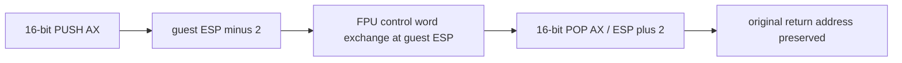

# Task 606: x64 16비트 register stack lowering

## 한국어

기존 trace를 넓히면 FPU 초기화 중 `0x010F839E`의 스택 반환값
`0x010F4B7E`가 `0x010F83C2`에서 `0x010F0103`으로 바뀐다.
원본에는 `66 50`, `D9 2C 24`, `66 87 04 24`, `66 58`이 있다.
Task 559는 `66 PUSH/POP`의 lowering을 거절하므로 이 경계를 우선 보완한다.
Task 605의 의도적 중첩 진입 및 사설 ABI 확정은 호출 출처 검증이 빠진 결론이다.

기존 `kStackSequence`를 확장해 정확한 `66 50..5F`만 2바이트 스택 이동으로
변환한다. guest ESP는 R15D이며 LEA로 ±2를 계산해 flags를 보존한다.
register load/store는 16비트 MOV로 상위 16비트를 보존한다.
PUSH SP는 감소 전 값을 R14D에 보존한다. POP SP는 읽은 값을 R14W에 보관하고
ESP를 증가시킨 후 R15W에 반영한다. 다른 prefix 조합은 기존 거절 정책을 유지한다.

검증은 실제 x64 probe에서 2바이트 저장, 상위 register 보존, flags, 인접 반환주소,
SP 특례를 확인하고 `pumpit2a` 기본 경로를 재실행한다. 게임별 주소 분기는 추가하지 않는다.

## English

An expanded trace shows the stack return value changing from `0x010F4B7E` at
`0x010F839E` to `0x010F0103` at `0x010F83C2` during FPU initialization.
Original instructions include `66 50`, `D9 2C 24`, `66 87 04 24`, and `66 58`.
Task 559 refuses lowering of word PUSH/POP, making that boundary the first fix.
Task 605 established neither intentional overlapping entry nor a private ABI:
it did not verify the incoming control flow.

Extend `kStackSequence` for exact `66 50..5F` forms with two-byte stack updates.
LEA updates R15D by two without changing flags. Word MOV preserves upper register
bits. PUSH SP snapshots the old value in R14D. POP SP loads R14W, increments ESP,
then updates R15W. Other prefix combinations retain their existing refusal.

Verify word stores, upper register bits, flags, adjacent return-address preservation,
and SP special cases in the executable x64 probe; rerun default `pumpit2a`.
No game-address-specific behavior is introduced.
