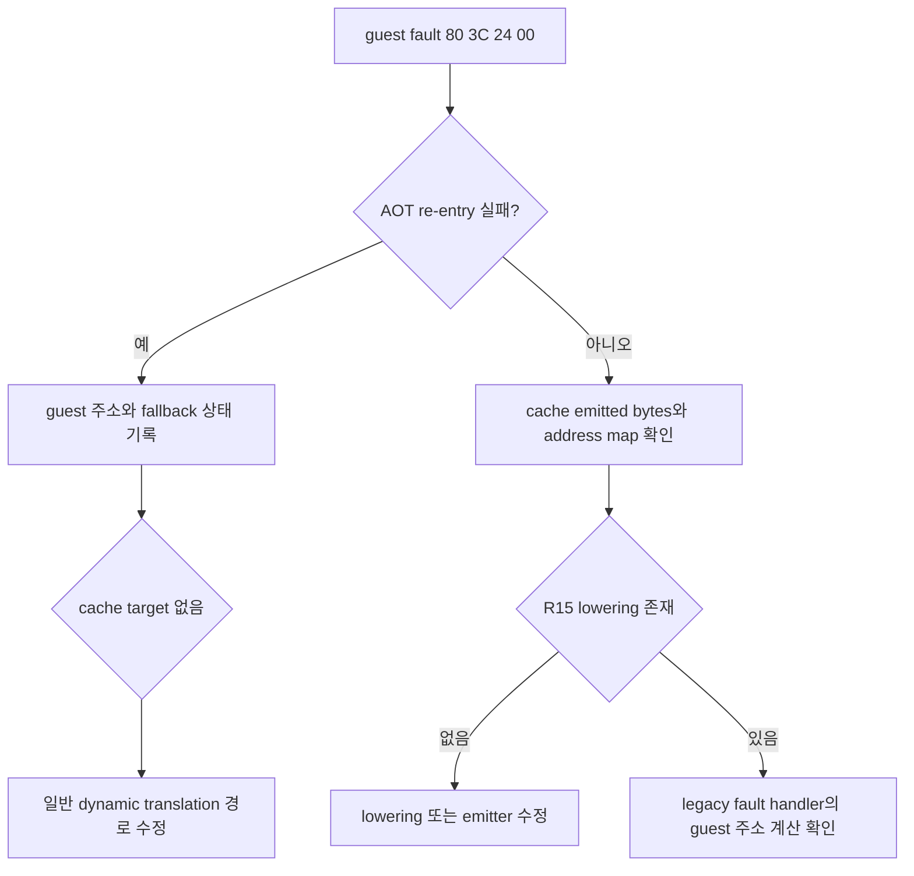

# Linux x64 ESP 메모리 fault 경계 설계

## 한국어

### 목적

Linux x64 실행 중 guest EIP `0x010F1E0F`에서 발생한 `SIGSEGV`의 원인을
확정합니다. fault 바이트 `80 3C 24 00`은 32-bit guest의
`CMP byte ptr [ESP], 0`입니다. x64에서는 host `RSP`와 guest `ESP`를 분리하고
guest stack pointer를 `R15D`에 보관하므로, 이 명령이 원시 guest 주소에서
실행되면 잘못된 host stack을 참조할 수 있습니다.

### 확인할 가설

1. 해당 guest 주소가 AOT cache에 매핑되지 않아 legacy fallback으로 원시
   guest 바이트를 실행했는지 확인합니다.
2. AOT 계획에 포함되었지만 `80 3C 24 00`의 stack-pointer 메모리 피연산자
   lower가 누락되었는지 확인합니다.
3. 둘 다 아니라면 fault 복구/HLE 분기에서 `CMP r/m8, imm8`의 ESP 기반
   주소를 guest 메모리 주소로 해석하지 못한 것인지 확인합니다.

### 설계 원칙

주소 `0x010F1E0F`에 특례를 추가하지 않습니다. 원본 게임 코드는 계속 주
실행 경로에 남기고, x64 차이인 register mapping, AOT re-entry, guest memory
접근 경계만 수정합니다. 진단은 opt-in 환경 변수로 제한하여 기본 실행의
출력을 바꾸지 않습니다.

### 확인 흐름

### 검증 기준

* compatibility probe가 `80 3C 24 00`을 `kStackPointerToR15`로 분류합니다.
* lowering 결과가 opcode와 immediate를 유지하면서 `[ESP]`를 `[R15]`로
  바꿉니다.
* runtime 진단에서 fault 직전의 AOT/fallback 상태를 확인할 수 있습니다.
* 수정 후 같은 fault가 사라지거나, 다음 guest instruction으로 진행하는
  새로운 재현 가능한 frontier가 기록됩니다.

## English

### Purpose

Determine the cause of the Linux x64 `SIGSEGV` at guest EIP `0x010F1E0F`.
The fault bytes `80 3C 24 00` encode `CMP byte ptr [ESP], 0` in the 32-bit
guest. On x64, host `RSP` is separate from guest `ESP`, which is kept in
`R15D`, so executing these bytes directly from the guest address can access
the wrong host stack.

### Hypotheses

1. The guest address was not mapped into the AOT cache and entered legacy
   fallback, executing the original guest bytes directly.
2. The address was in the AOT plan but the stack-pointer memory operand of
   `80 3C 24 00` was not lowered.
3. Neither is true, and the fault recovery/HLE path failed to calculate the
   guest memory address for `CMP r/m8, imm8` using guest ESP.

### Design principles

No special case for `0x010F1E0F` will be added. Original game code remains the
primary execution path; only x64 register mapping, AOT re-entry, and guest
memory boundaries may be changed. Diagnostics are opt-in through an
environment variable so default output remains unchanged.

### Confirmed result and selected fix

Runtime diagnostics showed that `0x010F920C` was an unmapped legacy-fallback
entry, after which the original `80 3C 24 00` used host RSP and referenced an
invalid address. The classifier and lowerer already produce
`41 80 3C 27 00`, so the AOT lowerer is not the defect.

The traced memory compare handler will therefore also handle the `/7`
`CMP r/m8, imm8` form by reading guest memory calculated from guest ESP and
reusing the existing 8-bit subtraction-flag calculation. This is a shared
fallback path that preserves the original instruction semantics without an
EIP-specific bypass.

### Verification criteria

* The compatibility probe classifies `80 3C 24 00` as
  `kStackPointerToR15`.
* Lowering preserves the opcode and immediate while changing `[ESP]` to
  `[R15]`.
* Runtime diagnostics expose the AOT/fallback state immediately before the
  fault.
* The fallback handler reads `CMP byte ptr [ESP],0` through guest ESP and
  advances EFLAGS and EIP.
* After the fix, the fault disappears or advances to a new reproducible guest
  frontier that can be recorded.

### Task 607 x64 exit-path extension

실제 실행에서 ESP 비교 fault와 두 종류의 long-mode segment validator 불일치를
수정한 뒤 SIGSEGV 없이 DOS `INT 21h AX=4C01`까지 도달했습니다. 이후
`RecoverGuestStackException`의 x64 `ud2`에서 SIGILL이 발생했습니다. 이는 게스트
명령 실행 fault가 아니라, x64 캐시 엔트리의 호스트 반환 경로가 아직 i386
복구 함수 주소를 사용한 결과입니다.

x64 캐시 엔트리는 게스트 ESP를 R15D에 두고 호스트 RSP를 보존합니다. 따라서
신호 복귀 시 전체 64-bit RIP를 x64 반환 트램펄린으로 설정하고, 현재 호스트
스택의 캐시 호출 반환 주소로 `ret`하여 엔트리 후처리로 돌아가는 방식을
사용합니다. i386의 stack-switch recovery와 `GuestCpuContext`의 기존 의미는
변경하지 않습니다.

### Task 607 x64 exit-path extension (English)

The real run passed the ESP compare fault and both long-mode segment validator
mismatches, reached DOS `INT 21h AX=4C01`, and produced no SIGSEGV. The
remaining SIGILL was at the x64 `ud2` body of
`RecoverGuestStackException`. This is not a guest memory fault; it proves
that the x64 cache-entry exit path still routes through the i386 recovery
address.

The x64 cache entry keeps guest ESP in R15D and preserves host RSP. The design
therefore uses a full-width host RIP override to an x64 exit trampoline whose
`ret` consumes the cache call's host return address and resumes the entry
bridge's post-call state writeback. The i386 stack-switch recovery and the
existing 32-bit meaning of `GuestCpuContext` remain unchanged.
