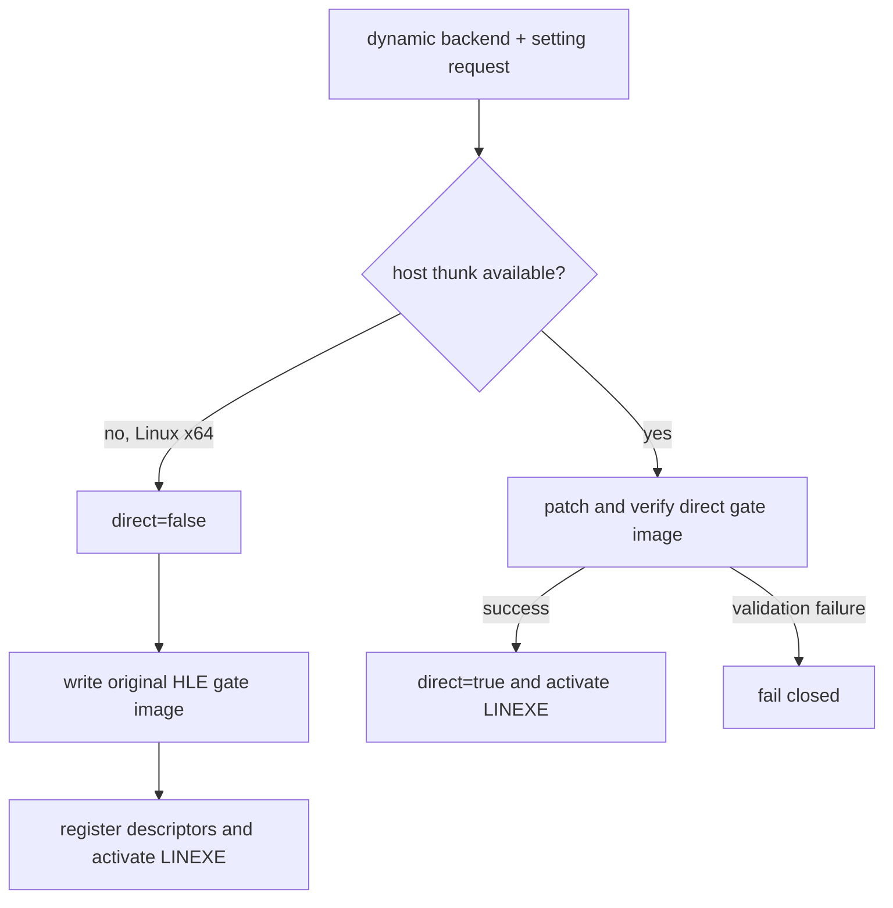

# Task 609 — Linux x64 LINEXE direct-dispatch capability 설계

## 목적

Task 608의 초기화 trace에서 Linux x64 기본 실행이
`linexe_environment_active=false`가 되는 첫 단계를 확인했습니다. 추출,
LINEXE plan, arena layout은 유효하지만 선택적 Glide direct-dispatch patch가
실패하여 전체 LINEXE 환경이 비활성화됩니다.

## 확인된 원인

`RunExecutionThread`는 dynamic backend와 환경 설정만 보고 direct dispatch를
활성화합니다. 이후 `PatchGlideGatePlanForDirectDispatch`는 32비트 guest
image에 삽입할 thunk 주소가 없으면 `false`를 반환합니다. Linux x64의
`GetGlideGateDirectDispatchThunkAddress()`는 현재 `nullptr`이므로,
`glide_gate_fits`가 false로 덮어써지고 일반 HLE gate image까지 기록되지
않습니다.

이 direct patch는 성능 최적화이며 DOS/4GW LINEXE 환경의 필수 요소가
아닙니다. 기존 UD2 기반 Glide gate image는 VEH/HLE 경계에서 처리할 수
있으므로, direct thunk가 없는 host에서는 이 경로를 보존해야 합니다.

## 설계 결정

1. direct dispatch 설정을 정책 요청과 host capability로 분리합니다.
2. host thunk capability가 없으면 실제 `direct_glide_dispatch`를 false로
   만들고, 검증된 기본 Glide gate plan을 그대로 기록합니다.
3. capability가 있는 host에서는 기존 `CALL thunk + RET imm16` patch와
   image verification을 그대로 사용합니다.
4. capability가 있는 host에서 patch 자체가 ABI/layout 검증으로 실패하면
   기존 fail-closed 동작을 유지합니다. 임의로 부분 patch를 사용하지
   않습니다.
5. `REPIU_LINEXE_INIT_TRACE`에 요청 상태와 capability 상태를 함께 기록하여
   requested-but-unavailable와 validation failure를 구분합니다.
6. 로더의 direct-dispatch 상태 로그도 실제 capability-aware 상태와
   일치시킵니다.

## 안전 경계

* 32비트 guest image에 64비트 host function pointer를 잘라 넣지 않습니다.
* 원본 guest code를 patch하지 않습니다.
* Linux x64에서 direct dispatch를 억지로 활성화하지 않습니다.
* 기존 trap/HLE Glide gate를 제거하거나 게임 로직을 C++로 재구현하지
  않습니다.
* 이 작업은 LINEXE 초기화를 통과시키는 범위이며, 그 이후 DPMI/guest
  초기화 오류의 의미를 추정하지 않습니다.

## 검증 전략

* Linux x64 core probe를 실행해 기존 24개 probe가 계속 통과하는지 확인합니다.
* 기본 설정 실행에서 `direct_requested=1`, `direct_capable=0`,
  `direct=0`, `glide_fits=1`, `active=1`을 확인합니다.
* `AX=FF00h` 반환이 `EAX=0000FFFFh`, `GS=0x20`인지 확인합니다.
* `CON` open/write가 계속 handle `0x0005`와 console sink로 동작하는지
  확인합니다.
* 실행이 더 진행되면 새 DOS/DPMI frontier를 별도로 기록합니다.

## English

### Purpose

Task 608's initialization trace identified why the default Linux x64 run sets
`linexe_environment_active=false`. Extraction, the LINEXE plan, and the arena
layout are valid, but the optional Glide direct-dispatch patch fails and
invalidates the entire LINEXE environment.

### Cause established

`RunExecutionThread` enables direct dispatch from the dynamic-backend and
environment setting alone. `PatchGlideGatePlanForDirectDispatch` then returns
`false` when no thunk address can be embedded in the 32-bit guest image. On
Linux x64, `GetGlideGateDirectDispatchThunkAddress()` currently returns
`nullptr`, so `glide_gate_fits` is overwritten to false and the normal HLE gate
image is not written.

The direct patch is a performance optimization, not a required part of the
DOS/4GW LINEXE environment. The existing UD2-based Glide gate image is handled
at the VEH/HLE boundary, so it must remain available when the host has no
direct thunk.

### Design decisions

1. Separate the direct-dispatch policy request from host capability.
2. If the host thunk is unavailable, set actual `direct_glide_dispatch` to
   false and write the validated base Glide gate plan unchanged.
3. On capable hosts, retain the existing `CALL thunk + RET imm16` patch and
   image verification.
4. If a capable host fails patch ABI/layout validation, retain the existing
   fail-closed behavior; do not use a partial patch.
5. Extend `REPIU_LINEXE_INIT_TRACE` with request and capability state so
   requested-but-unavailable is distinct from validation failure.
6. Make the loader's direct-dispatch status log reflect the actual
   capability-aware state.

### Safety boundary

* Never truncate a 64-bit host function pointer into the 32-bit guest image.
* Do not patch the original guest code.
* Do not force direct dispatch on Linux x64.
* Preserve the existing trap/HLE Glide gate and do not reimplement game logic.
* Limit this task to completing LINEXE initialization; do not infer the meaning
  of the later DPMI/guest initialization error.

### Verification strategy

* Run the Linux x64 core probe and confirm all existing 24 probes still pass.
* In the default run, confirm `direct_requested=1`, `direct_capable=0`,
  `direct=0`, `glide_fits=1`, and `active=1`.
* Confirm `AX=FF00h` returns `EAX=0000FFFFh` with `GS=0x20`.
* Confirm `CON` open/write still uses handle `0x0005` and the console sink.
* If execution advances, record the new DOS/DPMI frontier separately.
