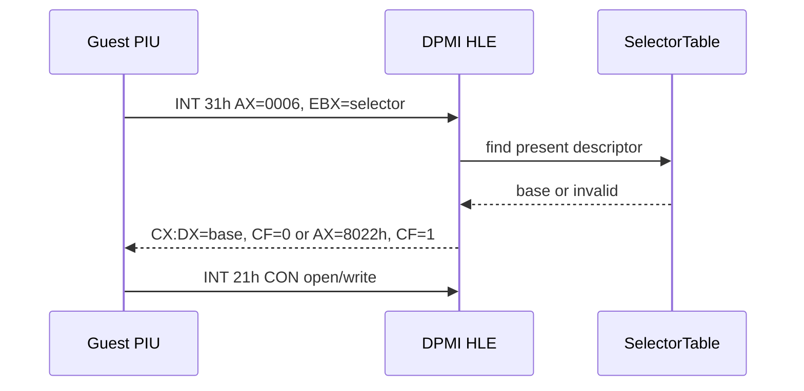
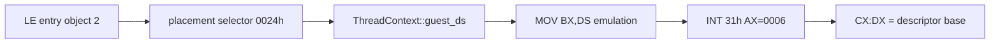
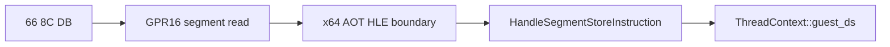

# Task 610 — DPMI `INT 31h AX=0006` frontier 설계

## 목적

Task 609에서 LINEXE 초기화를 활성화한 뒤 Linux x64 `pumpit2a`가
`INT 31h AX=0006`을 실행하고, `CON` open/write 후
`Not enough memory to allocate file structures`로 종료하는 경계를
확인했습니다. 현재 `AX=0006` HLE는 `EBX` selector의 descriptor base를
`CX:DX`로 반환하고 CF를 clear하도록 구현되어 있으므로, 먼저 실제 guest
호출 계약과 반환값을 기록합니다.

## 현재 근거

* Task 609 기본 실행은 LINEXE `active=1`, `AX=FF00h` 반환
  `EAX=0000FFFFh`, `GS=0x20`까지 확인되었습니다.
* 그 다음 DOS/DPMI trace의 세 번째 서비스는 `INT 31h AX=0006`입니다.
* 현재 실행에서는 그 뒤 `INT 21h AH=3Dh`가 `CON` handle `0x0005`로
  성공하고 `AH=40h`가 `0x2F` 바이트를 성공적으로 씁니다.
* 따라서 종료 메시지만으로 `AX=0006`의 실패를 단정할 수 없습니다.

## 설계 결정

1. `REPIU_DOS_INT_TRACE=1`에 opt-in `[repiu-dpmi-context]` trace를
   추가합니다.
2. 우선 `AX=0006` 진입/반환에서 guest EIP, EAX, EBX, ECX, EDX, ESI,
   EDI, ESP, EFLAGS, selector, descriptor base, 반환 `CX:DX`, CF를
   기록합니다.
3. 기본 실행의 출력량과 guest-visible register 동작은 변경하지 않습니다.
4. descriptor가 없거나 present가 아니면 기존 `0x8022`/CF set 계약을
   유지하고, 임의의 base나 selector를 만들어내지 않습니다.
5. trace가 실제 계약 오류를 확정할 때만 같은 작업의 별도 구현 단계에서
   HLE를 수정합니다. trace가 성공을 확정하면 종료 오류를 다음 guest
   initialization frontier로 분리합니다.



## 안전 경계

* 원본 guest binary를 수정하지 않습니다.
* 특정 guest EIP를 우회하지 않습니다.
* DPMI 표준의 관찰되지 않은 함수 의미를 추정하지 않습니다.
* `AX=0006` trace가 원인을 증명하기 전에는 반환값을 바꾸지 않습니다.

## 검증 전략

* Linux x64 build와 `repiu_core_probe`를 실행합니다.
* `pumpit2a` 기본 실행에서 `[repiu-dpmi-context]` entry/return을 수집합니다.
* `AX=0006` selector가 LINEXE descriptor table에 존재하는지와 반환
  `CX:DX`가 descriptor base와 일치하는지 비교합니다.
* `CON` open/write 및 fault-free termination 경계를 회귀 확인합니다.
* 원인이 `AX=0006`가 아니면 해당 사실과 다음 EIP/frontier를 로그에
  기록하고 추가 HLE를 추정하지 않습니다.

## 추가 확인 및 구현 범위

`AX=0006` trace는 실패한 DPMI 반환이 아니라, 호출자가 `BX=0`을 넣고
들어온 것을 확인했습니다. 원본 바이트 dump에서 `0x010F1805`의
`66 8C DB`는 ModRM 세그먼트 필드가 `3`인 `MOV BX,DS`이고, 뒤의
`0x010F1808`이 `INT 31h`입니다. planner probe도 이 명령을
`kGuardedSegmentRead`, `DS`, `BX(GPR16)`로 분류하며 x64에서는 HLE
boundary로 fail-closed하는 것을 확인했습니다.

실행 trace에서 `MOV BX,DS`는 HLE로 처리되지만 당시
`ThreadContext::guest_ds=0x0000`이어서 실제로 `BX=0`이 되었습니다.
같은 실행에서 guest entry가 속한 LE object 2의 placement selector는
`0x0024`이고, DPMI `AX=0006`은 이 selector를 받아야 descriptor base
`0x01010000`을 반환할 수 있습니다. 따라서 다음 구현은 entry address가
속한 placement binding을 guest 초기 DS로 사용합니다. 이는 임의 selector
주입이 아니라 LE object/selector binding에서 유도한 초기 상태입니다.

guest stack은 별도로 LE object 4(`0x01110000..0x0158CC90`)의 placement
selector `0x0034`로 확인되었으며, 현재 SS logical-state 초기화는 stack
실행을 위한 독립적인 수정으로 유지합니다. 이는 이번 `MOV BX,DS`의
DPMI 입력을 해결하는 근거로 사용하지 않습니다. DPMI `AX=0006`의
invalid-selector 응답과 descriptor base 반환 계약은 유지합니다.

추가 AOT 확인 결과 현재 planner는 이미 `GPR16` segment read를 분류하고
x64 HLE boundary로 전달합니다. 따라서 이번 단계에서는 분류 회귀를
막는 probe를 남기고, guest-visible `MOV BX,DS` 결과가
`ThreadContext::guest_ds`에서 나오도록 초기 DS를 binding으로 시드합니다.
특정 EIP patch나 원본 코드 변경은 사용하지 않습니다.





### 최종 확인과 다음 경계

`pumpit2a`의 최신 Linux x64 실행에서 `AX=0006`은 selector `0x0024`와
descriptor base `0x01010000`을 받아 `CX:DX=0x01010000`, CF clear로
정상 반환한다. 이어서 `AH=3Dh`의 `CON` open은 handle `0x0005`를 반환하고,
`AH=40h`는 47바이트를 모두 기록한 뒤 `AX=4C01h`로 정상 종료한다.

종료 시점의 원본 allocator 전역은 object 4 기준으로 다음 상태이다.

```text
head=cursor=limit=0
gate=1 extension_limit=0x10
selector_limit=memory_base=0x0158CC90
mode=1 mode_flag=1
```

파일 구조체 allocator의 요청 크기 8은 내부에서 최소 단위 `0x1000`으로
정규화된다. 따라서 현재 요청 끝은 `0x0158DC90`이고,
`0x109A9D`의 경계 검사에서 `memory_base (0x0158CC90)`보다 커서 실패한다.
이 비교가 먼저 실패하므로 현재 실행에서는 DOS `AH=4Ah` resize interrupt까지
도달하지 않는다. 다음 작업은 DPMI selector나 `CON` HLE가 아니라, 원본
DOS/4GW memory-boundary 계약과 guest stack top 사이의 headroom을 설계하는
것이어야 한다.

`pumpit1`도 동일한 원본 오류 문구와 정상 DOS 종료까지 도달했지만,
현재 allocator 주소 진단은 `pumpit2a`의 auto-data/code 오프셋을 사용하므로
다른 대상의 진단 수치는 비교 증거로 사용하지 않는다. `pumpit2`는 이 환경에
CHD mount directory가 없어 실행 비교에서 제외했다.

### Final confirmation and next frontier

In the latest Linux x64 `pumpit2a` run, `AX=0006` receives selector `0x0024`
and descriptor base `0x01010000`, returning `CX:DX=0x01010000` with CF clear.
`AH=3Dh` then opens `CON` as handle `0x0005`, `AH=40h` writes all 47 bytes,
and `AX=4C01h` terminates normally.

The original allocator globals, interpreted relative to LE object 4, are:

```text
head=cursor=limit=0
gate=1 extension_limit=0x10
selector_limit=memory_base=0x0158CC90
mode=1 mode_flag=1
```

The file-structure allocation request of 8 is normalized to the internal
minimum `0x1000`. Its requested end is therefore `0x0158DC90`, which fails the
`0x109A9D` boundary check because it exceeds `memory_base (0x0158CC90)`.
The guest consequently does not reach DOS `AH=4Ah` in this run. The next task
must design the DOS/4GW memory-boundary contract and headroom between the guest
stack top and dynamic allocation, rather than changing DPMI selector handling
or `CON` HLE.

`pumpit1` also reaches the same original error text and normal DOS termination,
but the current allocator diagnostic uses `pumpit2a`-specific auto-data/code
offsets, so its values are not cross-target evidence. `pumpit2` was excluded
because this environment has no CHD mount directory for it.

## English

### Purpose

After Task 609 activates LINEXE, Linux x64 `pumpit2a` executes
`INT 31h AX=0006`, then opens/writes `CON`, and terminates with
`Not enough memory to allocate file structures`. The current `AX=0006` HLE
returns the descriptor base for the `EBX` selector in `CX:DX` and clears CF, so
the first step is to capture the actual guest contract and return value.

### Current evidence

* The Task 609 default run reaches LINEXE `active=1`, with `AX=FF00h` returning
  `EAX=0000FFFFh` and `GS=0x20`.
* The next DOS/DPMI trace entry is `INT 31h AX=0006`.
* The current run then opens `CON` as handle `0x0005` and successfully writes
  `0x2F` bytes through `AH=40h`.
* The termination message alone therefore cannot prove that `AX=0006` failed.

### Design decisions

1. Add an opt-in `[repiu-dpmi-context]` trace under
   `REPIU_DOS_INT_TRACE=1`.
2. Initially record guest EIP, EAX, EBX, ECX, EDX, ESI, EDI, ESP, EFLAGS,
   selector, descriptor base, returned `CX:DX`, and CF at `AX=0006` entry/return.
3. Keep default output and guest-visible register behavior unchanged.
4. Preserve the existing `0x8022`/CF-set response for missing descriptors and
   never fabricate a base or selector.
5. Change HLE behavior in this task only if the trace proves a contract error.
   If it proves success, split the termination error into the next guest
   initialization frontier.

### Safety boundary

* Do not modify the original guest binary.
* Do not bypass a specific guest EIP.
* Do not infer unobserved DPMI function semantics.
* Do not change the `AX=0006` return until the trace proves why.

### Verification strategy

* Run the Linux x64 build and `repiu_core_probe`.
* Collect `[repiu-dpmi-context]` entry/return lines from a default
  `pumpit2a` run.
* Compare the selector and returned `CX:DX` with the selector table's
  descriptor base.
* Recheck `CON` open/write and the fault-free termination boundary.
* If `AX=0006` is not the cause, record that fact and the next EIP/frontier
  without guessing another HLE.

### Confirmed diagnosis and implementation scope

The `AX=0006` trace shows that the caller entered with `BX=0`; it does not
show a failed DPMI response. A dump of the original bytes identifies
`0x010F1805` (`66 8C DB`) as `MOV BX,DS` (ModRM segment field `3`), immediately
before `0x010F1808` (`INT 31h`). The planner probe confirms the same bytes as
`kGuardedSegmentRead`, `DS`, and `BX(GPR16)`, with x64 failing closed to the
existing HLE boundary.

The runtime trace shows that this HLE boundary read logical
`ThreadContext::guest_ds`, which was still zero. The guest entry belongs to
LE object 2 and its placement binding is selector `0x0024`; the next change
seeds that binding as the initial logical DS so DPMI `AX=0006` receives the
selector whose descriptor base is `0x01010000`.

The startup log independently identifies the guest stack as LE object 4
(`0x01110000..0x0158CC90`), whose placement selector is `0x0034`. The logical
SS initialization remains as a separate stack-state fix, but it is not the
selector read by this DPMI call. The existing DPMI invalid-selector and
descriptor-base behavior remains unchanged. No EIP-specific patch or
original-code mutation is used.

### 추가 진단 단계

`AX=0006` 성공 이후에도 동일한 종료 문구가 남으므로, `CON` write를 원인으로
간주하지 않고 오류 보고 호출부를 분리한다. `AH=40h` trace를 opt-in으로
확장하여 write 시점의 guest EIP, buffer 주소, handle, byte count를 기록한다.
원본 오류 printer의 호출 규약은 `EAX=메시지 주소`, `EDX=종료 코드`이므로,
기록된 buffer 주소와 원본 LE 주소를 대조하여 실제 fatal caller를 연결한다.

### Additional diagnostic stage

Because the same termination text remains after `AX=0006` succeeds, the `CON`
write must not be treated as the cause. Extend the opt-in `AH=40h` trace with
the guest EIP, buffer address, handle, and byte count at the write. The original
error printer receives `EAX=message address` and `EDX=exit code`; correlate the
observed write buffer with the original LE address to identify the actual fatal
caller.


