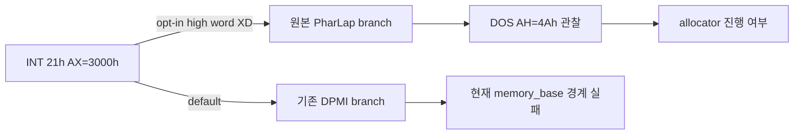

# Task 611 — DOS/4GW memory path probe 설계

## 한국어

### 배경

Task610에서 Linux x64 `pumpit2a`는 DPMI `AX=0006h`와 `CON` I/O를 통과했지만,
원본 file-structure allocator가 첫 8바이트 요청을 `0x1000`으로 정규화한 뒤
`memory_base=0x0158CC90`을 넘어 실패했다. 현재 guest startup은
`AX=3000h`의 상위 반환값을 검사해 PharLap 계열과 기본 DPMI 계열을 나눈다.

현재 HLE는 표준 DOS version 응답 `AX=0007h`만 반환하므로 기본 DPMI 분기로
진입한다. 원본 PharLap 분기는 DS의 memory boundary를 읽고 DOS `AH=4Ah`를
호출하는 정적 증거가 있다. 이 분기가 현재 HLE의 arena headroom과 연결될 수
있는지는 아직 실행으로 확인하지 않았다.

Open Watcom의 공식 DOS/4GW 문서는 DPMI 환경에서 고정 start/end 주소가
의미 없고, DPMI가 관리하는 메모리의 크기는 지정할 수 있다고 설명한다.
이 문서는 주소를 임의로 주입할 근거가 아니라, 두 초기화 path를 분리해서
검증해야 한다는 배경 근거로 사용한다.

참조: [Open Watcom DOS/4GW Configuration Guide](https://github.com/open-watcom/open-watcom-v2/blob/master/bld/redist/dos4gw/dos4gw.doc)

### 목표

* 기본 DOS `AX=3000h` 반환 계약을 변경하지 않는다.
* opt-in 환경변수에서만 PharLap signature를 상위 word에 넣는다.
* 해당 probe가 원본 PharLap branch, DOS `AH=4Ah`, allocator 진행으로
  이어지는지 기록한다.
* 결과가 긍정적이어도 즉시 영구 HLE로 승격하지 않고, memory contract의
  후속 설계 근거로 남긴다.

### 비목표

* 기본 실행에서 `AX=3000h` 결과 변경
* free-list node 또는 allocator 전역의 임의 주입
* 특정 guest EIP 우회
* DOS `AH=4Ah`를 호출하지 않은 상태에서 resize 성공을 가정
* stack object의 선언된 크기나 LE stack offset 변경

### Probe 계약

환경변수 `REPIU_DOS4GW_MEMORY_PATH_PROBE=pharlap`일 때만
`INT 21h AX=3000h`의 기존 low word `0x0007`은 유지하고 high word를
`0x4458`(`"XD"`)로 설정한다. 기본값, 알 수 없는 값, 다른 값은 기존
응답을 유지한다. trace에는 probe 활성 상태와 반환 EAX를 함께 기록한다.

### 판정 기준

* `pharlap` probe에서 `AH=4Ah`가 관찰되면: DS:0x5C 값, resize selector,
  paragraph count, 결과 주소를 기록하고 다음 memory-boundary 설계로 이동한다.
* `AH=4Ah`가 없고 같은 오류로 종료하면: signature가 allocator boundary를
  해결하지 못한 것으로 판단하고 probe를 영구 계약으로 승격하지 않는다.
* fault, selector invalid, 또는 arena 밖 write가 발생하면: probe를 실패한
  가설로 기록하고 기본 경로로 되돌린다.

### 검증

1. Linux x64 `repiu_core_probe`를 실행해 기존 24개 검사를 유지한다.
2. 기본 `pumpit2a` 실행에서 `AX=0007h`, `AH=4Ah` 미도달, `4C01h`를 확인한다.
3. probe 실행에서 `AX=44580007h` 관찰, 원본 분기, `AH=4Ah` 여부를 확인한다.
4. 두 실행 모두 SIGSEGV/SIGILL과 임의 allocator state injection이 없는지
   확인한다.

### Probe 결과

`pharlap` probe는 예상대로 `AX=44580007h`를 반환했고 원본
`INT 21h AH=4Ah`까지 도달했다. resize 요청은 selector `0x0024`,
`EBX=0x11A8`, requested end `0x01021A80`으로 HLE에서 성공 처리됐다.
그러나 이후에도 원본은 같은 file-structure 오류 문구를 출력하고
`AX=4C01h`로 종료했다. 따라서 PharLap signature는 실제 분기를 여는
관찰 수단으로는 유효하지만, allocator 성공 계약을 증명하지 못했으며
기본 HLE 응답으로 승격하지 않는다.

### Probe result

The `pharlap` probe returned `AX=44580007h` as expected and reached the
original `INT 21h AH=4Ah`. The resize request used selector `0x0024`,
`EBX=0x11A8`, and requested end `0x01021A80`; the HLE accepted it.
The original code nevertheless printed the same file-structure error and
terminated with `AX=4C01h`. The PharLap signature is therefore useful as an
observation switch, but it does not prove allocator success and is not promoted
to the default HLE response.

## English

### Background

Task 610 showed that Linux x64 `pumpit2a` passes DPMI `AX=0006h` and `CON`
I/O, but the original file-structure allocator normalizes its first request of
8 bytes to `0x1000` and fails because `memory_base=0x0158CC90`. Guest startup
checks the upper return word of `AX=3000h` to select between a PharLap-like
path and the default DPMI path.

The current HLE returns only the standard DOS version response `AX=0007h`, so
the default DPMI path is selected. Static evidence shows that the original
PharLap path reads a DS memory boundary and calls DOS `AH=4Ah`. Whether that
path can connect to the HLE arena headroom has not been tested at runtime.

The official Open Watcom DOS/4GW guide explains that fixed start/end addresses
are not meaningful under DPMI, while a size may be specified for DPMI-managed
memory. This is background for separating the two initialization paths, not a
license to inject an arbitrary address.

Reference: [Open Watcom DOS/4GW Configuration Guide](https://github.com/open-watcom/open-watcom-v2/blob/master/bld/redist/dos4gw/dos4gw.doc)

### Goals

* Keep the default DOS `AX=3000h` return contract unchanged.
* Add the PharLap signature only under an opt-in environment variable.
* Record whether the probe reaches the original PharLap branch, DOS `AH=4Ah`,
  and allocator progress.
* Do not promote a positive probe to permanent HLE until the memory contract is
  designed separately.

### Non-goals

* Changing `AX=3000h` in the default run.
* Injecting a free-list node or allocator globals.
* Bypassing a guest EIP.
* Assuming resize success without observing DOS `AH=4Ah`.
* Changing the declared stack-object size or LE stack offset.

### Probe contract

When `REPIU_DOS4GW_MEMORY_PATH_PROBE=pharlap` is set, preserve the existing
low word `0x0007` of `INT 21h AX=3000h` and set only the high word to
`0x4458` (`"XD"`). The unset, unknown, and other values preserve the existing
response. The trace records whether the probe is active and the returned EAX.

### Decision criteria

* If the probe observes `AH=4Ah`, record DS:0x5C, resize selector, paragraph
  count, and result addresses, then design the next memory-boundary contract.
* If it still terminates with the same error without `AH=4Ah`, reject the
  signature as an allocator solution and do not promote it.
* If it faults, sees an invalid selector, or writes outside the arena, record
  the probe as a rejected hypothesis and return to the default path.

### Verification

1. Run the Linux x64 `repiu_core_probe` and preserve all 24 existing checks.
2. Run default `pumpit2a` and confirm `AX=0007h`, no `AH=4Ah`, and `4C01h`.
3. Run the probe and inspect `AX=44580007h`, branch selection, and `AH=4Ah`.
4. Confirm both runs have no SIGSEGV/SIGILL and no arbitrary allocator-state
   injection.
