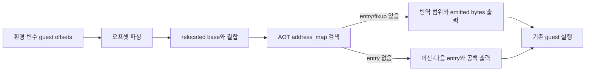

# Task 612 — AOT guest 주소 맵 추적 설계

## 한국어

### 배경

Task 611에서 PharLap 계열 memory path와 DOS `AH=4Ah` 도달은 확인했지만,
resize 이후 원본 allocator가 다음 상태로 진행하지 않는 원인은 아직 확정되지
않았습니다. allocator 본체(`0x010F1D74`)와 보조 함수 주소에 execution sentinel을
설치했을 때 일부 주소가 hit되지 않았습니다. 그러나 sentinel은 AOT 블록 시작점에만
설치되므로, 이 결과만으로 direct call 또는 보조 함수가 번역되지 않았다고 결론 낼
수 없습니다.

### 목표

초기 AOT 배치 결과와 guest 종료 후 최종 AOT 배치 결과에서 지정한 guest 주소가
어떤 주소 맵 entry와 연결되는지 읽기 전용으로 확인합니다. 실행 중 동적 append가
같은 guest 주소의 새 entry를 추가할 수 있으므로, 두 시점의 결과를 함께 봅니다.
이를 통해 다음 가설을 구분합니다.

1. 지정 주소가 AOT map에 없어서 원본 경로가 번역되지 않은 경우
2. 지정 주소가 다른 instruction 범위에 포함되어 map에는 있으나 별도 진입점이
   아닌 경우
3. direct edge fixup은 존재하지만 대상 cache 연결이 다른 경우
4. 주소와 번역은 정상이며, 실제 문제는 실행 중 재진입 또는 guest memory 상태인 경우

### 진단 인터페이스

`REPIU_AOT_GUEST_MAP_TRACE`가 설정된 경우 쉼표로 구분된 32-bit hexadecimal
guest offset을 읽습니다. offset은 relocated image base 기준이며, 다음처럼
사용합니다.

```text
REPIU_AOT_GUEST_MAP_TRACE=0xF1D74,0xF1E17,0xF1E1C,0xF4FE8,0xF5134,0xF849D
```

각 target에 대해 phase(`initial` 또는 `final`), absolute guest address,
exact/covering map entry, cache offset, guest/emitted 길이, 비활성 entry 여부,
대응 fixup, emitted bytes를 출력합니다. 일치하는 entry가
없으면 가장 가까운 이전/다음 map entry를 출력하여 CFG 공백 여부를 확인할 수
있게 합니다. 값이 없거나 너무 길거나 파싱되지 않는 항목은 실행을 중단시키지
않고 `invalid`로 기록합니다.

### 안전성 경계

* 기본 실행에서는 환경 변수가 없으므로 출력과 동작이 변하지 않습니다.
* 진단은 초기 배치 전과 guest/translation worker가 정리된 후에만 수행하며
  map/cache를 수정하지 않습니다.
* guest EIP를 건너뛰거나, allocator free-list·selector limit·stack 값을 변경하지
  않습니다.
* emitted bytes는 placement가 유효하고 entry 범위가 cache 크기 안에 있을 때만
  읽습니다.



### 검증 기준

* Linux x64 debug 빌드가 성공해야 합니다.
* `repiu_core_probe` 기존 전체 검사가 유지되어야 합니다.
* 기본 `pumpit2a` 실행 결과와 종료 방식이 변하지 않아야 합니다.
* trace 실행에서 allocator 본체와 보조 함수 target의 map coverage를 관찰할 수
   있어야 하며, trace 미설정 실행에는 새 출력이 없어야 합니다.

## English

### Background

Task 611 confirmed that the PharLap-style memory path and DOS `AH=4Ah` are
reachable, but it did not establish why the original allocator does not continue
after resize. Execution sentinels installed at the allocator body
(`0x010F1D74`) and helper addresses did not all fire. A sentinel is only
installed at an AOT block entry, however, so that observation cannot prove that a
direct call or helper was not translated.

### Goal

Add a read-only inspection of the initial AOT placement for selected guest
addresses. The trace distinguishes:

1. an address absent from the AOT map,
2. an address covered by another instruction but not a block entry,
3. a direct-edge fixup whose cache linkage differs from the expected path, and
4. a normally mapped address where the remaining issue is runtime re-entry or
   guest memory state.

### Diagnostic interface

When `REPIU_AOT_GUEST_MAP_TRACE` is set, parse comma-separated 32-bit
hexadecimal guest offsets relative to the relocated image base. The same targets
are reported once at initial placement and once after the guest and translation
worker have stopped, so dynamic appended generations are visible:

```text
REPIU_AOT_GUEST_MAP_TRACE=0xF1D74,0xF1E17,0xF1E1C,0xF4FE8,0xF5134,0xF849D
```

For each target, print the phase (`initial` or `final`), absolute guest address,
exact/covering map entries, cache offset, guest/emitted lengths, inactive status,
matching fixup, and the leading emitted bytes. If no entry matches, print the
nearest preceding and following map entries to expose a CFG gap. Missing,
oversized, or malformed items are reported as `invalid` without stopping
execution.

### Safety boundary

* With the variable unset, default output and behavior are unchanged.
* The trace runs once before AOT execution and once after the guest and translation workers stop; it does not mutate the map or cache.
* It does not bypass guest EIP or change allocator free-list, selector limits, or
  stack values.
* Emitted bytes are read only when the placement is valid and the entry lies
  within the cache size.

### Verification

* The Linux x64 debug build must succeed.
* All existing `repiu_core_probe` checks must remain green.
* Default `pumpit2a` behavior and termination must remain unchanged.
* The opt-in run must expose initial and final map coverage for the allocator body
  and helper targets, while the default run remains free of the new output.
