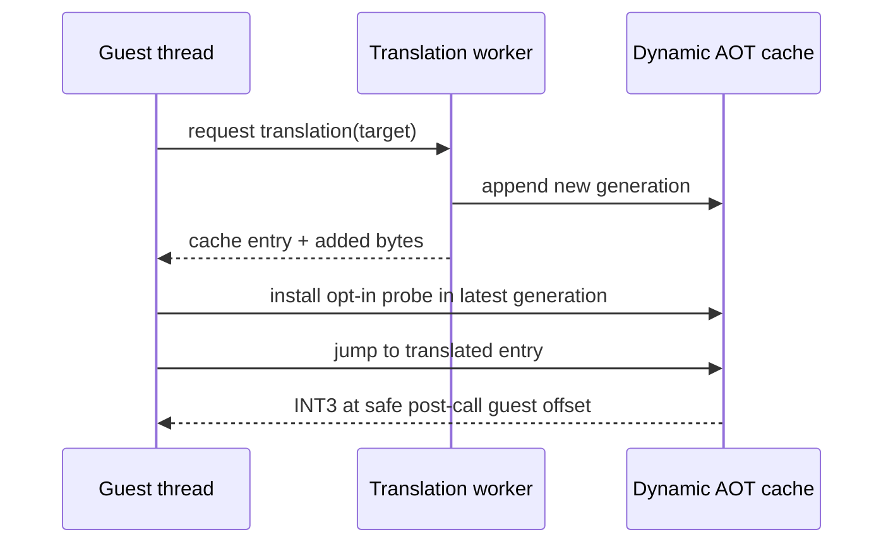

# Task 613 — Linux x64 동적 AOT probe generation 추적 설계

## 한국어

### 배경

Task 612에서 allocator와 helper가 초기 map과 동적 map 세대 모두에 존재하고,
`0x010F1E17 -> 0x010F4FE8` direct-call fixup도 해결됨을 확인했습니다. 그러나
기존 `REPIU_EXECUTION_PROBE_OFFSET`은 초기 AOT 배치에서 첫 번째 map entry만
INT3로 바꾸므로, 실행 중 append된 generation의 동일 guest offset을 관찰하지
못할 수 있습니다.

### 목표

동적 AOT image가 guest thread에 공개되기 직전에 현재 generation에서 지정한
probe guest offset의 active map entry를 INT3로 표시합니다. 이를 통해 원본
guest 코드의 CALL이나 stack instruction을 직접 single-step하지 않고, 호출
직후의 안전한 non-stack instruction에서 helper 반환 레지스터를 관찰합니다.

기본 관찰 예시는 allocator 호출 직후의 `TEST EAX,EAX`입니다.

```text
REPIU_EXECUTION_PROBE_OFFSET=0xF1E1C
```

### 동작 경계

* 환경 변수로 probe를 설정한 경우에만 동적 generation patch를 수행합니다.
* patch 시점은 동적 worker가 append를 완료하고 guest thread가 cache entry로
  이동하기 직전입니다. 이 구간에서는 해당 placement를 수정할 다른 guest
  실행이 없습니다.
* 새 generation의 guest offset exact entry만 찾고, inactive entry는 건너뜁니다.
* cache를 잠시 read-write로 전환하고 첫 byte를 `INT3`로 바꾼 뒤 execute-read로
  복구하고 instruction cache를 flush합니다.
* probe가 없거나 target이 새 image에 없으면 append 성공/실패와 실행 결과를
  변경하지 않습니다.
* guest EIP, 원본 executable, selector, stack, allocator state, memory contract는
  변경하지 않습니다.



### 검증 전략

1. Linux x64 debug에서 `repiu`와 `repiu_core_probe`를 빌드합니다.
2. `REPIU_EXECUTION_PROBE_OFFSET=0xF1E1C`로 `pumpit2a`를 실행합니다.
3. probe snapshot의 `hit=true`와 `EAX`를 확인하고, 기존 DOS 종료 경계를
   비교합니다.
4. probe 환경 변수 없이 실행하여 새 로그와 동작 변화가 없는지 확인합니다.

## English

### Background

Task 612 confirmed that the allocator and helpers exist in both the initial map
and dynamically appended generations, and that the direct call
`0x010F1E17 -> 0x010F4FE8` is resolved. The existing
`REPIU_EXECUTION_PROBE_OFFSET` only patches the first matching entry in the
initial AOT placement, so it can miss the same guest offset in an appended
generation.

### Goal

Immediately before a dynamic AOT image is exposed to the guest thread, mark the
active map entry for the configured probe offset in that generation with INT3.
This observes the helper's return register at a safe non-stack instruction after
the call, without single-stepping the original CALL or guest stack operations.

The probe snapshot must also copy the fixed-width Linux x64 guest context. The
Linux x64 platform context deliberately carries `Eax`, `Eflags`, and the other
32-bit guest fields even though the host process is 64-bit; leaving the copy
guarded by the i386 preprocessor condition makes a successful probe report an
empty snapshot.

The allocator post-call `TEST EAX,EAX` is the intended first observation:

```text
REPIU_EXECUTION_PROBE_OFFSET=0xF1E1C
```

### Safety boundary

* Dynamic-generation patching is enabled only when the execution probe is
  configured through the environment.
* It runs after the worker completes the append and before the guest jumps to
  the returned cache entry. No other guest execution can modify the placement
  in that rendezvous window.
* Only exact active entries for the configured guest offset in the new image are
  considered; inactive entries are skipped.
* The cache is temporarily made read-write, its first byte is changed to INT3,
  execute-read protection is restored, and the instruction cache is flushed.
* A missing probe or target entry does not change append success/failure or guest
  execution.
* Guest EIP, the original executable, selectors, the stack, allocator state, and
  the memory contract are not changed.
* Linux x64 probe snapshots copy the already-materialized guest fields; they do
  not reinterpret or modify host `RSP` or host-width registers.

### Verification

1. Build Linux x64 Debug `repiu` and `repiu_core_probe`.
2. Run `pumpit2a` with `REPIU_EXECUTION_PROBE_OFFSET=0xF1E1C`.
3. Confirm `hit=true`, capture the probe `EAX`, and compare the existing DOS
   termination boundary.
4. Run without the probe variable and confirm no new output or behavior change.
