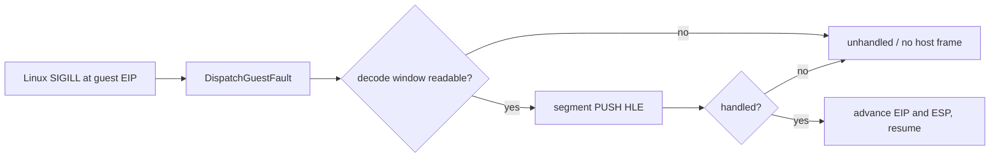

# 20260906-615 Linux x64 segment HLE attribution

## 한국어

### 배경

Task 614에서 Linux x64 AOT가 allocator의 high-byte source를 올바르게
재인코딩한 뒤, 실행은 이전의 잘못된 branch를 지나 원본 guest
`0x010F4A96`의 `PUSH ES` 경계까지 도달했습니다. 그러나 현재 실행은
`no-host-frame-to-unwind`로 종료되므로, 이미 있는 segment HLE이 호출되지
않았는지, 호출되었지만 operand/stack 검증에서 거절되었는지 아직 구분되지
않습니다.

### 목표

동작 경로를 바꾸지 않고 다음 세 지점을 opt-in으로 구분합니다.

1. Linux fault callback이 guest fault를 `DispatchGuestFault`까지 전달했는가
2. x64 decode window가 HLE handler를 실행할 수 있다고 판정했는가
3. `HandleSegmentPushInstruction`이 guest stack에 selector를 기록하고
   resume을 반환했는가

### 진단 계약

`REPIU_SEGMENT_HLE_TRACE=1`일 때만 최대 16회의 segment-chain 진단을
출력합니다. 진단은 fault kind, guest EIP/opcode, decode-window 결과,
segment HLE 활성화 상태, `cache_entry_active`, `active_call_state`, guest
ESP/ES selector, handler 결과를 포함합니다. 환경 변수가 없거나 `0`이면
기존 출력과 제어 흐름을 유지합니다.

### 범위

이번 단위에서는 `RecoverGuestStackException`의 x64 반환 계약을 변경하지
않습니다. handler가 성공하지 않은 원인이 확인된 뒤에만 fault recovery 또는
segment HLE 구현을 별도 설계합니다.

## English

### Background

After Task 614 made the Linux x64 AOT high-byte source correct, execution moved
past the previously wrong allocator branch and reached the original guest
`PUSH ES` boundary at `0x010F4A96`. The run still exits as
`no-host-frame-to-unwind`, so it is not yet clear whether segment HLE was never
called or whether it rejected the decoded instruction or stack destination.

### Goal

Without changing the execution path, distinguish three points with opt-in
diagnostics:

1. whether the Linux fault callback delivered the guest fault to
   `DispatchGuestFault`;
2. whether the x64 decode window was accepted for HLE dispatch; and
3. whether `HandleSegmentPushInstruction` wrote the selector to the guest stack
   and returned resume.

### Diagnostic contract

With `REPIU_SEGMENT_HLE_TRACE=1`, print at most 16 segment-chain diagnostics.
The line includes the fault kind, guest EIP/opcode, decode-window result,
segment-HLE enablement, `cache_entry_active`, `active_call_state`, guest ESP/ES
selector, and the handler result. With the variable absent or set to `0`, the
existing output and control flow remain unchanged.

### Scope

This unit does not change the x64 `RecoverGuestStackException` return contract.
Only after the diagnostic identifies the rejection point will fault recovery or
segment HLE behavior receive a separate design.

### Verified routing requirement

The first run showed that `PUSH ES` is not handled directly by the later
fault-chain call. It reaches `DispatchGuestHleHandlers` from the single-step
path after `DispatchGuestFault` re-arms execution. The trace therefore covers
both the shared dispatch path and the later fault-chain path, while preserving
the existing control flow.
