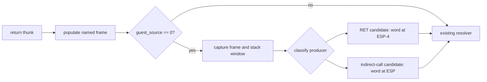

# 20260906-616 Linux x64 반환 source provenance 설계

## 한국어

### 배경

현재 Linux x64 AOT는 `RepiuLinuxX64ReturnThunk`를 일반 `RET`와 간접 호출
target transfer에 함께 사용합니다. 일반 `RET`에서는 `R14D`가 guest stack에서
pop한 반환 주소이고, 간접 호출에서는 `R14D`가 target load 결과입니다. 두
경로가 같은 resolver를 사용하므로 다음 로그만으로는 원인을 구분할 수 없습니다.

```text
[repiu-x64-return] result=translation-failed source=0x00000000 ...
```

현재 unhandled fault 창에는 `guest ESP=0x0158CC4C`,
`guest_stack_m4=0x00000000`, `guest_stack_0=0x010F1026`가 관찰됐습니다.
이는 direct `RET`가 `ESP-4`의 0을 소비한 경우와, indirect call이 target 0을
resolver에 전달하면서 현재 ESP에 유효한 fallthrough를 남긴 경우를 모두
설명할 수 있습니다. resolver frame을 직접 관찰하기 전에는 어느 가설도
확정하지 않습니다.

### 목표

`guest_source=0`일 때 resolver 입력 frame과 guest stack의 provenance를
변경 없이 기록합니다.

* frame의 `guest_source`, `guest.eip`, `guest.esp`, EFLAGS와 continuation 필드
* frame guest ESP 기준 `-8`, `-4`, `0`, `+4`의 32-bit stack word와 valid mask
* 마지막 indirect/return 관찰값과 AOT call depth
* `source`가 각 stack word와 일치하는지 여부

진단은 `REPIU_LINUX_X64_RETURN_FRAME_TRACE=1`일 때만 최대 8회 출력하며,
guest 범위 확인과 fault-safe copy를 사용합니다. 환경 변수가 없거나 `0`이면
제어 흐름과 기존 출력은 변하지 않습니다.

두 producer를 확정적으로 구분하기 위해 emitter는 thunk 진입 직전에 caller-
saved `R10D`에 producer tag를 넣습니다. 일반 `RET`는 0, indirect call은 1이며,
thunk는 이 값을 named frame의 기존 `status` 필드에 복사합니다. `MOV R10D,
imm32`는 guest GPR/flags를 변경하지 않고, 이 tag는 resolver 진단용 frame
metadata일 뿐 guest control flow를 선택하지 않습니다.



### 경계

* 이번 작업에서는 resolver 결과, thunk branch, fault recovery contract를
  변경하지 않습니다.
* `source=0`을 유효한 guest target으로 보정하지 않습니다.
* stack window가 unreadable인 경우 임의 dereference를 하지 않고 valid mask로
  표시합니다.
* 진단 결과가 확정한 producer별 수정은 후속 설계와 작업으로 분리합니다.

## English

### Background

Linux x64 AOT currently uses `RepiuLinuxX64ReturnThunk` for both ordinary
`RET` and indirect-call target transfers. For an ordinary `RET`, `R14D` is the
return address popped from the guest stack. For an indirect call, `R14D` is the
loaded target. Both paths use the same resolver, so this line alone is
ambiguous:

```text
[repiu-x64-return] result=translation-failed source=0x00000000 ...
```

The current unhandled-fault window observes guest `ESP=0x0158CC4C`,
`guest_stack_m4=0x00000000`, and `guest_stack_0=0x010F1026`. That is consistent
both with a direct `RET` consuming zero at `ESP-4` and with an indirect call
passing target zero to the resolver while leaving a valid fallthrough at the
current ESP. Neither hypothesis is accepted until the resolver frame is
observed directly.

### Goal

When `guest_source=0`, record the resolver input frame and guest-stack
provenance without changing execution:

* frame `guest_source`, `guest.eip`, `guest.esp`, EFLAGS, and continuation fields;
* 32-bit stack words at frame guest ESP `-8`, `-4`, `0`, and `+4`, with a valid
  mask;
* the last indirect/return observations and AOT call depth; and
* whether `source` matches any captured stack word.

The diagnostic is bounded to eight events and enabled only by
`REPIU_LINUX_X64_RETURN_FRAME_TRACE=1`. It uses guest-range validation and a
fault-safe copy. With the variable absent or set to `0`, control flow and
existing output remain unchanged.

To distinguish the two producers conclusively, the emitter places a producer
tag in caller-saved `R10D` immediately before entering the thunk: 0 for an
ordinary `RET` and 1 for an indirect call. The thunk copies this value into the
named frame's existing `status` field. `MOV R10D, imm32` changes neither guest
GPRs nor flags; the tag is resolver metadata and does not select guest control
flow.


### Boundaries

* This task does not change the resolver result, thunk branch, or fault-recovery
  contract.
* It does not turn `source=0` into a fabricated guest target.
* An unreadable stack window is reported through the valid mask rather than
  being dereferenced speculatively.
* Any producer-specific fix required by the evidence becomes a separate design
  and work order.
