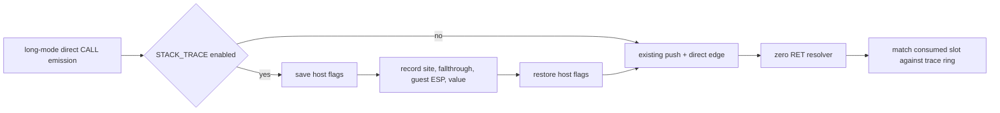

# Task 618: Linux x64 direct-call guest-stack provenance trace

## 한국어

### 목적

Task 617에서 Linux x64의 실패 지점은 게스트 `RET` `0x010F101D`가
`0x0158CC48`의 0을 반환 주소로 소비하는 것으로 좁혀졌다. 이 0이 AOT가
생성한 direct `CALL`의 스택 기록 실패인지, 다른 게스트 명령 또는 초기
스택 상태인지 구분해야 한다.

### 설계

1. `REPIU_LINUX_X64_STACK_TRACE=1`일 때만 direct `CALL`의 long-mode
   emission 직후에 진단 코드를 추가한다.
2. 진단 코드는 게스트 의미를 바꾸지 않도록 host `RFLAGS`를 보존하고,
   guest `R15D`에 기록된 ESP와 push한 반환 주소를 별도 trace ring에
   기록한다.
3. trace ring은 현재 x64 dispatch frame에 두고, 기존 resolver가 zero
   return frame을 출력할 때 `guest_esp - 4`와 일치하는 direct-call 기록만
   출력한다.
4. trace가 꺼져 있으면 생성 바이트와 실행 경로를 변경하지 않는다. trace가
   켜져 있어도 반환 주소를 보정하거나 실행을 계속하지 않는다.

### 비범위

이 작업은 zero 반환 주소를 임의의 주소로 복구하지 않는다. indirect `CALL`,
일반 게스트 `PUSH`/메모리 store, HLE 경계의 스택 기록은 이번 direct-call
trace의 범위 밖이며, direct-call 기록이 없을 때의 결론은 별도 증거로 남긴다.

### 검증 기준

* 기존 Linux x64 core probe가 계속 통과한다.
* trace를 켠 실행에서 terminal zero `RET`의 소비 슬롯과 일치하는 direct-call
  기록 유무가 로그로 확인된다.
* trace를 끈 실행에서 기존 AOT emission 결과와 런타임 경로가 유지된다.

## English

### Purpose

Task 617 narrowed the Linux x64 failure to guest `RET` `0x010F101D`
consuming zero at `0x0158CC48` as its return address. The next question is
whether that zero came from a failed AOT direct-call stack write, another guest
instruction, or initial stack state.

### Design

1. Add the diagnostic sequence after long-mode direct-call emission only when
   `REPIU_LINUX_X64_STACK_TRACE=1` is present.
2. Preserve host `RFLAGS` so the sequence has no guest-visible flag effect, and
   record the guest `R15D` stack pointer plus the pushed fallthrough address in
   a trace ring.
3. Keep the ring in the current x64 dispatch frame. When the existing resolver
   reports a zero return frame, print only records whose post-push ESP matches
   `guest_esp - 4`.
4. With tracing disabled, do not change emitted bytes or execution. Even with
   tracing enabled, do not repair the return address or continue execution.

### Out of scope

This task does not synthesize a zero return target. Indirect calls, ordinary
guest `PUSH`/memory stores, and HLE-boundary stack writes remain outside this
direct-call trace. Absence of a matching direct-call record is evidence for a
separate writer path, not permission to guess one.

### Verification criteria

* The existing Linux x64 core probe remains green.
* A traced run reports whether a direct-call record matches the terminal zero
  `RET` consumed slot.
* A run without tracing retains the existing AOT emission and runtime path.
