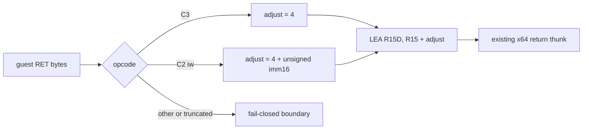

# Task 620: Linux x64 `RET imm16` stack adjustment

## 한국어

### 배경

Task 619의 writer trace에서 terminal zero를 기록한 `PUSH ECX`
(`0x010F0FE5`) 직전의 `0x010F0FE2`가 원본 바이트 `C2 04 00`인 guest
`RET 4`임을 확인했습니다. 현재 long-mode near-return emitter는 모든
`RET`를 `RET` opcode의 4바이트 pop만 수행하는 것으로 lower하므로,
`RET 4`의 즉시 stack cleanup 4바이트를 잃습니다. 그 결과 이후 guest
stack access가 4바이트 어긋납니다.

### 설계

1. `kReturn` instruction의 원본 bytes가 `C3`이면 guest stack adjustment를
   4바이트로 계산합니다.
2. 원본 bytes가 정확히 `C2 iw`이면 unsigned little-endian `imm16`을 읽어
   adjustment를 `4 + imm16`으로 계산합니다.
3. 계산된 adjustment를 이용해 `LEA R15D,[R15+adjustment]`를 emit합니다.
   `LEA`는 arithmetic flags를 변경하지 않으므로 기존 near-return 계약을
   유지합니다. 8비트 displacement로 표현할 수 없으면 32비트 displacement
   형식을 사용합니다.
4. `C2 iw` 이외의 불완전하거나 지원하지 않는 return byte 형식은 잘못된
   stack 보정을 emit하지 않고 기존 fail-closed boundary로 보냅니다.
5. guest return target 복구, 원본 guest code 수정, zero target 자동 복구는
   이 작업에 포함하지 않습니다.

### 검증 전략

* Linux x64 `repiu_core_probe`가 계속 통과하는지 확인합니다.
* `RET 4` map entry의 emitted bytes가 `LEA ... +8`을 포함하는지 확인합니다.
* `pumpit2a`를 실행해 기존 `0x010F101D` zero-return frontier를 벗어나는지
  확인하고, 벗어나면 새 frontier를 동일한 방식으로 기록합니다.

## English

### Background

Task 619 identified the instruction immediately before the terminal zero writer
`PUSH ECX` (`0x010F0FE5`) as `0x010F0FE2` with original bytes `C2 04 00`, a
guest `RET 4`. The current long-mode near-return emitter lowers every return
with only the four-byte pop effect and drops the immediate stack cleanup. Later
guest stack accesses are therefore shifted by four bytes.

### Design

1. Treat original `C3` bytes as a four-byte guest stack adjustment.
2. For exact `C2 iw` bytes, decode unsigned little-endian `imm16` and use
   `4 + imm16` as the adjustment.
3. Emit `LEA R15D,[R15+adjustment]` so the guest flags remain unchanged. Use a
   32-bit displacement form when the adjustment does not fit the short form.
4. For truncated or unsupported return bytes, emit no incorrect stack update;
   retain the existing fail-closed boundary.
5. Do not repair the guest return target, modify original guest code, or infer a
   zero target repair.

### Verification strategy

* Keep the Linux x64 core probe green.
* Inspect the `RET 4` map entry and verify that its emitted bytes contain
  `LEA ... +8`.
* Run `pumpit2a` and determine whether execution advances beyond the existing
  `0x010F101D` zero-return frontier; record any new frontier if it does.
