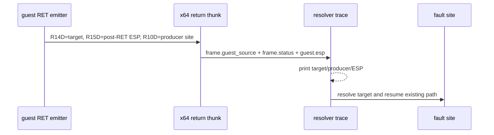

# Task 621: Linux x64 return target provenance trace

## 한국어

### 배경

Task 620에서 `RET 4`의 stack 보정을 고친 뒤 기존 zero-return frontier는
해소됐습니다. 현재 실행은 resolver가 guest target `0x011A643A`를 dynamic
AOT로 resolve한 다음 `0x011A6440`에서 fault합니다. `0x011A6440`은 initial
AOT map entry가 아니며 fault bytes도 data-like합니다.

long-mode return thunk에는 이미 producer metadata가 있습니다. return
emitter는 `R10D`에 guest `RET` site를 넣고, thunk는 이를 `frame.status`에
저장합니다. 그러나 기존 `REPIU_LINUX_X64_RETURN_TRACE`는
`frame.guest_source`만 `source`로 출력해 target을 만든 return site와
post-RET guest ESP를 확인할 수 없습니다.

### 설계

1. 기존 `REPIU_LINUX_X64_RETURN_TRACE=1` 출력에 producer site와 post-RET
   guest ESP를 추가합니다.
2. `source` 필드는 기존 호환성을 위해 resolver가 받은 guest target으로
   유지하고, 새 `producer` 필드는 `frame.status`의 producer tag에서
   출력합니다.
3. indirect-call producer tag의 high bit는 기존 규칙대로 표시하며, near
   return은 guest `RET` site를 표시합니다.
4. invalid state와 translation failure에도 새 필드는 안전한 zero 값으로
   출력할 수 있도록 resolver trace helper의 인자를 확장합니다.
5. resolved return의 consumed slot(`guest_esp - 4`)과 일치하는 기존
   stack-write ring record도 출력해 target word writer를 확인합니다.
6. runtime이 512개 ring을 순환할 수 있으므로 trace ring은 16384개 record를
   보존합니다.
7. trace는 관찰 전용이며 guest register, target resolution, dynamic AOT
   정책을 변경하지 않습니다.

### 검증 전략

* core probe는 기존과 같이 `24/24`를 유지합니다.
* `pumpit2a`를 `REPIU_LINUX_X64_RETURN_TRACE=1`로 실행해 마지막
  `source=0x011A643A` record의 producer site와 ESP를 수집합니다.
* 같은 record의 consumed slot writer를 수집합니다.
* producer site의 AOT map entry와 원본 bytes를 대조해 return stack word의
  출처를 다음 구현 작업의 범위로 좁힙니다.

## English

### Background

After Task 620 corrected the `RET 4` stack adjustment, the old zero-return
frontier disappeared. Execution now resolves guest target `0x011A643A` as
dynamic AOT and faults at `0x011A6440`. The latter is not an initial AOT map
entry and its fault bytes look like data.

The long-mode return thunk already carries producer metadata. The return
emitter puts the guest `RET` site in `R10D`, and the thunk stores it in
`frame.status`. The existing `REPIU_LINUX_X64_RETURN_TRACE` prints only
`frame.guest_source` as `source`, so it cannot show which return produced the
target or what guest ESP was after that return.

### Design

1. Add producer site and post-return guest ESP to the existing
   `REPIU_LINUX_X64_RETURN_TRACE=1` output.
2. Preserve `source` as the guest target received by the resolver for output
   compatibility; add `producer` from the `frame.status` producer tag.
3. Keep the existing high-bit distinction for indirect-call producer tags and
   show the guest `RET` site for near returns.
4. Extend the trace helper so invalid-state and translation-failure paths can
   provide safe zero values for the new fields.
5. Print existing stack-write ring records matching the resolved return's
   consumed slot (`guest_esp - 4`) to identify the target-word writer.
6. Use a 16384-record ring so the runtime's trace sequence does not overwrite
   the relevant history during the reproduced run.
7. Keep the trace observational: do not change guest registers, target
   resolution, or dynamic AOT policy.

### Verification strategy

* Keep the core probe at `24/24`.
* Run `pumpit2a` with `REPIU_LINUX_X64_RETURN_TRACE=1` and capture producer
  site, ESP, and consumed-slot writer for the final `source=0x011A643A` record.
* Compare the producer's AOT map entry and original bytes to narrow the next
  implementation task to the source of the return stack word.
