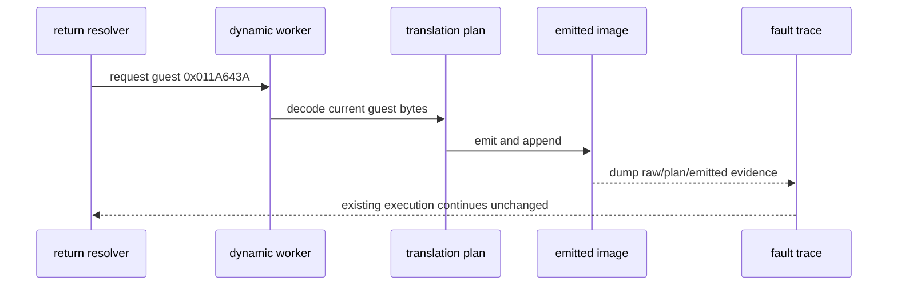

# Task 622: Linux x64 dynamic target dump

## 한국어

### 배경

Task 621에서 `0x011A643A`의 반환 producer와 consumed stack slot은
확인했지만, 이 주소는 initial AOT map에 없고 dynamic AOT append를 통해
실행됩니다. 현재 fault는 `0x011A6440`에서 발생하므로, 원본 guest bytes와
dynamic plan/emitted bytes를 같은 실행에서 대조해야 합니다.

기존 `REPIU_AOT_GUEST_MAP_TRACE`는 initial/final placement를 조회하지만,
fault로 프로세스가 끝나는 재현에서는 dynamic append 내부의 image bytes를
보여주지 않습니다.

### 설계

1. `REPIU_AOT_DYNAMIC_TRACE=<guest-address>` opt-in을 추가합니다.
2. 지정한 dynamic append에 대해서만 guest entry의 raw bytes를 출력합니다.
3. 해당 entry의 translation-plan instruction 종류·길이·bytes를 출력합니다.
4. append image에서 entry map과 emitted bytes를 출력합니다.
5. 출력은 관찰 전용이며 dynamic AOT의 acceptance, target resolution,
   register state, memory protection 순서를 변경하지 않습니다.
6. 환경 변수가 없으면 기존 output과 emitted image가 동일해야 합니다.

### 검증 전략

* 기존 core probe를 그대로 실행합니다.
* `REPIU_AOT_DYNAMIC_TRACE=0x011A643A`로 `pumpit2a`를 실행합니다.
* `0x011A643A` raw bytes, plan instruction, emitted entry와
  `0x011A6440` fault bytes를 대조합니다.
* dump가 없을 때와 있을 때의 target resolution과 fault frontier가 같은지
  확인합니다.

## English

### Background

Task 621 identified the return producer and consumed stack slot for
`0x011A643A`, but that address is absent from the initial AOT map and executes
through a dynamic AOT append. The run faults at `0x011A6440`, so the raw guest
bytes and the dynamic plan/emitted bytes must be compared in one reproduction.

The existing `REPIU_AOT_GUEST_MAP_TRACE` queries the initial/final placement,
but a process that terminates at the fault does not expose the dynamic image
bytes from inside the append operation.

### Design

1. Add the opt-in `REPIU_AOT_DYNAMIC_TRACE=<guest-address>`.
2. Print raw guest bytes only for the selected dynamic append.
3. Print the selected translation-plan instruction kind, length, and bytes.
4. Print the appended image map entry and emitted bytes.
5. Keep the diagnostic observational: do not change dynamic-AOT acceptance,
   target resolution, register state, or memory-protection ordering.
6. With the variable absent, preserve existing output and emitted image bytes.

### Verification strategy

* Run the existing core probe.
* Run `pumpit2a` with `REPIU_AOT_DYNAMIC_TRACE=0x011A643A`.
* Compare raw bytes, plan instruction, emitted entry, and the
  `0x011A6440` fault bytes.
* Confirm that target resolution and the fault frontier are unchanged when the
  dump is enabled.
