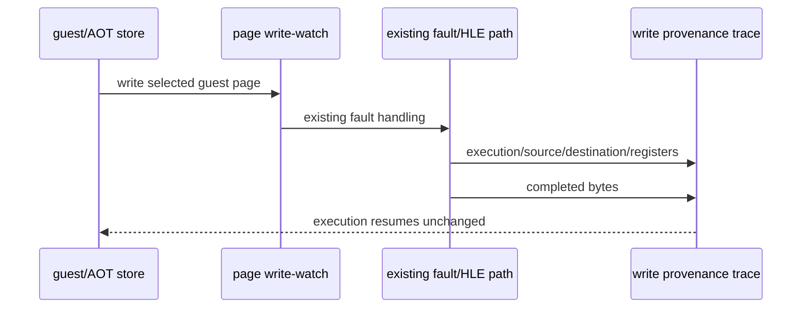

# Task 624: Linux x64 guest write provenance

## 한국어

### 배경

Task 623에서 `PUSH ES` HLE의 stack write는 정상임을 확인했다. 추가 정적
매핑 결과 `0x011A643A`는 object 4(auto-data/stack)의 base
`0x01110000`에서 offset `0x9643A`에 있다. 원본 `PIU.EXE`의 대응 data page와
file offset `0x1A4A3A`는 0으로 읽히지만, 실행 중에는 이 주소가
`0D E9 6B 01 37 ...`로 바뀌어 동적 AOT target이 된다.

현재 AOT write-watch는 이미 번역된 guest code page만 감시한다. target page는
동적 target이 만들어지기 전에는 active translation이 없으므로, 첫 runtime
writer가 감시되지 않을 수 있다.

### 설계

1. `REPIU_GUEST_WRITE_TRACE=<guest-address>` opt-in을 추가한다.
2. 실행 시작 시 선택 주소가 guest arena 안에 있으면 해당 page를 기존 AOT
   write-watch set에 추가한다.
3. 기존 write-fault/completion 경로에서 execution cache address, guest source,
   destination, write size, register snapshot, 결과 bytes를 기록한다.
4. `WriteGuestUInt8/16/32`와 `WriteGuestBytes` HLE 경로도 같은 주소에 겹치는
   write를 기록한다.
5. 진단 page는 dynamic append 이후에도 유지하여 여러 writer를 관찰한다.
6. 일반 실행 중에는 즉시 출력량을 제한하고, unhandled fault가 발생하면
   최근 writer ring을 async-signal-safe 경로로 출력하여 장시간 fault trace도
   마지막 writer를 보존한다.
7. trace가 없으면 page protection, HLE semantics, AOT retirement, guest
   control flow는 기존과 동일하게 유지한다.

### 검증 전략

* Linux x64 `repiu_core_probe`를 실행한다.
* `REPIU_GUEST_WRITE_TRACE=0x011A643A`로 `pumpit2a`를 실행한다.
* 첫 writer가 target page에 실제 bytes를 쓰는지 확인한다.
* fault 직전 writer tail에서 마지막 source와 target bytes를 확인한다.
* `0x011A643A` 동적 AOT append와 `0x011A6440` fault frontier가 유지되는지
  확인한다.

## English

### Background

Task 623 established that the `PUSH ES` HLE stack write is correct. Further
static mapping shows that `0x011A643A` lies in object 4 (auto-data/stack), at
offset `0x9643A` from base `0x01110000`. The corresponding original
`PIU.EXE` data page and file offset `0x1A4A3A` read as zero, while the runtime
address becomes `0D E9 6B 01 37 ...` and is then used as a dynamic AOT target.

The current AOT write-watch observes only guest pages that already contain an
active translation. Before the dynamic target is created, its page may have no
active translation, so the first runtime writer can be missed.

### Design

1. Add the opt-in `REPIU_GUEST_WRITE_TRACE=<guest-address>` setting.
2. At execution startup, add the selected page to the existing AOT write-watch
   set when the address lies inside the guest arena.
3. Record the execution cache address, guest source, destination, write size,
   register snapshot, and resulting bytes in the existing write-fault and
   completion paths.
4. Record overlapping writes through the `WriteGuestUInt8/16/32` and
   `WriteGuestBytes` HLE paths as well.
5. Keep the diagnostic page watched after dynamic append so multiple writers
   can be observed.
6. Limit immediate output during execution and dump the recent writer ring
   through an async-signal-safe path when an unhandled fault occurs, preserving
   the final writer even when the fault trace is long.
7. With tracing disabled, preserve page protection, HLE semantics, AOT
   retirement, and guest control flow.

### Verification strategy

* Run the Linux x64 `repiu_core_probe`.
* Run `pumpit2a` with `REPIU_GUEST_WRITE_TRACE=0x011A643A`.
* Confirm whether the first writer stores the target-page bytes.
* Confirm the final source and target bytes from the pre-fault writer tail.
* Confirm that the dynamic append at `0x011A643A` and the
  `0x011A6440` fault frontier remain unchanged.
