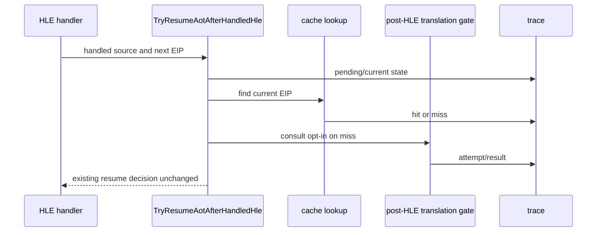

# Task 625 설계: Linux x64 HLE boundary 재진입 추적

## 한국어

### 배경

Task 624에서 `0x011A643A`의 dynamic code fragment writer와
`0x011A643F` `PUSH ES` HLE semantics는 정상임을 확인했다. 다음 fault는
HLE 직후 `0x011A6440`에서 발생한다. 기존 `posthle` aggregate counter만으로는
해당 한 번의 재진입에서 `aot_reentry_pending`, cache lookup, post-HLE
translation gate 중 어느 단계가 선택되었는지 알 수 없다.

### 설계

1. `REPIU_AOT_HLE_REENTRY_TRACE=<guest-address>`를 opt-in으로 추가한다.
2. `TryResumeAotAfterHandledHle`에서 handled source 또는 HLE 이후 current
   EIP가 선택 주소에 해당할 때만 상태를 기록한다.
3. trace에는 pending 상태, handled/current EIP, cache hit, span safety,
   post-HLE translation 설정, translation 결과와 cache target을 포함한다.
4. 기존 분기·카운터·EIP/EFLAGS·single-step 정책은 변경하지 않는다.
5. 환경 변수가 없으면 출력과 실행 비용을 기존과 동일하게 유지한다.

### 검증 전략

* Linux x64 `repiu_core_probe`를 실행한다.
* `REPIU_AOT_HLE_REENTRY_TRACE=0x011A643F`로 `pumpit2a`를 실행한다.
* `0x011A643F -> 0x011A6440` 경계에서 실제 pending/lookup/gate 상태를
  확인한다.
* post-HLE translation을 켠 A/B가 기존 fault frontier를 바꾸는지도 확인한다.

## English

### Background

Task 624 confirmed that the dynamic fragment writer at `0x011A643A` and the
`PUSH ES` HLE semantics at `0x011A643F` are correct. The next fault occurs at
`0x011A6440`. Existing aggregate `posthle` counters cannot identify which
`aot_reentry_pending`, cache-lookup, or post-HLE translation state applied to
this specific boundary.

### Design

1. Add the opt-in `REPIU_AOT_HLE_REENTRY_TRACE=<guest-address>` setting.
2. In `TryResumeAotAfterHandledHle`, record state when either the handled
   source or the post-HLE current EIP matches the selected address.
3. Include pending state, handled/current EIP, cache hit, span safety,
   post-HLE translation setting, translation result, and cache target.
4. Preserve all existing branches, counters, EIP/EFLAGS, and single-step policy.
5. When the environment variable is absent, preserve existing output and
   execution cost.

### Verification strategy

* Run the Linux x64 `repiu_core_probe`.
* Run `pumpit2a` with `REPIU_AOT_HLE_REENTRY_TRACE=0x011A643F`.
* Confirm the actual pending, lookup, and gate state at the
  `0x011A643F -> 0x011A6440` boundary.
* Check whether enabling post-HLE translation changes the existing fault
  frontier in an A/B run.
