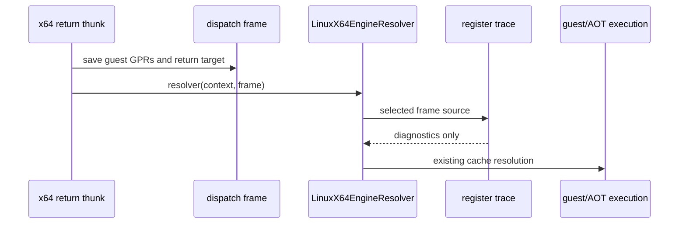

# Task 626 설계: Linux x64 return frame register provenance

## 한국어

### 배경

Task 624와 625는 `0x011A643F`의 `PUSH ES` HLE 및 그 다음 재진입 분기를
확인했지만, fault 직전 `EAX=0x37016BE9`가 x64 return thunk 이전부터
존재했는지는 확인하지 못했습니다. 현재 return frame trace는 zero return
또는 stack writer만 기록하므로, 정상 target `0x011A643A`에 전달된 전체
guest register state를 직접 비교할 수 없습니다.

### 설계

1. `REPIU_LINUX_X64_RETURN_REG_TRACE=<guest-address>` opt-in 설정을
   추가합니다.
2. `LinuxX64EngineResolver`가 선택된 `frame->guest_source`에 도달했을 때
   thunk가 frame에 저장한 EAX, EBX, ECX, EDX, ESI, EDI, EBP, ESP, EFLAGS와
   producer tag를 기록합니다.
3. 같은 시점의 stack words와 frame continuation fields를 함께 기록하여
   return target과 register state의 관측 시점을 고정합니다.
4. trace는 resolver 호출 시점의 frame만 읽고 guest register, EIP, stack,
   cache map 또는 return 정책을 변경하지 않습니다.
5. 출력은 선택 주소와 제한된 횟수에만 적용하며 설정이 없으면 기존 비용과
   출력을 유지합니다.

### 관측 흐름

### 검증 전략

* Linux x64 `repiu_core_probe`를 실행합니다.
* `REPIU_LINUX_X64_RETURN_REG_TRACE=0x011A643A`로 `pumpit2a`를 실행합니다.
* `0x011A643A` return frame의 EAX와 다른 GPR, ESP, producer를 기록합니다.
* 기존 `0x011A6440` fault가 동일하게 유지되는지 확인합니다.

## English

### Background

Tasks 624 and 625 confirmed the `PUSH ES` HLE at `0x011A643F` and the
subsequent re-entry branch, but did not establish whether
`EAX=0x37016BE9` already existed before the x64 return thunk. The current
return-frame diagnostics cover zero returns or stack writers, so they do not
directly expose the complete guest register state delivered for the valid
target `0x011A643A`.

### Design

1. Add the opt-in setting `REPIU_LINUX_X64_RETURN_REG_TRACE=<guest-address>`.
2. When `LinuxX64EngineResolver` receives the selected `frame->guest_source`,
   print the EAX, EBX, ECX, EDX, ESI, EDI, EBP, ESP, EFLAGS, and producer tag
   saved by the thunk.
3. Print the stack words and frame continuation fields at the same observation
   point, fixing the provenance timestamp of the return target and registers.
4. Read-only diagnostics must not change guest registers, EIP, stack, cache
   mapping, or return policy.
5. Limit output to the selected address and a bounded number of observations;
   preserve existing cost and output when unset.

### Verification strategy

* Run the Linux x64 `repiu_core_probe`.
* Run `pumpit2a` with `REPIU_LINUX_X64_RETURN_REG_TRACE=0x011A643A`.
* Record EAX, the other GPRs, ESP, and the producer at the target's return
  frame.
* Confirm that the existing `0x011A6440` fault remains unchanged.
