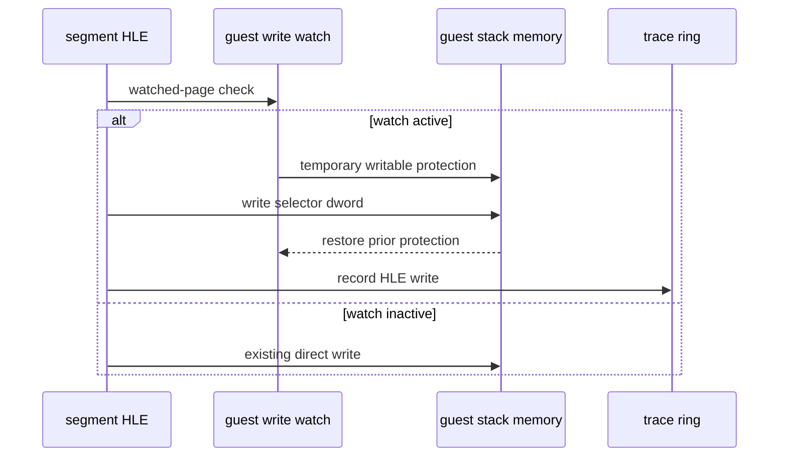

# Task 627 설계: Linux x64 stack writer watch compatibility

## 한국어

### 배경

Task 626은 일반 `RET`가 `0x0158CC44`의 `0x011A643A`를 target으로
소비하고, return thunk 진입 시 EAX가 0임을 확인했습니다. Task 621의
AOT stack trace에는 `0x010F12BF`의 `PUSH EBX`가 같은 값을 쓴 기록이
있지만, 같은 ESP 슬롯은 여러 호출에서 재사용되므로 최종 writer로 확정할
수 없습니다.

`REPIU_GUEST_WRITE_TRACE=0x0158CC44`를 사용하면 해당 stack page를
write-watch할 수 있지만, 이후 `PUSH ES` HLE가 보호된 page에 직접 store를
수행하면서 fault handler 외부에서 중단됩니다. 이 때문에 일반 AOT store와
HLE store를 하나의 writer timeline으로 끝까지 비교할 수 없습니다.

### 설계

1. guest write trace가 활성화되고 segment HLE destination이 watched page에
   있을 때만 HLE store 직전에 해당 범위를 임시 writable로 전환합니다.
2. store 후 원래 protection을 복원하여 기존 AOT write-watch 상태를
   유지합니다.
3. 해당 HLE store는 `GuestWriteTraceEvent::kHle`로 기록합니다.
4. trace가 없으면 기존 직접 store 경로와 실행 비용을 유지합니다.
5. writer source, destination, value, register snapshot은 기존 trace 형식을
   사용하며, target 보정이나 stack semantics 변경은 하지 않습니다.

### 흐름

### 검증 전략

* Linux x64 `repiu_core_probe`를 실행합니다.
* `REPIU_GUEST_WRITE_TRACE=0x0158CC44`와 stack/return trace를 함께 실행합니다.
* HLE store가 trace를 중단시키지 않고 최종 fault까지 진행하는지 확인합니다.
* `0x0158CC44`의 native writer와 HLE writer를 시간 순서로 비교합니다.

## English

### Background

Task 626 established that an ordinary `RET` consumes `0x011A643A` from
`0x0158CC44`, while EAX is zero on return-thunk entry. Task 621 recorded a
`PUSH EBX` at `0x010F12BF` writing the same value to the slot, but the same
guest ESP is reused across calls, so this is not yet proof of the final writer.

`REPIU_GUEST_WRITE_TRACE=0x0158CC44` can watch the stack page, but the later
`PUSH ES` HLE performs a direct store into that protected page and stops outside
the normal writer-fault path. Native AOT and HLE stores therefore cannot yet be
compared on one complete writer timeline.

### Design

1. Only when guest write tracing is enabled and the segment-HLE destination is
   on the watched page, temporarily make the destination writable before the
   HLE store.
2. Restore the previous protection after the store, preserving the AOT
   write-watch state.
3. Record that HLE store as `GuestWriteTraceEvent::kHle`.
4. Preserve the existing direct-store path and cost when tracing is disabled.
5. Use the existing trace format for source, destination, value, and register
   snapshot; do not repair the target or change stack semantics.

### Verification strategy

* Run the Linux x64 `repiu_core_probe`.
* Run stack and return traces with `REPIU_GUEST_WRITE_TRACE=0x0158CC44`.
* Confirm that the HLE store no longer stops the trace before the final fault.
* Compare native and HLE writers of `0x0158CC44` in temporal order.
