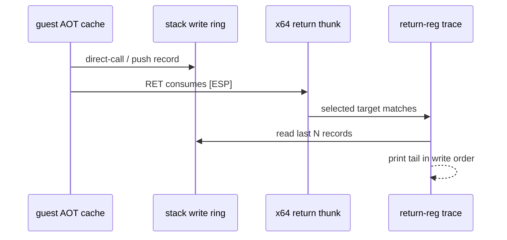

# Task 628 설계: Linux x64 return stack writer tail

## 한국어

### 배경

Task 627은 `0x0158CC44`의 최종 writer를 확정하지 못한 채 끝났습니다.
Task 628의 재현에서 그 이유가 드러났습니다. 실패하는 `RET`의 ring
sequence는 `13676`인데, 같은 slot을 쓴 마지막 기록은 index `2784`입니다.
실패 직전 수천 건의 stack write는 모두 한 dword 아래인 `0x0158CC40`으로
갔고, slot 필터를 통과하지 못해 출력되지 않았습니다.

정적 분석으로 관련 guest code도 확정했습니다. object 2의 runtime base는
`0x01010000`이며, `0x010F1A80`은 `push ebx; push ecx`로 시작하는 문자열
비교 함수입니다. `0x010F1AF4`는 `sub eax,eax; pop ecx; pop ebx`이고
`0x010F1AF8`이 그 `RET`입니다. 호출자는 `0x0102A065`의 다섯 회 반복
루프이며 `0x0102A07D`에서 이 함수를 호출하고 `0x0102A082`로 돌아옵니다.

재현 로그의 마지막 두 return은 다음과 같습니다.

```text
[repiu-x64-return] result=resolved source=0x0102A082 ... producer=0x010F1AF8 guest_esp=0x0158CC44
[repiu-x64-return] result=resolved source=0x011A643A ... producer=0x010F1AF8 guest_esp=0x0158CC48
```

즉 같은 `RET` site가 연속 두 번 resolver에 도달했고, 첫 번째는 정상적으로
`0x0102A082`를 소비했으며 두 번째는 그보다 한 dword 위의 오래된 값을
소비했습니다. 그 사이에 `0x0102A07D`의 direct-call push는 ring에
기록되지 않았습니다.

따라서 남은 질문은 "누가 slot을 썼는가"가 아니라 "정상 return과 실패
return 사이에 guest stack에서 실제로 무슨 write가 일어났는가"입니다. 이는
slot별 필터가 아니라 ring의 **최근 기록 꼬리**로만 답할 수 있습니다.

### 설계

1. `REPIU_LINUX_X64_RETURN_STACK_TAIL=<count>`를 추가합니다. 값이 없거나
   `0`이면 비활성화하고, ring capacity로 상한을 둡니다.
2. Task 626의 `TraceLinuxX64ReturnRegisters`는 이미 선택된 return target
   하나와 최대 8회로 제한되어 있으므로, 그 안에서 register line 다음에
   최근 `count`개 record를 기록 순서대로 출력합니다.
3. 각 record는 ring index, writer 종류, site, fallthrough, guest ESP,
   기록된 값을 그대로 출력합니다. 값 해석이나 보정은 하지 않습니다.
4. resolver 정책, return target 선택, guest stack semantics는 바꾸지
   않습니다. 환경 변수가 없으면 기존 출력과 실행 비용이 동일합니다.

### 흐름



### 검증 전략

* Linux x64 `repiu_core_probe`를 실행합니다.
* `REPIU_LINUX_X64_RETURN_REG_TRACE=0x011A643A`와
  `REPIU_LINUX_X64_RETURN_STACK_TAIL=48`로 재현합니다.
* 정상 return과 실패 return 사이의 write를 순서대로 확인합니다.
* 환경 변수를 뺀 실행이 기존과 같은 fault를 재현하는지 확인합니다.

## English

### Background

Task 627 ended without identifying the final writer of `0x0158CC44`. The Task
628 reproduction shows why. The failing `RET` reports ring sequence `13676`,
while the newest record for that slot is index `2784`. Every one of the
thousands of stack writes just before the failure went to `0x0158CC40`, one
dword lower, and the slot filter therefore printed none of them.

Static analysis also pinned the guest code. Object 2's runtime base is
`0x01010000`. `0x010F1A80` is a string-compare function opening with
`push ebx; push ecx`; `0x010F1AF4` is `sub eax,eax; pop ecx; pop ebx`, and
`0x010F1AF8` is its `RET`. The caller is the five-iteration loop at
`0x0102A065`, which calls the function at `0x0102A07D` and resumes at
`0x0102A082`.

The last two returns in the reproduction are:

```text
[repiu-x64-return] result=resolved source=0x0102A082 ... producer=0x010F1AF8 guest_esp=0x0158CC44
[repiu-x64-return] result=resolved source=0x011A643A ... producer=0x010F1AF8 guest_esp=0x0158CC48
```

The same `RET` site therefore reached the resolver twice in a row. The first
consumed `0x0102A082` correctly; the second consumed a much older value one
dword higher. No direct-call push for `0x0102A07D` was recorded in the ring
between them.

The open question is no longer "who wrote the slot" but "what did the guest
stack actually do between the correct return and the failing one". Only the
**tail of the ring** can answer that; a per-slot filter cannot.

### Design

1. Add `REPIU_LINUX_X64_RETURN_STACK_TAIL=<count>`. Absent or `0` disables it,
   and the value is clamped to the ring capacity.
2. Task 626's `TraceLinuxX64ReturnRegisters` is already limited to one selected
   return target and eight occurrences, so print the most recent `count`
   records there, in write order, after the register line.
3. Print each record's ring index, writer kind, site, fallthrough, guest ESP,
   and stored value verbatim. Do not interpret or repair values.
4. Do not change resolver policy, return-target selection, or guest stack
   semantics. With the variable unset, output and execution cost are unchanged.

### Verification strategy

* Run the Linux x64 `repiu_core_probe`.
* Reproduce with `REPIU_LINUX_X64_RETURN_REG_TRACE=0x011A643A` and
  `REPIU_LINUX_X64_RETURN_STACK_TAIL=48`.
* Read the writes between the correct return and the failing one in order.
* Confirm a run without the new variable reproduces the same fault as before.
