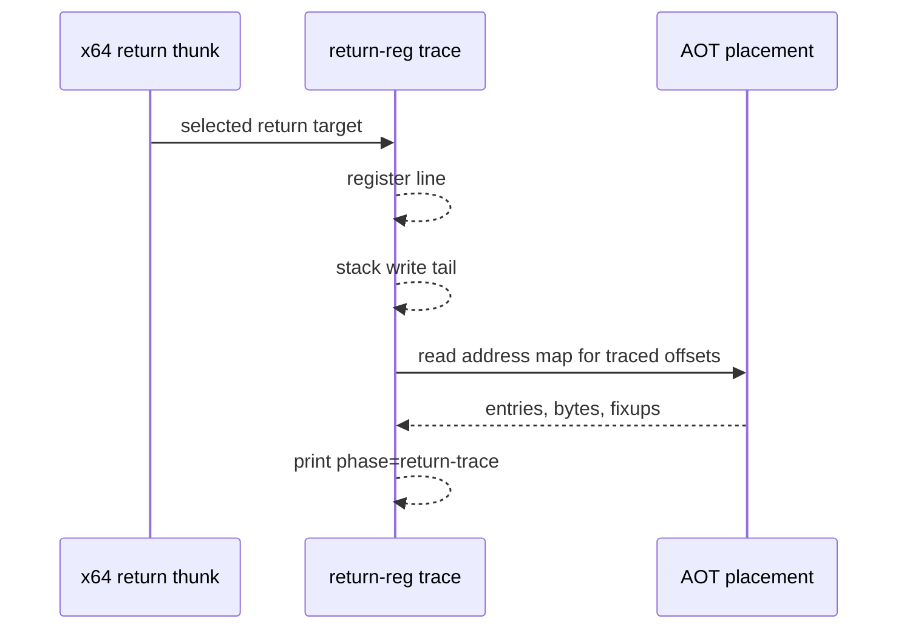

# Task 629 설계: Linux x64 return-time AOT guest map phase

## 한국어

### 배경

Task 628은 실패 직전 두 번째 반복이 `call 0x010F1A80`의 return 주소 push
없이 함수에 진입했음을 확인했습니다. 남은 질문은 그 시점의 AOT cache가
`0x0102A072`, `0x0102A07D`, `0x0102A082`를 어떻게 배치하고 있었는가입니다.

기존 `REPIU_AOT_GUEST_MAP_TRACE`는 `initial`과 `final` 두 phase에서만
출력합니다. 이번 실패는 guest thread가 SIGSEGV로 죽으면서 끝나므로 `final`
phase가 실행되지 않고, 문제의 블록은 초기 map에 entry가 없어 `initial`
출력도 비어 있습니다. 그래서 실패 시점의 배치를 볼 방법이 없습니다.

fault handler에서 dump하는 방법도 있으나, 그 경로는 async-signal-safe를
지켜야 하고 `address_map`은 수만 entry의 vector입니다. 대신 Task 626의
return-register trace 지점이 더 낫습니다. 그곳은 guest thread의 정상 호출
문맥이고, translation worker는 guest가 멈춘 동안에만 동작하므로 map을 읽는
동안 변경되지 않습니다.

### 설계

1. `TraceLinuxX64ReturnRegisters`가 선택한 return target에서 register line과
   stack tail을 출력한 뒤 `TraceAotGuestMap`을 `phase=return-trace`로
   호출합니다.
2. `REPIU_AOT_GUEST_MAP_TRACE`가 없으면 `TraceAotGuestMap`이 즉시 반환하므로
   새 환경 변수는 만들지 않습니다.
3. 출력 대상은 기존과 같이 `REPIU_AOT_GUEST_MAP_TRACE`의 offset 목록이며,
   entry의 cache 주소, guest/emitted 길이, active 여부, emitted bytes,
   fixup을 그대로 보여 줍니다.
4. `REPIU_LINUX_X64_RETURN_REG_TRACE`를 실패한 return과 직전의 정상 return에
   각각 맞추면, 같은 offset 목록에 대한 두 시점의 배치를 비교할 수 있습니다.
5. resolver 결과, return target, guest stack semantics는 바꾸지 않습니다.

### 흐름

### 검증 전략

* Linux x64 `repiu_core_probe`를 실행합니다.
* `REPIU_AOT_GUEST_MAP_TRACE=0x2A065,0x2A072,0x2A07D,0x2A082,0xF1A80`으로
  두 번 재현합니다. 한 번은 `REPIU_LINUX_X64_RETURN_REG_TRACE=0x0102A082`,
  다른 한 번은 `=0x011A643A`입니다.
* 두 시점의 entry 수, cache 주소, emitted bytes, fixup을 비교합니다.
* 진단 변수를 모두 뺀 실행이 같은 fault를 재현하는지 확인합니다.

## English

### Background

Task 628 established that the failing second iteration entered the function
without the return-address push of `call 0x010F1A80`. The remaining question is
how the AOT cache laid out `0x0102A072`, `0x0102A07D`, and `0x0102A082` at that
moment.

The existing `REPIU_AOT_GUEST_MAP_TRACE` prints at only two phases, `initial`
and `final`. This failure ends with the guest thread dying on SIGSEGV, so the
`final` phase never runs, and the block in question has no initial map entry, so
the `initial` output is empty for it. The layout at the failure is therefore
unobservable today.

Dumping from the fault handler is possible but that path must stay
async-signal-safe and `address_map` is a vector of tens of thousands of entries.
Task 626's return-register trace point is the better place: it runs in ordinary
guest-thread call context, and the translation worker only runs while the guest
is parked, so the map does not change while it is read.

### Design

1. After `TraceLinuxX64ReturnRegisters` prints its register line and stack
   tail for the selected return target, call `TraceAotGuestMap` with
   `phase=return-trace`.
2. Add no new environment variable: `TraceAotGuestMap` already returns
   immediately when `REPIU_AOT_GUEST_MAP_TRACE` is unset.
3. Keep the existing target list and output — each entry's cache address,
   guest and emitted lengths, active flag, emitted bytes, and fixups.
4. Pointing `REPIU_LINUX_X64_RETURN_REG_TRACE` at the failing return and then
   at the correct return just before it yields two snapshots of the same offset
   list to compare.
5. Do not change resolver results, return targets, or guest stack semantics.

### Verification strategy

* Run the Linux x64 `repiu_core_probe`.
* Reproduce twice with
  `REPIU_AOT_GUEST_MAP_TRACE=0x2A065,0x2A072,0x2A07D,0x2A082,0xF1A80`, once
  with `REPIU_LINUX_X64_RETURN_REG_TRACE=0x0102A082` and once with
  `=0x011A643A`.
* Compare entry counts, cache addresses, emitted bytes, and fixups.
* Confirm a run without the diagnostic variables reproduces the same fault.
