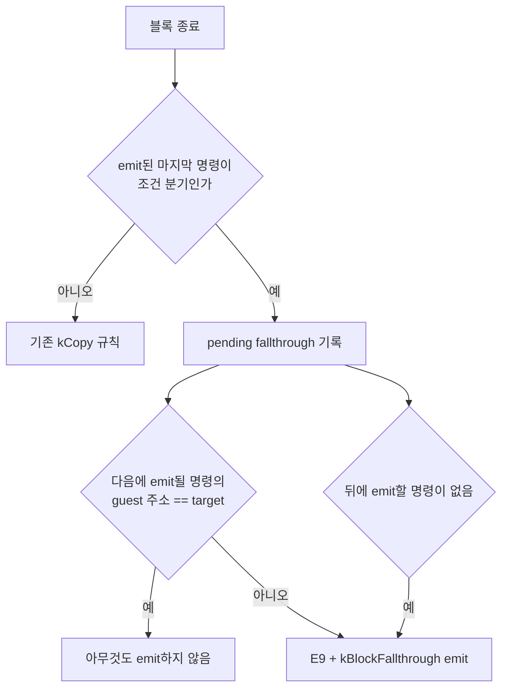
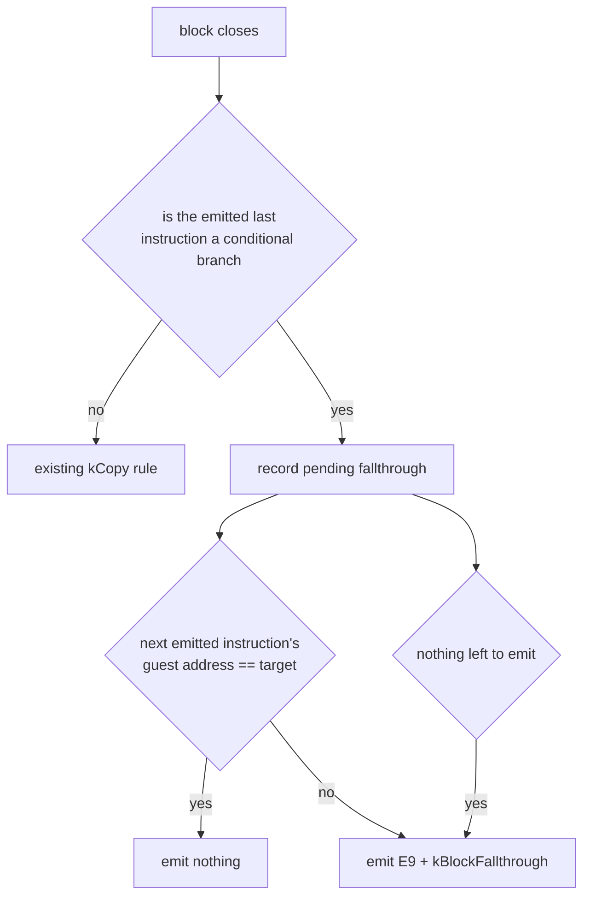

# Task 630 설계: AOT 조건 분기 fallthrough edge

## 한국어

### 배경

Task 629는 실패의 원인을 확정했습니다. `BuildAotCodeCacheImage`는 블록의
마지막 명령이 `AotInstructionKind::kCopy`일 때만 `E9`와
`kBlockFallthrough` fixup을 붙입니다. 마지막 명령이 조건 분기인 블록은
not-taken edge를 전혀 갖지 않고, 그 edge가 물리적으로 다음에 오는 바이트라는
가정에만 의존합니다.

그 가정은 보장되지 않습니다. 동적 append에서 `0x0102A06C`의 `jge` 다음
바이트는 fallthrough인 `0x0102A072`의 번역이 아니라 같은 image에 나중에
emit된 `0x010F1A80`의 사본이었습니다. `0x0102A072`는 append의 entry라서 이미
앞쪽에 emit되어 있었고, 그래서 블록 배치 순서가 guest 순서와 달랐습니다.

결과적으로 조건이 성립하지 않은 `jge`가 함수 prologue로 흘러 들어가
`call`의 return 주소 push를 건너뛰었고, 뒤따르는 `RET`이 오래된 stack 값을
소비했습니다.

### 설계

핵심은 "fallthrough가 다음에 오는가"를 emit 시점에 실제로 확인하는 것입니다.
블록을 닫을 때는 다음에 무엇이 emit될지 아직 모르므로, 결정을 한 단계
미룹니다.

1. 블록의 emit된 마지막 명령이 조건 분기이면 pending fallthrough를
   기록합니다. 값은 source guest 주소와 target(`guest_address + length`)입니다.
2. 다음 명령을 emit하기 직전에 pending을 해소합니다.
   * 그 명령의 guest 주소가 pending target이면 아무것도 emit하지 않습니다.
     기존 배치와 바이트가 그대로 유지됩니다.
   * 다르면 `E9`와 `kBlockFallthrough` fixup을 먼저 emit합니다.
3. 모든 블록을 emit한 뒤에도 pending이 남아 있으면 emit합니다. 뒤에 아무것도
   없으므로 fallthrough는 반드시 명시되어야 합니다.
4. 마지막 명령이 fail-closed `INT3` 경계로 emit된 조건 분기는 제외합니다.
   그 슬롯은 fallthrough하지 않고 trap합니다.
5. 이미 emit된 guest 주소를 건너뛰는 중복 제거 경로에서는 pending을 해소하지
   않습니다. 그 명령은 바이트를 만들지 않으므로 물리적 다음이 아닙니다.

`E9`의 target 해소는 기존 fixup 경로를 그대로 씁니다. target이 image 안에
있으면 그 cache offset으로 patch되고, 없으면 기존 `kCopy` fallthrough와 같은
방식으로 boundary 또는 dispatch stub이 됩니다.

### 왜 항상 붙이지 않는가

조건 분기마다 무조건 `E9`를 붙이면 정확하지만, fallthrough가 다음인 흔한
경우에도 블록마다 5바이트와 분기 하나가 늘어납니다. 그 경우는 지금도
올바르므로 비용만 늘어납니다. 한 단계 지연은 같은 정확성을 얻으면서 기존
배치를 바꾸지 않습니다.

### i386 배치에 대한 영향

이 emitter는 i386과 long mode가 공유합니다. fallthrough가 물리적으로 다음인
image에서는 아무 바이트도 바뀌지 않습니다. 다른 image에서는 i386도 같은
결함을 갖고 있었으므로, 이 변경은 두 경로 모두에 대한 수정입니다.

### 검증 전략

* `long_mode_emission` 코어 프로브에 두 항목을 추가합니다.
  * fallthrough가 바로 다음 블록이면 추가 edge가 생기지 않습니다.
  * fallthrough가 앞쪽에 이미 emit되어 있으면 해소된 `kBlockFallthrough`
    fixup이 그 cache offset을 가리킵니다.
* Linux x64 `repiu_core_probe`를 실행합니다.
* `pumpit2a`를 실행하여 `0x011A6440` fault가 사라지는지 확인하고, 실행이
  어디까지 진행되는지 기록합니다.
* 실행이 더 진행되어 새로운 지점에서 멈추면 그것을 다음 frontier로 남깁니다.

## English

### Background

Task 629 established the cause. `BuildAotCodeCacheImage` appends the `E9` and
its `kBlockFallthrough` fixup only when a block's last instruction is an
`AotInstructionKind::kCopy`. A block whose last instruction is a conditional
branch gets no not-taken edge at all and relies entirely on that edge being the
bytes that physically follow.

That assumption is not guaranteed. In a dynamic append, the bytes after the
`jge` at `0x0102A06C` were not the translation of its fallthrough
`0x0102A072` but a copy of `0x010F1A80` emitted later into the same image.
`0x0102A072` was the append's entry, so it had already been emitted earlier, and
the block order therefore differed from guest order.

The not-taken `jge` consequently ran into a function prologue, skipped the
`call`'s return-address push, and the following `RET` consumed a stale stack
value.

### Design

The point is to check "is the fallthrough next" at emission time. When a block
closes, what comes next is not yet known, so defer the decision by one step.

1. When a block's emitted last instruction is a conditional branch, record a
   pending fallthrough: the source guest address and the target
   (`guest_address + length`).
2. Resolve the pending immediately before emitting the next instruction.
   * If that instruction's guest address is the pending target, emit nothing.
     Existing layouts and bytes are unchanged.
   * Otherwise emit the `E9` and its `kBlockFallthrough` fixup first.
3. If a pending remains after every block is emitted, emit it. Nothing follows,
   so the fallthrough must be explicit.
4. Exclude a conditional branch emitted as a fail-closed `INT3` boundary. That
   slot traps rather than falling through.
5. Do not resolve a pending on the deduplication path that skips an already
   emitted guest address. That instruction produces no bytes, so it is not what
   physically follows.

Target resolution reuses the existing fixup path: a target inside the image is
patched to its cache offset, and one outside becomes a boundary or dispatch stub
exactly as the existing `kCopy` fallthrough does.

### Why not always emit it

Emitting an unconditional `E9` after every conditional branch would also be
correct, but it costs five bytes and one branch per block in the common case
where the fallthrough really is next. That case is already correct today, so
this would buy nothing. Deferring by one step gets the same correctness without
changing existing layouts.

### Effect on the i386 layout

This emitter is shared between i386 and long mode. In an image where the
fallthrough is physically next, no byte changes. In an image where it is not,
i386 had the same defect, so this change fixes both paths.

### Verification strategy

* Add two items to the `long_mode_emission` core probe.
  * When the fallthrough is the next block, no extra edge appears.
  * When the fallthrough was already emitted earlier, a resolved
    `kBlockFallthrough` fixup points at that cache offset.
* Run the Linux x64 `repiu_core_probe`.
* Run `pumpit2a` and confirm the `0x011A6440` fault is gone, recording how far
  execution now reaches.
* If execution advances and stops somewhere new, record that as the next
  frontier.
