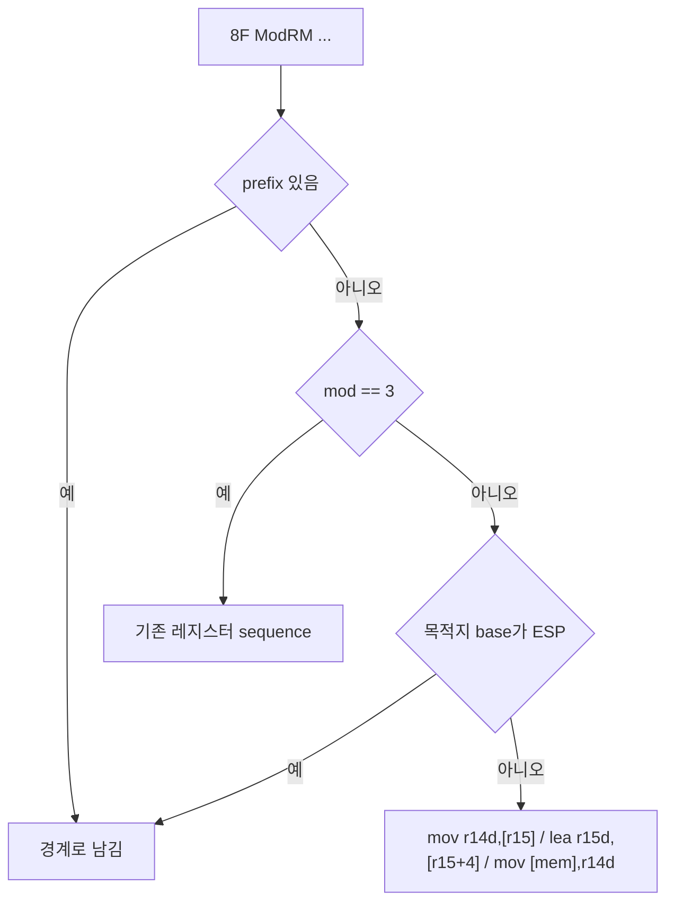
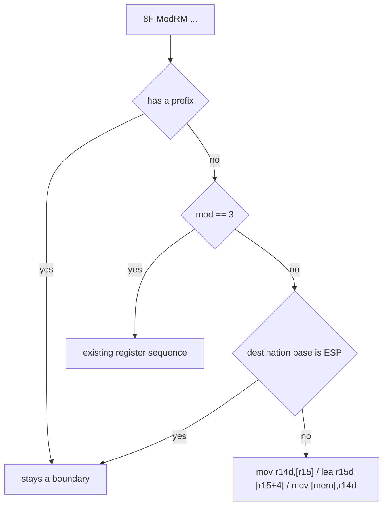

# Task 631 설계: long mode `POP r/m32` 메모리 형식 lowering

## 한국어

### 배경

Task 630 이후 frontier는 guest `0x010F6062`의 `MOV [EBX+6],AX`이고, `EBX`가
far pointer가 아니라 `0x24`였습니다. Task 631의 측정으로 원인이 확정되었습니다.

`REPIU_GUEST_WRITE_TRACE=0x0158CBEC`로 얻은 push 타임라인은 `0x010F6034`의
함수 진입이 정상임을 보여 줍니다.

| guest | 명령 | 기록된 stack slot |
|---|---|---|
| `0x010F6034` | `PUSH EBP` | `0x0158CBF8` |
| `0x010F6035` | `PUSH ES` (HLE) | `0x0158CBF4` |
| `0x010F6036` | `PUSH EBX` | `0x0158CBF0` |
| `0x010F6037` | `PUSH DS` (HLE) | `0x0158CBEC`, 값 `0x24` |
| `0x010F6038` | `PUSH EDX` | `0x0158CBE8` |
| `0x010F6039` | `CALL` | `0x0158CBE4` |

즉 segment HLE의 stack 폭은 정확히 4바이트이고 진입 프레임은 올바릅니다.

문제는 `0x010F6056`의 `8F 47 14`, `POP DWORD PTR [EDI+0x14]`입니다.

```text
[repiu-watch] event=fault guest=0x010F6056 n=1 at=0x200008A8 esp=0x0158CBE0
[repiu-watch] event=step  guest=0x010F6056 n=1 at=0x010F6056 le_bytes=0x184789C01914478F
[repiu-watch] event=dispatch_req guest=0x010F6059 n=1
[repiu-watch] event=cache_enter guest=0x010F6059 n=1 at=0x200008A9
```

`ClassifyLongModeBytes`는 `0x8F`를 `NeedsWidthReencode`로 판정하지만
`HasStackSequenceLowering`은 `mod == 3`인 레지스터 형식만 받습니다. 메모리
형식은 lowering이 없어 `INT3` HLE 경계가 되고, 해석기에는 `POP r/m32` 처리가
없으므로 runtime은 guest 주소에서 한 명령을 단일 실행한 뒤 다음 guest 주소로
재진입합니다. 이 경로는 guest ESP를 4만큼 올리지 않습니다.

그 결과 `0x010F605E`의 `POP EAX`와 세 번의 `POP EBX`가 한 슬롯씩 어긋난
값을 소비하고, `EBX`는 진입 시 저장된 `PUSH DS`의 `0x24`를 받습니다.

### 설계

`POP r/m32`의 메모리 형식에 long mode stack sequence lowering을 추가하여 이
명령이 더 이상 경계가 되지 않게 합니다.

emit할 세 명령은 다음과 같습니다.

```text
mov  r14d, [r15]              ; 45 8B 37   스택에서 값을 읽는다
lea  r15d, [r15+4]            ; 45 8D 7F 04  guest ESP를 올린다
mov  [<guest mem>], r14d      ; 67 44 89 <modrm(reg=r14)> [sib] [disp]
```

목적지 피연산자는 guest의 ModRM/SIB/변위를 그대로 옮기고 `reg` 필드만
`110`(R14)으로 바꾼 뒤, 32비트 주소 지정을 위한 `67`과 REX.R인 `44`를 앞에
둡니다. `8F 47 14`는 `67 44 89 77 14`가 됩니다.

### 받지 않는 형식

fail-closed로 남기는 경우입니다. 받지 않으면 기존과 같이 경계가 됩니다.

1. prefix가 하나라도 있는 형식. `66`은 `POP m16`이고 segment override는
   guest segment HLE가 필요합니다.
2. 목적지가 ESP를 base로 쓰는 형식. Intel SDM은 이 경우 실효 주소를 ESP
   증가 **이후에** 계산한다고 규정하므로 순서가 다른 별도 문제입니다.
   ESP를 쓰지 않는 피연산자는 주소가 ESP에 의존하지 않으므로 위 순서가
   안전합니다.
3. `mod == 3`인 레지스터 형식은 기존 경로가 계속 처리합니다.



### 별도로 기록할 사실

이번 측정은 더 넓은 위험도 드러냈습니다. x64에서 처리기가 없는 경계 명령은
guest 주소에서 그대로 단일 실행됩니다. 32비트 guest 명령을 64비트로 실행하는
것이므로, 두 모드에서 의미가 같은 명령에만 우연히 안전합니다. `0x8F` 메모리
형식은 그중 의미가 다른 예입니다. 이 작업은 그 명령 하나를 고치고, 일반적인
위험은 분석 문서에 남깁니다.

### 검증 전략

* `long_mode_compatibility` 코어 프로브에 항목을 추가합니다.
  * `8F 47 14`가 stack sequence로 분류되고 세 명령으로 lowering됩니다.
  * emit된 바이트가 `67 44 89 77 14`로 끝납니다.
  * `POP [ESP+4]`와 prefix가 붙은 형식은 계속 거부됩니다.
* Linux x64 `repiu_core_probe`를 실행합니다.
* `0x010F6056`이 더 이상 경계 fault를 내지 않는지 guest watch로 확인합니다.
* `pumpit2a`를 실행하여 `0x010F6062` fault가 사라지는지 확인하고 다음
  정지 지점을 기록합니다.

## English

### Background

After Task 630 the frontier is guest `0x010F6062`, `MOV [EBX+6],AX`, with `EBX`
holding `0x24` rather than a far pointer. The Task 631 measurement settles why.

The push timeline from `REPIU_GUEST_WRITE_TRACE=0x0158CBEC` shows the function
entry at `0x010F6034` is correct.

| guest | instruction | recorded stack slot |
|---|---|---|
| `0x010F6034` | `PUSH EBP` | `0x0158CBF8` |
| `0x010F6035` | `PUSH ES` (HLE) | `0x0158CBF4` |
| `0x010F6036` | `PUSH EBX` | `0x0158CBF0` |
| `0x010F6037` | `PUSH DS` (HLE) | `0x0158CBEC`, value `0x24` |
| `0x010F6038` | `PUSH EDX` | `0x0158CBE8` |
| `0x010F6039` | `CALL` | `0x0158CBE4` |

The segment HLE's stack width is exactly four bytes and the entry frame is
correct.

The defect is `8F 47 14` at `0x010F6056`, `POP DWORD PTR [EDI+0x14]`.

```text
[repiu-watch] event=fault guest=0x010F6056 n=1 at=0x200008A8 esp=0x0158CBE0
[repiu-watch] event=step  guest=0x010F6056 n=1 at=0x010F6056 le_bytes=0x184789C01914478F
[repiu-watch] event=dispatch_req guest=0x010F6059 n=1
[repiu-watch] event=cache_enter guest=0x010F6059 n=1 at=0x200008A9
```

`ClassifyLongModeBytes` sends `0x8F` through `NeedsWidthReencode`, but
`HasStackSequenceLowering` accepts only the register form with `mod == 3`. The
memory form has no lowering, so it becomes an `INT3` HLE boundary; the
interpreter has no `POP r/m32` case, so the runtime single-steps one instruction
at the guest address and re-enters at the next guest address. That path never
raises guest ESP by four.

The `POP EAX` and three `POP EBX` at `0x010F605E` therefore consume values one
slot off, and `EBX` receives the `0x24` that the entry `PUSH DS` left.

### Design

Give the memory form of `POP r/m32` a long-mode stack sequence so it stops being
a boundary. The three emitted instructions are:

```text
mov  r14d, [r15]              ; 45 8B 37     read the value off the stack
lea  r15d, [r15+4]            ; 45 8D 7F 04  raise guest ESP
mov  [<guest mem>], r14d      ; 67 44 89 <modrm(reg=r14)> [sib] [disp]
```

The destination operand carries the guest's ModRM, SIB, and displacement
unchanged with only the `reg` field replaced by `110` (R14), preceded by `67`
for 32-bit addressing and the REX.R byte `44`. `8F 47 14` becomes
`67 44 89 77 14`.

### Forms not accepted

These stay fail-closed and remain boundaries exactly as today.

1. Any form carrying a prefix. `66` is `POP m16`, and a segment override needs
   the guest segment HLE.
2. A destination whose base register is ESP. The Intel SDM computes that
   effective address *after* ESP is incremented, which is a different ordering
   problem. An operand that does not name ESP has an address independent of it,
   so the order above is safe.
3. The register form with `mod == 3`, which the existing path keeps handling.



### A separate fact to record

The measurement also exposes a wider hazard. On x64 a boundary instruction with
no handler is single-stepped at the guest address, which executes 32-bit guest
code as 64-bit code. That is only accidentally safe for instructions whose
meaning is the same in both modes, and the `0x8F` memory form is one where it is
not. This task fixes that one instruction and records the general hazard in the
analysis.

### Verification strategy

* Add items to the `long_mode_compatibility` core probe.
  * `8F 47 14` classifies as a stack sequence and lowers to three instructions.
  * The emitted bytes end with `67 44 89 77 14`.
  * `POP [ESP+4]` and prefixed forms are still refused.
* Run the Linux x64 `repiu_core_probe`.
* Confirm with a guest watch that `0x010F6056` no longer raises a boundary
  fault.
* Run `pumpit2a`, confirm the `0x010F6062` fault is gone, and record the next
  stopping point.
