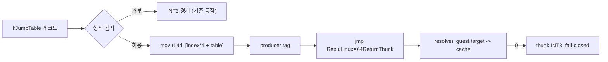
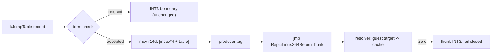

# Task 632 설계: long mode jump table slot

## 한국어

### 배경

Task 631 이후 frontier는 guest `0x0105547D`의
`JMP CS:[EBX*4+0x01055410]`입니다. 초기 AOT map은 이 명령을 이미 포기하고
있습니다.

```text
[repiu-aot-map-entry] target=0x0105547D index=48424 cache=0x2004B0AF guest_len=8 emitted_len=1 bytes=CC
[repiu-aot-map-fixup] source=0x0105547D kind=hle-boundary target=0x00000000 resolved=0
```

planner는 이 명령을 `AotInstructionKind::kJumpTable`로 분류하지만, long mode
emit 경로에는 `kJumpTable` 슬롯이 없습니다. i386 경로에는
`EmitJumpTableSlot`이 있고 cache 안에 target 표를 만들어 `JMP [index*4 +
table]`을 emit합니다.

### 두 선택지

1. **처리기 없는 경계의 native 단일 실행을 fail-closed로 바꾼다.** Task 631이
   기록한 일반적 위험을 없애지만, 지금 조용히 지나가던 모든 경계가 즉시
   정지가 됩니다. 도달 범위가 크게 뒤로 갑니다. 무엇이 얼마나 걸리는지
   census 없이 하기에는 범위가 큽니다.
2. **long mode `kJumpTable` 슬롯을 만든다.** frontier를 직접 없애고, 다른
   경계의 동작은 바꾸지 않습니다.

이번 작업은 2를 택합니다. 1은 census가 먼저 필요하며 별도 작업으로 남깁니다.

### 설계

i386처럼 cache 안에 표를 복사하지 않고, guest의 표를 그대로 읽고 target을
기존 return thunk resolver에 넘깁니다. indirect call 슬롯에서 return 주소
push만 뺀 형태입니다.

```text
67 44 8B 34 <sib> <disp32>   ; mov r14d, [index*4 + table]
41 BA <guest addr | 0x80000000>  ; producer tag
49 BC <thunk>                ; movabs r12, RepiuLinuxX64ReturnThunk
41 FF E4                     ; jmp r12
```

thunk은 R14D를 "해석할 guest 주소"로만 쓰고 스택을 건드리지 않으므로, push를
빼면 그대로 indirect jump가 됩니다. resolver는 guest target을 cache 주소로
바꾸고, 못 바꾸면 0을 돌려주어 thunk의 `INT3`으로 fail-closed합니다.

guest의 표를 실행 시점에 읽으므로 i386처럼 표를 미리 복사할 필요가 없고,
표가 갱신되어도 따라갑니다.

### 받는 형식

`EmitJumpTableSlot`과 같은 제약에 long mode 제약을 더합니다.

1. opcode `FF`, ModRM `/4`, `mod == 0`, `rm == 100`(SIB).
2. SIB는 scale `4`, base `101`(없음), index는
   `instruction.table_index_register`이며 `4`(ESP)가 아닐 것.
3. 변위는 disp32.
4. 앞에 `2E`(CS) 하나가 붙는 형식까지 받고, 그 prefix는 무시합니다. LE fixup이
   절대 주소를 이미 배치된 선형 주소로 바꾸어 두었으므로 이 이미지에서 모든
   selector base는 0이고 `CS:`는 데이터 참조에 대해 무연산입니다. i386의
   `EmitJumpTableSlot`도 같은 이유로 이 prefix를 버립니다.
5. 그 밖의 prefix, 다른 ModRM 형태, `LongModeReturnThunkAddress()`가 0인
   경우는 거부하고 기존처럼 경계로 남깁니다.

주소 재작성은 `LowerLongModeIndirectTargetLoad`가 쓰는 경로를 그대로
공유합니다. `FF /4`를 `8B /r`로 바꾸어 `ESI`로 읽는 32비트 명령을 만들고
`LowerLongModeBytes`에 넘긴 뒤, 그 앞에 REX.R을 넣어 `R14`로 만듭니다. 재작성
규칙의 사본을 두지 않기 위해 함수를 바이트 구간과 기대 `/reg`를 받는 형태로
일반화합니다.



### 검증 전략

* `linux_x64_guest_register_probe`에 실행 프로브를 추가합니다. 표를 데이터
  영역에 두고 `EBX=1`로 실행하여, resolver가 표의 두 번째 항목에 대해
  질문했는지, `EAX`가 그 대상의 표식이 되었는지, guest ESP가 그대로인지
  확인합니다. ESP가 그대로라는 것이 call과 구별되는 핵심입니다.
* 거부 프로브를 추가합니다. 레지스터 형식, `/2`, ESP index, `2E` 외의 prefix.
* Linux x64 `repiu_core_probe`를 실행합니다.
* `pumpit2a`를 실행하여 `0x0105547D` fault가 사라지는지 확인하고 다음 정지
  지점을 기록합니다.

## English

### Background

After Task 631 the frontier is `JMP CS:[EBX*4+0x01055410]` at guest
`0x0105547D`. The initial AOT map has already given up on it:

```text
[repiu-aot-map-entry] target=0x0105547D index=48424 cache=0x2004B0AF guest_len=8 emitted_len=1 bytes=CC
[repiu-aot-map-fixup] source=0x0105547D kind=hle-boundary target=0x00000000 resolved=0
```

The planner classifies it as `AotInstructionKind::kJumpTable`, but the long-mode
emit path has no `kJumpTable` slot. The i386 path has `EmitJumpTableSlot`, which
builds a table of targets inside the cache and emits `JMP [index*4 + table]`.

### The two options

1. **Make the native single-step of an unhandled boundary fail closed.** This
   removes the general hazard Task 631 recorded, but every boundary that
   currently passes silently becomes an immediate stop, and reach falls a long
   way back. Doing that without a census of what it would cost is too large a
   scope for one step.
2. **Build a long-mode `kJumpTable` slot.** This removes the frontier directly
   and changes no other boundary's behavior.

This task takes option 2. Option 1 needs a census first and stays a separate
task.

### Design

Rather than copying a table into the cache as i386 does, read the guest's own
table and hand the target to the existing return-thunk resolver. It is the
indirect-call slot with the return-address push removed.

```text
67 44 8B 34 <sib> <disp32>       ; mov r14d, [index*4 + table]
41 BA <guest addr | 0x80000000>  ; producer tag
49 BC <thunk>                    ; movabs r12, RepiuLinuxX64ReturnThunk
41 FF E4                         ; jmp r12
```

The thunk treats R14D purely as "the guest address to resolve" and touches no
stack, so dropping the push turns the same sequence into an indirect jump. The
resolver maps the guest target to a cache address, and answering zero reaches
the thunk's `INT3`, which is the fail-closed boundary.

Reading the guest's table at run time means no table has to be copied ahead of
execution, and a table the guest updates is followed.

### Forms accepted

The same constraints `EmitJumpTableSlot` uses, plus the long-mode ones.

1. Opcode `FF`, ModRM `/4`, `mod == 0`, `rm == 100` (SIB).
2. The SIB has scale `4`, base `101` (none), and index
   `instruction.table_index_register`, which must not be `4` (ESP).
3. The displacement is a disp32.
4. A single leading `2E` (CS) is accepted and ignored. LE fixups have already
   rewritten absolute addresses to placed linear addresses, so every selector
   base in this image is zero and `CS:` is a no-op on a data reference. The
   i386 `EmitJumpTableSlot` drops the same prefix for the same reason.
5. Any other prefix, any other ModRM shape, and a zero
   `LongModeReturnThunkAddress()` are refused and stay boundaries as today.

The address rewrite shares the path `LowerLongModeIndirectTargetLoad` already
uses: turn `FF /4` into the 32-bit `8B /r` that reads the same operand into
`ESI`, hand that to `LowerLongModeBytes`, and insert the REX.R that makes it
`R14`. To avoid a second copy of that rewrite, the function is generalized to
take a byte range and the `/reg` extension it expects.



### Verification strategy

* Add an executing probe to `linux_x64_guest_register_probe`: put a table in the
  data region, run with `EBX=1`, and check that the resolver was asked about the
  table's second entry, that `EAX` carries that target's marker, and that guest
  ESP is unchanged. The untouched ESP is what distinguishes this from a call.
* Add a refusal probe: the register form, `/2`, an ESP index, and prefixes other
  than `2E`.
* Run the Linux x64 `repiu_core_probe`.
* Run `pumpit2a`, confirm the `0x0105547D` fault is gone, and record the next
  stopping point.
