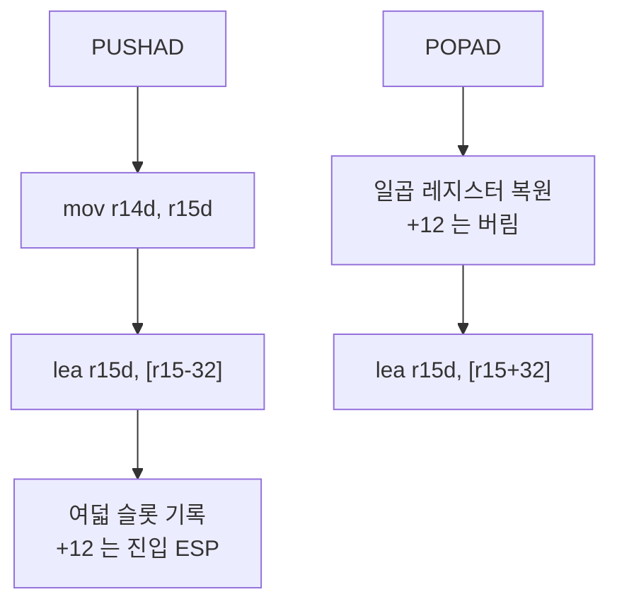
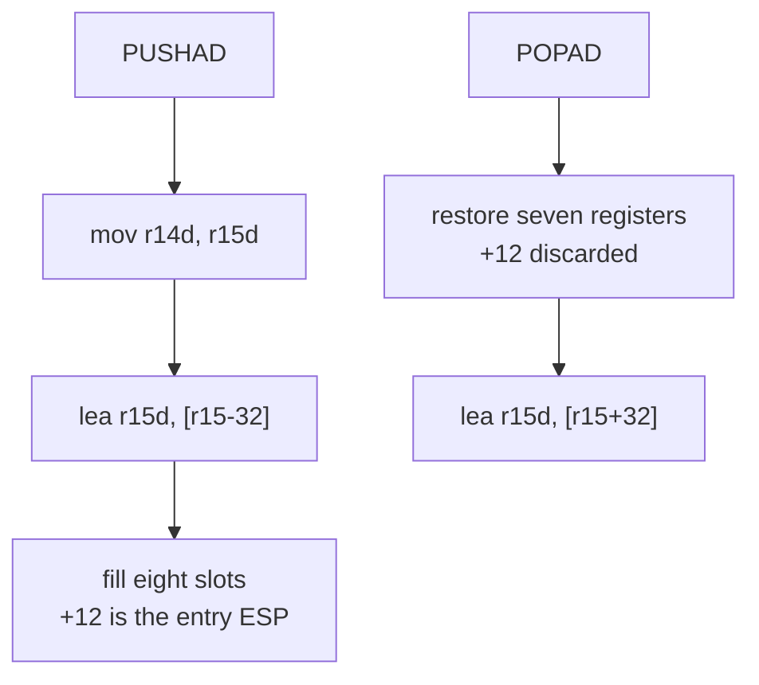

# Task 634 설계: long mode `PUSHAD` / `POPAD`

## 한국어

### 배경

Task 632 이후 frontier는 guest `0x010EFE38`의 `60`, 즉 `PUSHAD`입니다.

```text
[repiu-fault] unhandled signal=0x4 rip=0x10efe38 eip=0x10efe38 access=0x0
  bytes=60 89 c7 81 3d 4c 62 1a 01 ff ff 00 00 75 2b e8
[repiu-aot-map-entry] target=0x010EFE38 index=653 cache=0x200016DE guest_len=1 emitted_len=1 bytes=CC
```

`0x60`은 64비트 모드에 없는 인코딩이므로, 처리기 없는 경계를 guest 주소에서
단일 실행하는 경로가 SIGILL을 냅니다. 해당 명령은 평범한 함수 prologue이며
특별한 문맥이 아닙니다.

```text
010efe38: 60           pusha
010efe39: 89 c7        mov  %eax,%edi
010efe3b: 81 3d ...    cmpl $0xffff,0x9624c
```

Task 633의 census는 `pushad`와 `popad`가 각 1건임을 확인했습니다.

### 설계

`HasStackSequenceLowering`과 `WriteStackSequence`에 두 opcode를 추가합니다.
guest ESP는 R15D, 스크래치는 R14D라는 기존 규약을 그대로 씁니다.

`PUSHAD`는 진입 시점의 ESP를 저장한 뒤 32바이트를 내리고 여덟 슬롯을
채웁니다. Intel SDM의 순서에 따라 `[ESP+0]`이 EDI, `[ESP+12]`가 진입
ESP, `[ESP+28]`이 EAX입니다.

```text
mov  r14d, r15d          ; 진입 ESP를 먼저 붙든다
lea  r15d, [r15-32]
mov  [r15+0],  edi
mov  [r15+4],  esi
mov  [r15+8],  ebp
mov  [r15+12], r14d      ; 진입 ESP
mov  [r15+16], ebx
mov  [r15+20], edx
mov  [r15+24], ecx
mov  [r15+28], eax
```

`POPAD`는 ESP 슬롯을 건너뛰고 일곱 레지스터를 복원한 뒤 32바이트를 올립니다.

```text
mov  edi, [r15+0]
mov  esi, [r15+4]
mov  ebp, [r15+8]
;    [r15+12] 는 버린다
mov  ebx, [r15+16]
mov  edx, [r15+20]
mov  ecx, [r15+24]
mov  eax, [r15+28]
lea  r15d, [r15+32]
```

두 sequence 모두 `MOV`와 `LEA`만 씁니다. `PUSHAD`와 `POPAD`는 flag를 바꾸지
않으므로, `AdjustGuestEsp`가 `ADD`가 아니라 `LEA`인 이유가 여기에도 그대로
적용됩니다.

### 버퍼 상한

`PUSHAD`는 39바이트, `POPAD`는 32바이트를 emit합니다. 현재
`kMaxLoweredBytes`는 24이므로 48로 올립니다. 이 상수는 모든 사용처에서 스택
버퍼 크기이거나 `<=` 비교이며, `AotAddressMapEntry::emitted_length`는
`std::uint8_t`라 39는 여유가 있습니다.

### 순서에 대한 확인

`PUSHAD`는 진입 ESP를 먼저 R14D에 붙듭니다. `lea` 뒤에 읽으면 이미 32가
빠진 값이 되어 다른 값을 스택에 남깁니다. `PUSH ESP` 사례가 같은 이유로 같은
모양을 씁니다.

`POPAD`의 일곱 load는 서로 다른 슬롯을 읽어 서로 다른 레지스터에 쓰고, base인
R15D는 마지막 `lea`까지 바뀌지 않으므로 순서에 의존하지 않습니다. 그래도 SDM
순서를 그대로 씁니다.



### 검증 전략

* `long_mode_compatibility` 코어 프로브의 stack sequence 표에 두 항목을
  추가합니다. `PUSHAD`는 10개 명령, `POPAD`는 8개 명령이며 각 mnemonic을
  순서대로 확인합니다.
* `PUSHAD`가 진입 ESP를 `+12`에 남기는지 바이트로 확인합니다.
* Linux x64 `repiu_core_probe`를 실행합니다.
* `repiu_instruction_census`에서 `pushad`/`popad` 거부가 사라지고
  `agrees=true`가 유지되는지 확인합니다.
* `pumpit2a`를 실행하여 `0x010EFE38` SIGILL이 사라지는지 확인하고 다음 정지
  지점을 기록합니다.

## English

### Background

After Task 632 the frontier is `60` at guest `0x010EFE38` -- `PUSHAD`.

```text
[repiu-fault] unhandled signal=0x4 rip=0x10efe38 eip=0x10efe38 access=0x0
  bytes=60 89 c7 81 3d 4c 62 1a 01 ff ff 00 00 75 2b e8
[repiu-aot-map-entry] target=0x010EFE38 index=653 cache=0x200016DE guest_len=1 emitted_len=1 bytes=CC
```

`0x60` is an encoding 64-bit mode does not have, so the path that single-steps an
unhandled boundary at its guest address raises SIGILL. The instruction is an
ordinary function prologue, not a special context.

```text
010efe38: 60           pusha
010efe39: 89 c7        mov  %eax,%edi
010efe3b: 81 3d ...    cmpl $0xffff,0x9624c
```

Task 633's census confirmed `pushad` and `popad` are one record each.

### Design

Add both opcodes to `HasStackSequenceLowering` and `WriteStackSequence`, using
the existing convention that guest ESP is R15D and the scratch is R14D.

`PUSHAD` captures the entry ESP, lowers by thirty-two, and fills eight slots. In
the Intel SDM's order `[ESP+0]` is EDI, `[ESP+12]` is the entry ESP, and
`[ESP+28]` is EAX.

```text
mov  r14d, r15d          ; hold the entry ESP first
lea  r15d, [r15-32]
mov  [r15+0],  edi
mov  [r15+4],  esi
mov  [r15+8],  ebp
mov  [r15+12], r14d      ; the entry ESP
mov  [r15+16], ebx
mov  [r15+20], edx
mov  [r15+24], ecx
mov  [r15+28], eax
```

`POPAD` skips the ESP slot, restores seven registers, and raises by thirty-two.

```text
mov  edi, [r15+0]
mov  esi, [r15+4]
mov  ebp, [r15+8]
;    [r15+12] is discarded
mov  ebx, [r15+16]
mov  edx, [r15+20]
mov  ecx, [r15+24]
mov  eax, [r15+28]
lea  r15d, [r15+32]
```

Both sequences use only `MOV` and `LEA`. `PUSHAD` and `POPAD` change no flags,
so the reason `AdjustGuestEsp` is a `LEA` rather than an `ADD` applies here too.

### The buffer bound

`PUSHAD` emits thirty-nine bytes and `POPAD` thirty-two. `kMaxLoweredBytes` is
twenty-four today, so it rises to forty-eight. Every use of the constant is a
stack buffer size or a `<=` comparison, and
`AotAddressMapEntry::emitted_length` is a `std::uint8_t`, which has room for
thirty-nine.

### What the ordering rests on

`PUSHAD` holds the entry ESP in R14D first. Read after the `lea` it would
already be thirty-two lower and would leave a different value on the stack. The
`PUSH ESP` case takes the same shape for the same reason.

`POPAD`'s seven loads read distinct slots into distinct registers, and the base
R15D does not change until the final `lea`, so they do not depend on order. The
SDM's order is used anyway.



### Verification strategy

* Add two entries to the `long_mode_compatibility` core probe's stack-sequence
  table: ten instructions for `PUSHAD` and eight for `POPAD`, each mnemonic
  checked in order.
* Check by bytes that `PUSHAD` leaves the entry ESP at `+12`.
* Run the Linux x64 `repiu_core_probe`.
* Confirm `repiu_instruction_census` no longer refuses `pushad` and `popad` and
  still reports `agrees=true`.
* Run `pumpit2a`, confirm the `0x010EFE38` SIGILL is gone, and record the next
  stopping point.
