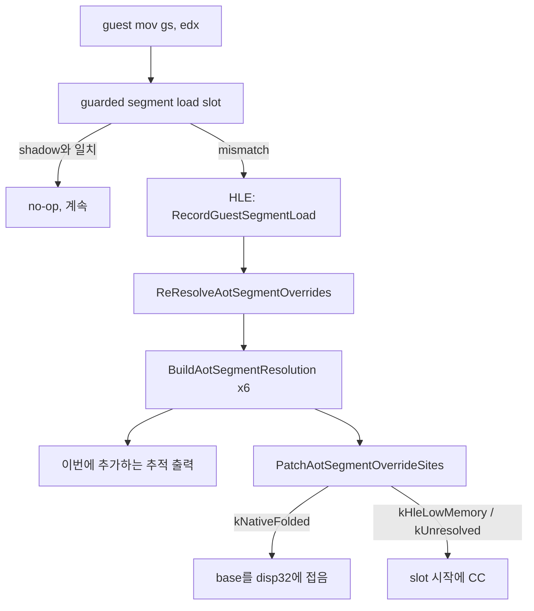
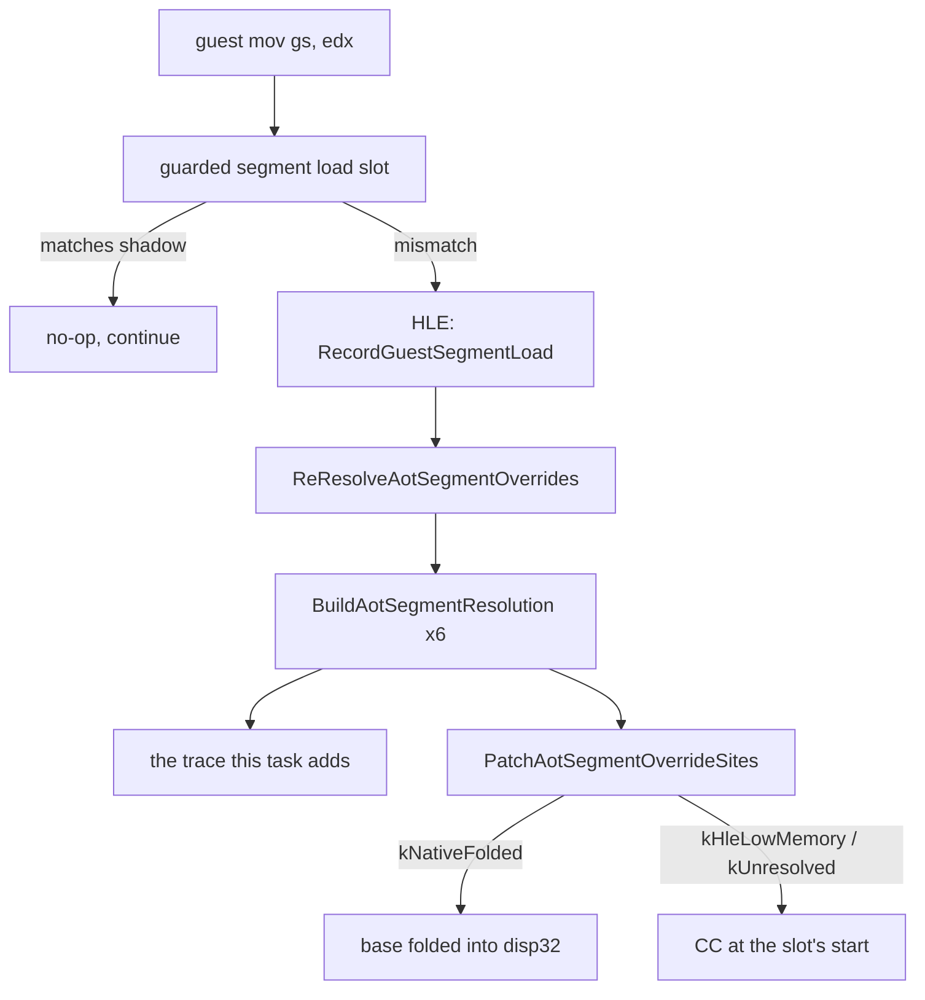

# Task 635 설계: x64 GS override frontier의 selector 해석 측정

## 한국어

### 배경

Task 634는 다음 작업을 이렇게 남겼습니다. "`0x010F06D0`이 어떤 문맥에서 GS를
읽는지 확인하고, 그 selector가 무엇을 가리키는지부터 측정한다."

HEAD(`29ea246`) 빌드를 세 번 실행하면 매번 같은 지점에서 멈춥니다.

```text
[repiu-fault] unhandled signal=0xb rip=0x10f06d0 eip=0x10f06d0 access=0x9fdd
  bytes=65 80 38 6a 75 4d 8d 45 ff b6 01 65 8a 18 88 35
  eax=0x9fdd ebx=0x9fdf ecx=0xffffffff edx=0x80 esi=0x9fed edi=0x11a6342
  esp=0x158c804
```

`pumpit2a`의 object 2 이미지를 그대로 디스어셈블하면 문맥이 나옵니다.

```text
010f06c9: eb 58        jmp  0x10f0723        ; 앞 블록의 끝
010f06cb: 8e ea        mov  gs, edx          ; GS는 여기서 EDX로부터 적재
010f06cd: 8d 45 fe     lea  eax, [ebp-2]
010f06d0: 65 80 38 6a  cmp  byte ptr gs:[eax], 0x6a
010f06d4: 75 4d        jne  0x10f0723
010f06d6: 8d 45 ff     lea  eax, [ebp-1]
010f06d9: b6 01        mov  dh, 1
010f06db: 65 8a 18     mov  bl, byte ptr gs:[eax]
```

`0x010F06CB`은 바로 앞이 무조건 `jmp`이므로 별도 진입 블록이고, GS 적재와
첫 GS 접근 사이에는 `lea` 하나뿐입니다. 따라서 폴트 시점의 `edx=0x80`이
그대로 GS selector입니다.

### 확인된 사실

**확인됨.** 두 GS 접근은 초기 map에서 모두 `CC`입니다.

```text
[repiu-aot-map-entry] target=0x010F06D0 index=2855 cache=0x20004ED6
                      guest_len=4 emitted_len=1 inactive=0 bytes=CC
[repiu-aot-map-fixup] source=0x010F06D0 kind=hle-boundary resolved=0
[repiu-aot-map-entry] target=0x010F06DB index=2859 cache=0x20004EE3
                      guest_len=3 emitted_len=1 inactive=0 bytes=CC
```

처리기 없는 경계이므로 Task 631이 이름 붙인 일반 위험 그대로, 32비트 명령이
guest 주소에서 64비트 코드로 한 번 실행됩니다.

**확인됨.** `access=0x9FDD`는 `eax`와 정확히 같습니다. 즉 host GS base는 0이며,
`65` prefix가 오프셋을 그대로 선형 주소로 만들었습니다. Task 634가 "host의
TLS"라고 적은 부분은 정정합니다 — Linux x86-64 사용자 스레드의 TLS는 FS이고
GS base는 0입니다. 결과가 unmapped 저주소 접근인 것은 같습니다.

**확인됨.** `LongModeSegmentOverrideEmittable`이 FS/GS를 거부하는 것은 코드의
`switch` 한 곳뿐입니다. 나머지 계층은 이미 segment index 0~5에 대해
일반적입니다.

* `AotShadowSelectorBlock::selectors`는 6칸이고 FS=4, GS=5 자리가 있습니다.
* `BuildAotSegmentResolution`은 selector index를 가리지 않습니다.
* `PatchAotSegmentOverrideSites`는 `seg >= 6U`만 거릅니다.

**확인됨.** 방출되는 slot은 guest의 segment prefix를 **버리고** base를 `disp32`에
접습니다. 즉 host FS/GS 레지스터에는 아무것도 쓰지 않습니다.

**확인됨.** 로더는 selector `0x0080`을 LINEXE code segment로 추출합니다.

```text
[loader] LINEXE extracted segment: selector=0x00000080 limit=0x0000914F
         access=0x0000009A image=37200 relocations=169
```

`kDos4gwLinexeCodeSelector`가 `0x0080`이고, 등록되는 base는
`linexe_arena_layout.gate_code_base`입니다.

**확인됨.** 미등록 selector가 적재되면 `RecordGuestSegmentLoad`가 base 0,
limit `kDosLowMemorySize - 1`(`0xFFFF`)로 descriptor를 등록합니다. 그리고
`BuildAotSegmentResolution`은 base와 end가 모두 `kDosLowMemorySize` 미만이면
`kHleLowMemory`를 고릅니다.

### 미확정 사항 — 이번 작업이 풀 것

폴트 시점 GS의 **해석 결과**가 확정되지 않았습니다. 두 갈래가 있고 결론이
정반대의 설계를 부릅니다.

| 갈래 | GS descriptor | policy | 접근 offset `0x9FDD`의 의미 |
|---|---|---|---|
| A | base=`gate_code_base`, limit=`0x914F` | `kNativeFolded` | limit 초과 |
| B | base=0, limit=`0xFFFF` | `kHleLowMemory` | DOS 저지대 안 |

갈래 A라면 fold + guard slot을 GS까지 넓히는 것으로 충분하지만 limit을 넘는
접근이 남습니다. 갈래 B라면 fold는 애초에 선택되지 않고 slot은 `CC`로
패치되므로, 저지대 HLE 경로가 x64에 없다는 것이 진짜 과제가 됩니다.

`selguard=` 카운터는 마지막 1초에 mismatch가 36,538건 증가했습니다. 즉 이
지점 직전에 guarded segment load가 반복해서 shadow와 어긋나 HLE로 떨어지고
있습니다. 어느 selector가 오가는지는 카운터로 알 수 없습니다.

### 결정

**이번 작업은 측정만 한다.** GS override slot을 넓히는 구현은 위 갈래가
확정된 뒤의 작업입니다. Task 634가 "설계 판단이 먼저 필요하다"고 적은 것이
바로 이 지점이고, 판단의 입력이 아직 없습니다.

측정 수단은 `ReResolveAotSegmentOverrides`가 해석을 갱신할 때 여섯 개의
`AotSegmentResolution`을 그대로 찍는 opt-in 진단입니다. 이 함수를 고르는
이유는 세 가지입니다.

1. 해석이 실제로 바뀌는 유일한 지점이므로, 출력이 곧 상태 전이 기록입니다.
2. 시그널 핸들러가 아니므로 `fprintf`를 써도 됩니다.
3. 이미 `AotSegmentTable`을 손에 들고 있어 새로 계산할 것이 없습니다.

기본 실행 경로는 바뀌지 않아야 합니다. 환경 변수가 없으면 출력도 없고 분기
하나만 늘어납니다.



### 범위 밖

* `LongModeSegmentOverrideEmittable`의 FS/GS 거부는 이번에 건드리지 않습니다.
* ModRM 형식 확대(`mod=00`의 base 레지스터 형식)도 건드리지 않습니다. 측정
  결과가 갈래 B로 나오면 그 확대만으로는 아무것도 풀리지 않기 때문입니다.
* i386 경로의 동작은 그대로 둡니다.

## English

### Background

Task 634 left its next step as: "confirm what context `0x010F06D0` reads GS in,
and measure what that selector points at."

Three runs of the HEAD (`29ea246`) build stop at the same place.

```text
[repiu-fault] unhandled signal=0xb rip=0x10f06d0 eip=0x10f06d0 access=0x9fdd
  bytes=65 80 38 6a 75 4d 8d 45 ff b6 01 65 8a 18 88 35
  eax=0x9fdd ebx=0x9fdf ecx=0xffffffff edx=0x80 esi=0x9fed edi=0x11a6342
  esp=0x158c804
```

Disassembling `pumpit2a`'s object 2 image gives the context.

```text
010f06c9: eb 58        jmp  0x10f0723        ; end of the previous block
010f06cb: 8e ea        mov  gs, edx          ; GS is loaded from EDX here
010f06cd: 8d 45 fe     lea  eax, [ebp-2]
010f06d0: 65 80 38 6a  cmp  byte ptr gs:[eax], 0x6a
010f06d4: 75 4d        jne  0x10f0723
010f06d6: 8d 45 ff     lea  eax, [ebp-1]
010f06d9: b6 01        mov  dh, 1
010f06db: 65 8a 18     mov  bl, byte ptr gs:[eax]
```

`0x010F06CB` follows an unconditional `jmp`, so it is a separate entry block,
and only one `lea` sits between the GS load and the first GS access. The
`edx=0x80` at the fault is therefore the GS selector itself.

### Confirmed facts

**Confirmed.** Both GS accesses are `CC` in the initial map.

```text
[repiu-aot-map-entry] target=0x010F06D0 index=2855 cache=0x20004ED6
                      guest_len=4 emitted_len=1 inactive=0 bytes=CC
[repiu-aot-map-fixup] source=0x010F06D0 kind=hle-boundary resolved=0
[repiu-aot-map-entry] target=0x010F06DB index=2859 cache=0x20004EE3
                      guest_len=3 emitted_len=1 inactive=0 bytes=CC
```

They are boundaries with nothing to service them, so Task 631's general hazard
applies verbatim: a 32-bit instruction runs once as 64-bit code at its guest
address.

**Confirmed.** `access=0x9FDD` equals `eax` exactly, so the host GS base is
zero and the `65` prefix turned the offset straight into a linear address.
Task 634's note that this reads "the host's TLS" is corrected here: on Linux
x86-64 a user thread's TLS is FS, and the GS base is zero. The outcome — an
unmapped low address — is the same.

**Confirmed.** Only one `switch` in `LongModeSegmentOverrideEmittable` refuses
FS and GS. Every layer beneath it is already generic over segment indices 0-5.

* `AotShadowSelectorBlock::selectors` has six slots, including FS=4 and GS=5.
* `BuildAotSegmentResolution` does not look at which index it is given.
* `PatchAotSegmentOverrideSites` filters only `seg >= 6U`.

**Confirmed.** The emitted slot **drops** the guest's segment prefix and folds
the base into a `disp32`. It writes nothing into a host FS or GS register.

**Confirmed.** The loader extracts selector `0x0080` as the LINEXE code segment.

```text
[loader] LINEXE extracted segment: selector=0x00000080 limit=0x0000914F
         access=0x0000009A image=37200 relocations=169
```

`kDos4gwLinexeCodeSelector` is `0x0080`, and the base registered for it is
`linexe_arena_layout.gate_code_base`.

**Confirmed.** When an unregistered selector is loaded,
`RecordGuestSegmentLoad` registers a descriptor with base 0 and limit
`kDosLowMemorySize - 1` (`0xFFFF`). `BuildAotSegmentResolution` then chooses
`kHleLowMemory` whenever base and end are both below `kDosLowMemorySize`.

### Unresolved — what this task settles

GS's **resolution** at the fault is not established. There are two branches and
they call for opposite designs.

| Branch | GS descriptor | Policy | What offset `0x9FDD` means |
|---|---|---|---|
| A | base=`gate_code_base`, limit=`0x914F` | `kNativeFolded` | past the limit |
| B | base=0, limit=`0xFFFF` | `kHleLowMemory` | inside DOS low memory |

Under branch A, widening the fold-and-guard slot to GS is enough, but an access
past the segment limit remains. Under branch B the fold is never chosen and the
slot is patched to `CC`, so the real work is that x64 has no low-memory HLE
route for this shape.

The `selguard=` counters gained 36,538 mismatches in the last second, so a
guarded segment load just before this point repeatedly disagrees with its
shadow and falls back to HLE. The counters cannot say which selector.

### Decision

**This task measures only.** Widening the GS override slot is the task after
the branch is settled. Task 634 wrote that a design judgement is needed first;
this is that point, and the judgement has no input yet.

The instrument is an opt-in diagnostic that prints the six
`AotSegmentResolution` values whenever `ReResolveAotSegmentOverrides` updates
them. That function is the right place for three reasons.

1. It is the only point where a resolution actually changes, so the output is a
   record of state transitions.
2. It is not a signal handler, so `fprintf` is allowed.
3. It already holds the `AotSegmentTable`, so nothing has to be recomputed.

The default execution path must not change. With no environment variable there
is no output and one extra branch.



### Out of scope

* The FS/GS refusal in `LongModeSegmentOverrideEmittable` is not touched.
* Widening the ModRM forms (the `mod=00` base-register shape) is not touched
  either: if the measurement lands on branch B, that widening alone resolves
  nothing.
* i386 behavior is left exactly as it is.
