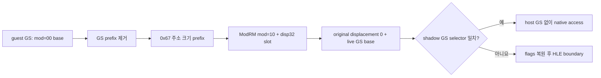

# Task 636 설계: Linux x64 GS base/no-displacement segment override

## 한국어

### 배경

Task 635는 `0x010F06D0` fault 직전 GS가 selector `0x0080`, base
`0x095C7000`, limit `0x9FFF`, policy `kNativeFolded`로 해석됨을 확인했습니다.
접근 offset `0x9FDD`도 descriptor 범위 안입니다. 따라서 이 frontier는
low-memory HLE 문제가 아니라 기존 x64 segment-override fold slot이 GS와 해당
ModRM 형식을 받지 않는 문제입니다.

```text
010f06cb: 8e ea        mov  gs, edx
010f06d0: 65 80 38 6a  cmp  byte ptr gs:[eax], 0x6a
010f06db: 65 8a 18     mov  bl, byte ptr gs:[eax]
```

두 접근의 ModRM은 모두 `mod=00`, `rm=000`인 EAX base/no-displacement
형식입니다. 현재 `LongModeSegmentOverrideEmittable`은 ES/SS/DS와 absolute
disp32 또는 base+disp8만 받습니다.

### 결정

기존 selector guard와 live-base patch 계약을 그대로 사용하되 다음 두 축만
확장합니다.

1. segment register 5(GS)를 prefix `0x65`로 인정합니다.
2. non-SIB `mod=00` base/no-displacement 형식을 인정하고 `mod=10 disp32`로
   넓힙니다.

guest GS prefix는 emitted access에서 제거됩니다. live GS base는 patcher가
새 disp32에 더하므로 host GS 레지스터는 읽거나 쓰지 않습니다. FS는 host TLS와
충돌할 수 있으므로 계속 거부합니다.

```text
guest:  65 80 38 6A                cmp byte ptr gs:[eax],0x6a
access: 67 80 B8 <GS base> 6A      cmp byte ptr [eax+disp32],0x6a

guest:  65 8A 18                   mov bl,gs:[eax]
access: 67 8A 98 <GS base>         mov bl,[eax+disp32]
```

`0x67`은 long mode에서 32비트 주소 계산을 선택합니다. ModRM의 `reg`와 `rm`은
유지하고 `mod`만 `00`에서 `10`으로 바꿉니다. site의
`original_displacement`는 0이고 patcher는 기존처럼 `0 + live GS base`를
disp32에 씁니다.

### displacement가 없는 형식의 경계

Zydis의 `raw.disp.size`가 0이면 `raw.disp.offset`은 원본 suffix 위치로 사용할
수 없습니다. 따라서 emitter는 다음을 명시적으로 구분해야 합니다.

* absolute disp32: 원본 signed disp32를 보존하고 suffix는 disp32 뒤에서 시작
* base+disp8: 원본 disp8을 부호 확장하고 suffix는 disp8 뒤에서 시작
* base/no-displacement: 원본 변위는 0이고 suffix는 ModRM 바로 뒤에서 시작

마지막 규칙이 없으면 prefix를 displacement로 오인하거나 원본 명령 전체를 새
disp32 뒤에 다시 붙일 수 있습니다. immediate `0x6A`가 있는 첫 frontier 명령을
probe에 포함하여 이 경계를 검증합니다.



### 안전 조건

새 형식은 다음을 모두 만족할 때만 허용합니다.

* GS 또는 기존 ES/SS/DS override
* default opcode map
* ModRM `mod=00`, `rm!=4`, `rm!=5`, displacement size 0
* 어느 register 또는 memory operand도 guest ESP를 가리키지 않음
* decode 길이와 ModRM 위치가 유효함

SIB, base+disp32, FS override는 계속 fail-closed합니다.

### 검증 전략

Linux x64 실행 probe에 실제 frontier CMP와 MOV 형식을 넣습니다.

1. GS selector 일치 시 CMP 결과를 `SETZ`로 관찰하고 GS byte load도 확인합니다.
2. 이어서 기존 ES base+disp8 및 absolute disp32 접근이 계속 성공하는지 확인합니다.
3. GS selector 불일치 시 첫 slot에서 access 전에 boundary로 가는지 확인합니다.
4. HLE policy로 바꾼 뒤 native policy로 복원하여 네 slot의 prologue가 모두
   복구되는지 실행으로 확인합니다.
5. core probe, instruction census `agrees=true`, 실제 `pumpit2a` 실행으로 다음
   frontier를 기록합니다.

## English

### Background

Task 635 established that immediately before the fault at `0x010F06D0`, GS
resolves to selector `0x0080`, base `0x095C7000`, limit `0x9FFF`, and policy
`kNativeFolded`. Offset `0x9FDD` is also inside the descriptor. The frontier is
therefore not a low-memory HLE problem; the existing x64 segment-override fold
slot does not admit GS or this ModRM form.

```text
010f06cb: 8e ea        mov  gs, edx
010f06d0: 65 80 38 6a  cmp  byte ptr gs:[eax], 0x6a
010f06db: 65 8a 18     mov  bl, byte ptr gs:[eax]
```

Both accesses use an EAX base with no displacement: ModRM `mod=00`, `rm=000`.
`LongModeSegmentOverrideEmittable` currently admits only ES/SS/DS and either
absolute disp32 or base+disp8.

### Decision

Retain the existing selector guard and live-base patch contract while extending
only two axes:

1. Admit segment register 5 (GS) with prefix `0x65`.
2. Admit non-SIB `mod=00` base/no-displacement and widen it to
   `mod=10 disp32`.

The guest GS prefix is removed from the emitted access. The patcher adds the
live GS base to the new disp32, so host GS is neither read nor written. FS
remains refused because it can conflict with host TLS.

```text
guest:  65 80 38 6A                cmp byte ptr gs:[eax],0x6a
access: 67 80 B8 <GS base> 6A      cmp byte ptr [eax+disp32],0x6a

guest:  65 8A 18                   mov bl,gs:[eax]
access: 67 8A 98 <GS base>         mov bl,[eax+disp32]
```

`0x67` selects 32-bit address calculation in long mode. The ModRM `reg` and
`rm` fields stay intact and only `mod` changes from `00` to `10`. The site's
`original_displacement` is zero, and the existing patcher writes
`0 + live GS base` into disp32.

### The no-displacement boundary

When Zydis reports `raw.disp.size == 0`, `raw.disp.offset` cannot be used as the
start of the original suffix. The emitter must distinguish three cases:

* absolute disp32: preserve the signed disp32 and start the suffix after it;
* base+disp8: sign-extend disp8 and start the suffix after it; and
* base/no-displacement: use original displacement zero and start the suffix
  immediately after ModRM.

Without the last rule, the emitter could mistake the prefix for a displacement
or append the entire original instruction again after the new disp32. The probe
includes the first frontier instruction, whose trailing `0x6A` immediate tests
this boundary.

The diagram above expresses the same lowering and guard flow for both
languages.

### Safety conditions

The new form is admitted only when all of these hold:

* a GS or existing ES/SS/DS override;
* the default opcode map;
* ModRM `mod=00`, `rm!=4`, `rm!=5`, and displacement size zero;
* no register or memory operand names guest ESP; and
* decoded length and ModRM position are valid.

SIB, base+disp32, and FS overrides remain fail-closed.

### Verification strategy

Add the actual frontier CMP and MOV forms to the Linux x64 execution probe.

1. With a matching GS selector, observe the CMP result through `SETZ` and
   verify the GS byte load.
2. Verify that the existing ES base+disp8 and absolute-disp32 accesses still
   succeed afterward.
3. With a mismatching GS selector, confirm the first slot reaches the boundary
   before any access.
4. Route through HLE policy and back to native policy, then execute all four
   restored slot prologues.
5. Run the core probe, instruction census with `agrees=true`, and real
   `pumpit2a` execution to record the next frontier.
