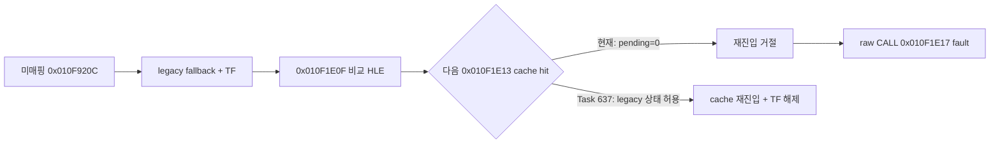

# Task 637 설계: legacy fallback의 HLE 후 cache 재진입

## 한국어

### 문제

Task 636 이후 Linux x64 `pumpit2a`는 guest `0x010F1E17`의 원본
`CALL 0x010F4FE8`을 long mode에서 직접 실행하여 SIGSEGV로 종료됩니다. source와
target 모두 현재 AOT generation에 정확히 매핑되어 있으므로 emitter나 fixup 누락은
아닙니다.

런타임 추적에서 최초 legacy fallback은 미매핑 guest `0x010F920C`에서 시작했습니다.
그 뒤 원본 코드를 TF로 실행하다가 `0x010F1E0F`의 guest-ESP 비교 HLE가 EIP를
`0x010F1E13`으로 전진시켰습니다. 이 주소에는 유효한 cache entry가 있지만
`TryResumeAotAfterHandledHle`는 `aot_reentry_pending == false`만 보고 즉시 거절합니다.
legacy fallback 상태는 별도의 `aot_legacy_fallback == true`로 보존되어 있으므로,
알려진 cache 주소에 다시 도달하면 AOT로 복귀한다는 기존 설계 계약이 적용되지 않는
상태입니다.

### 설계

HLE가 원본 명령을 완전히 처리하고 EIP를 전진시킨 뒤 호출되는 기존
`TryResumeAotAfterHandledHle`에서 재진입 자격을 다음 두 상태로 확장합니다.

1. 기존 cache boundary의 `aot_reentry_pending`
2. 미매핑 target 이후 원본 코드를 실행 중인 `aot_legacy_fallback`

나머지 안전 장치는 바꾸지 않습니다. segment-write probe, guest arena와 quarantine
검사, 정확한 cache lookup, 즉시 span preflight를 모두 통과한 경우에만 cache로
복귀합니다. cache miss의 동적 번역 opt-in 정책도 유지합니다. 성공 시 기존 코드가
두 상태와 TF를 함께 해제합니다.

진단 로그의 `pending`만으로 두 자격 상태를 구분할 수 없으므로
`REPIU_AOT_HLE_REENTRY_TRACE`에 `legacy` 필드를 추가합니다. 최초 복구 주소를 미리
알 수 없는 경우를 위해 `0xFFFFFFFF`는 모든 HLE reentry 시도를 선택하는 진단용
wildcard로 사용합니다. 기본 실행 출력은 변하지 않습니다.

### 검증

* Linux x64 Debug 빌드와 `repiu_core_probe`를 실행합니다.
* `REPIU_AOT_FALLBACK_TRACE=1` 및 `REPIU_AOT_HLE_REENTRY_TRACE=0x010F1E0F`로
  실제 실행하여 legacy 상태의 cache hit와 재진입 성공을 확인합니다.
* `0x010F1E17` raw CALL fault가 사라졌는지 확인하고 다음 실행 frontier를 기록합니다.

## English

### Problem

After Task 636, Linux x64 `pumpit2a` executes the original guest
`CALL 0x010F4FE8` at `0x010F1E17` directly in long mode and terminates with
SIGSEGV. Both source and target have exact entries in the current AOT generation,
so this is not an emitter or fixup omission.

Runtime tracing shows that the first legacy fallback starts at unmapped guest
`0x010F920C`. While the original code then runs under TF, the guest-ESP compare
HLE at `0x010F1E0F` advances EIP to `0x010F1E13`. That address has a valid cache
entry, but `TryResumeAotAfterHandledHle` rejects it solely because
`aot_reentry_pending` is false. The separate `aot_legacy_fallback` state is still
true, so the established contract to return to AOT upon reaching a known cache
address is not being applied.

### Design

Extend eligibility in the existing `TryResumeAotAfterHandledHle`, called only
after HLE fully handles an original instruction and advances EIP, to either:

1. the existing cache-boundary `aot_reentry_pending` state; or
2. original-code execution after an unmapped target, represented by
   `aot_legacy_fallback`.

All other safety gates remain unchanged: segment-write probing, guest-arena and
quarantine checks, exact cache lookup, and immediate-span preflight. The opt-in
policy for translating a post-HLE cache miss also remains unchanged. Existing
success handling clears both states and TF.

Add a `legacy` field to the opt-in `REPIU_AOT_HLE_REENTRY_TRACE`, since `pending`
alone cannot distinguish the two eligible states. Diagnostic value `0xFFFFFFFF`
selects all HLE re-entry attempts when the first recovery address is not known in
advance. Default output is unchanged.

### Verification

* Build Linux x64 Debug and run `repiu_core_probe`.
* Run the real executable with `REPIU_AOT_FALLBACK_TRACE=1` and
  `REPIU_AOT_HLE_REENTRY_TRACE=0x010F1E0F`, confirming a cache hit and successful
  re-entry from legacy state.
* Confirm that the raw CALL fault at `0x010F1E17` is gone and record the next
  execution frontier.
