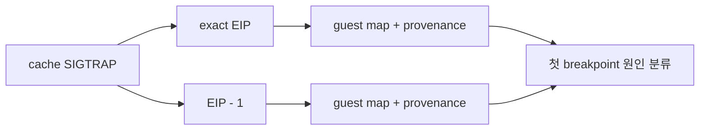

# Task 638 설계: AOT breakpoint 역매핑 추적

## 한국어

### 목표

Task 637 뒤 새로 관찰된 동적 cache breakpoint `0x200829C5`의 guest 주소와 구조적
provenance를 확인합니다. 뒤따르는 `0x21000000` SIGSEGV는 미처리 breakpoint의 복구
과정에서 발생한 2차 fault일 수 있으므로, 첫 SIGTRAP 자체를 우선 측정합니다.

### 설계

기존 opt-in `REPIU_AOT_FAULT_TRACE`를 access violation뿐 아니라 AOT cache 안의
breakpoint에도 적용합니다. 한 이벤트에서 다음 값을 고정 크기 로그 한 줄로 남깁니다.

* fault kind와 cache EIP
* cache EIP의 exact guest 역매핑
* `cache EIP - 1`의 guest 역매핑
* 두 후보의 `AotCacheBreakpointProvenance`
* 현재 cache 끝까지 남은 바이트 수

Linux가 `INT3` 다음 RIP를 한 바이트 되감아 공용 EIP로 전달하므로 exact와 previous를
모두 기록하면 플랫폼 보고 규약과 실제 cache slot 소유권을 분리할 수 있습니다.
`REPIU_AOT_FAULT_TRACE_ADDRESS`에는 선택할 cache 주소를 지정할 수 있습니다. 필터가
없으면 기존처럼 전체를 대상으로 하며, 필터가 있으면 일치한 이벤트만 16-event 상한을
소비합니다. 환경 변수가 없을 때는 기존과 동일하며 handler 순서, context, guest
memory와 cache를 변경하지 않습니다.

### 검증

Linux x64 Debug `repiu`와 core probe를 빌드합니다. 실제 `pumpit2a`에
`REPIU_AOT_FAULT_TRACE=1`을 적용하여 `0x200829C5`의 mapping과 provenance를
기록하고, 다음 수정 범위를 분석 문서에 남깁니다.

## English

### Goal

Identify the guest address and structural provenance of dynamic-cache
breakpoint `0x200829C5`, newly observed after Task 637. The following SIGSEGV at
`0x21000000` may be a secondary fault in unhandled-breakpoint recovery, so this
task measures the first SIGTRAP directly.

### Design

Extend the existing opt-in `REPIU_AOT_FAULT_TRACE` from access violations to
breakpoints inside the AOT cache. One fixed-size line records fault kind, cache
EIP, exact and `EIP - 1` guest reverse mappings, and
`AotCacheBreakpointProvenance` for both candidates, plus the byte distance to
the current cache end.

Recording both addresses separates Linux's common rewound-EIP convention from
the cache slot that owns the trap. `REPIU_AOT_FAULT_TRACE_ADDRESS` optionally
selects one cache address; only matching events consume the 16-event budget.
Without a filter the existing all-address behavior remains. The trace does not
alter handler order, context, guest memory, or cache.

### Verification

Build Linux x64 Debug `repiu` and the core probe. Run real `pumpit2a` with
`REPIU_AOT_FAULT_TRACE=1`, record mapping and provenance for `0x200829C5`, and
document the next implementation boundary in the analysis topic.
