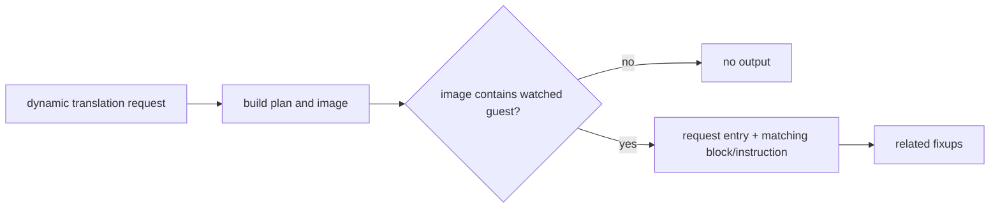

# Task 640 설계: 특정 주소를 포함하는 동적 AOT plan 추적

## 한국어

### 목표

Task 639의 fallthrough source `0x011C8E0E`는 동적 append 내부에 매핑되어 있지만
`REPIU_AOT_DYNAMIC_TRACE=0x011C8E0E`에는 잡히지 않았습니다. 기존 설정은 번역 요청
entry만 비교하기 때문입니다. 특정 guest instruction을 포함한 append의 실제 요청 entry,
block 위치와 fixup을 측정하여 데이터처럼 보이는 순차 실행의 최초 진입점을 좁힙니다.

### 설계

새 opt-in `REPIU_AOT_DYNAMIC_CONTAINS=<guest-address>`를 추가합니다. 동적 image가 만들어진
뒤 address map에 해당 주소가 있을 때만 기존 raw/request-entry trace를 활성화하고 다음을
추가로 출력합니다.

* 번역 요청 entry와 contains 주소
* 일치 instruction의 block 시작, block 내 index, tail 여부, kind, length, mnemonic, bytes
* contains 주소를 source 또는 target으로 사용하는 fixup의 kind, target, patch offset,
  resolved 상태

환경 변수가 없거나 주소가 포함되지 않으면 기존 실행과 출력은 변하지 않습니다. 진단은
plan/image를 읽기만 하며 cache 배치와 실행 제어를 바꾸지 않습니다.

### 검증

Linux x64 `repiu`를 빌드하고 실제 `pumpit2a`에서 contains 주소 `0x011C8E0E`를 지정합니다.
요청 entry와 관련 fixup을 기록하고, core probe `24/24`로 회귀를 확인합니다.

## English

### Goal

Task 639's fallthrough source `0x011C8E0E` is mapped inside a dynamic append,
but `REPIU_AOT_DYNAMIC_TRACE=0x011C8E0E` does not select it because the existing
setting compares only the translation request entry. Measure the containing
append's actual request entry, block position, and fixups to narrow the first
entry into the data-like sequential execution.

### Design

Add opt-in `REPIU_AOT_DYNAMIC_CONTAINS=<guest-address>`. After building the
dynamic image, enable the existing raw/request-entry trace only when its address
map contains the watched address, and additionally report the matching block,
instruction index and tail status, instruction metadata and bytes, plus fixups
whose source or target matches the watched address.

When unset or unmatched, behavior and output remain unchanged. The diagnostic
only reads the plan and image and does not alter cache placement or execution
control.

### Verification

Build Linux x64 `repiu`, run real `pumpit2a` with contains address
`0x011C8E0E`, record the request entry and related fixups, and run the `24/24`
core probe regression.
