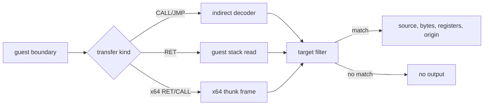

# Task 641 설계: AOT 전이 target 출처 추적

## 한국어

### 문제

Task 640은 zero-filled 동적 번역이 guest `0x011A8E10` 요청에서 시작했음을
확인했지만, 그 주소를 만든 제어 전이의 source와 종류는 아직 알 수 없습니다.
공용 `ResolveAotTransferTarget`에서만 기록하면 RET의 stack 값인지, 간접 CALL/JMP의
레지스터·메모리 피연산자인지 구분할 수 없습니다.

### 설계

`REPIU_AOT_TRANSFER_TARGET_TRACE=<guest-address>`를 opt-in 필터로 추가합니다. 실제
target을 해석한 `HandleAotIndirectTransfer`, `HandleAotReturnTransfer`, Linux x64
전용 반환 resolver에서 출력하며 다음 정보를 보존합니다.

* 공통: kind, origin, source, target, instruction bytes, ESP, cache miss 주소
* 간접 전이: CALL/JMP 구분과 범용 레지스터
* 반환: stack에서 읽은 target, 추적 중인 CALL의 기대 반환 주소와 일치 여부
* Linux x64 thunk: producer 종류와 guest source, 원본 source bytes, 소비 stack 슬롯

필터가 없거나 일치하지 않으면 출력과 제어 흐름은 기존과 동일합니다. 실제
`0x011A8E10` 캡처로 최초 source와 transfer kind를 확정하고, core probe로 회귀를
검사합니다.

## English

### Problem

Task 640 confirmed that zero-filled dynamic translation begins with a request
for guest `0x011A8E10`, but the source and kind of the control transfer remain
unknown. Logging only in shared `ResolveAotTransferTarget` cannot distinguish a
RET stack value from an indirect CALL/JMP register or memory operand.

### Design

Add opt-in `REPIU_AOT_TRANSFER_TARGET_TRACE=<guest-address>`. Emit where
`HandleAotIndirectTransfer`, `HandleAotReturnTransfer`, and the Linux x64
return resolver have decoded the actual target.

* Common: kind, origin, source, target, instruction bytes, ESP, cache-miss address
* Indirect transfer: CALL/JMP classification and general registers
* Return: stack target, tracked CALL's expected return address, and match state
* Linux x64 thunk: producer kind and guest source, original source bytes, and consumed stack slot

With the filter absent or unmatched, output and control flow remain unchanged.
Use a real `0x011A8E10` capture to identify the first source and transfer kind,
then run the core probe for regression coverage.
