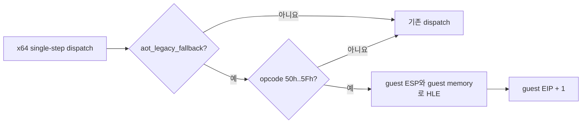

# Task 644 설계: Linux x64 legacy 일반 스택 명령 HLE

## 한국어

### 문제

Task 643은 Linux x64 `aot_legacy_fallback`이 원본 32-bit 명령을 한 단계씩
실행할 때 `PUSH r32`가 host `RSP`에 적용되고 guest `ESP`(`R15D`)에는 반영되지
않는다는 사실을 확인했습니다. 반면 뒤따르는 segment push/pop HLE와 AOT의
일반 pop lowering은 guest `ESP`를 사용하므로, prologue와 epilogue 사이에
20바이트 불균형이 생겨 stale return slot이 노출됩니다.

### 설계

`instruction_emulation`에 32-bit 일반 레지스터 스택 명령 handler를 추가합니다.
지원 범위는 한 바이트 opcode `50h..57h`(`PUSH r32`)와
`58h..5Fh`(`POP r32`)입니다.

`PUSH`는 감소 전 레지스터 값을 읽고 guest `ESP-4`에 기록한 다음 ESP를
갱신합니다. 따라서 `PUSH ESP`는 원래 ESP 값을 저장합니다. `POP`은 현재
guest ESP의 dword를 읽고 ESP를 4 증가시킨 뒤 대상 레지스터에 기록합니다.
따라서 `POP ESP`는 마지막 레지스터 기록이 증가된 ESP를 덮어쓰는 x86 의미를
보존합니다. 읽기·쓰기 범위가 guest arena 밖이면 처리하지 않고 기존 fail-closed
경로에 맡깁니다.

호출은 `_M_X64` 또는 `__x86_64__` host이면서
`aot_legacy_fallback == true`일 때만 허용합니다. i386 원본 실행과 AOT cache
실행에는 적용하지 않습니다. 즉 게임 로직을 재구현하지 않고, host 장기 모드에서
의미가 달라지는 guest stack interface만 HLE합니다.

### 검증

공용 core probe에서 다음을 확인합니다.

1. 일반 레지스터 push/pop의 값, ESP, EIP
2. `PUSH ESP`의 감소 전 값
3. `POP ESP`의 최종 ESP 값
4. guest arena 밖 stack 접근의 거부
5. Linux x64 빌드와 전체 core probe
6. 실제 게임 경로에서 `0x010F1D74..0x010F1D78`의 guest ESP 감소 및 기존
   zero-block return 증상 변화

## English

### Problem

Task 643 confirmed that when Linux x64 `aot_legacy_fallback` single-steps the
original 32-bit bytes, `PUSH r32` affects host `RSP` rather than guest `ESP`
(`R15D`). Subsequent segment push/pop HLE and AOT general-pop lowering use the
guest ESP, creating a 20-byte prologue/epilogue imbalance that exposes a stale
return slot.

### Design

Add a 32-bit general-register stack-instruction handler to
`instruction_emulation`. Its scope is the one-byte `50h..57h` (`PUSH r32`) and
`58h..5Fh` (`POP r32`) opcodes.

`PUSH` reads the register before decrementing and writes it at guest `ESP-4`,
so `PUSH ESP` stores the original ESP. `POP` reads the dword at current guest
ESP, increments ESP by four, and then writes the destination register, so the
final register write preserves the special `POP ESP` behavior. An access
outside the guest arena is rejected and left to the existing fail-closed path.

Dispatch is enabled only on an `_M_X64` or `__x86_64__` host while
`aot_legacy_fallback == true`. It does not affect i386 original execution or
AOT-cache execution. This HLEs only the guest stack interface whose meaning
changes in host long mode; it does not reimplement game logic.

### Verification

The shared core probe covers ordinary register push/pop, `PUSH ESP`, `POP ESP`,
out-of-arena rejection, the Linux x64 build and full probe suite. A real-game
run then checks guest ESP across `0x010F1D74..0x010F1D78` and records how the
former zero-block return symptom changes.
