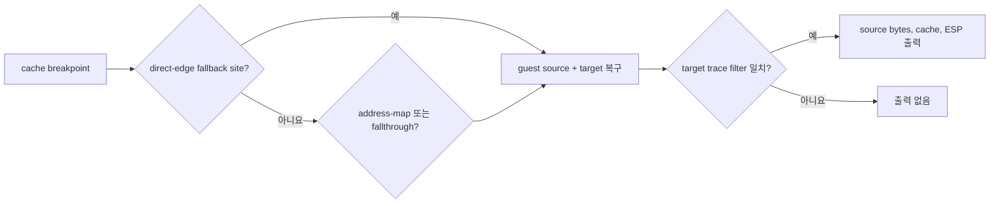

# Task 645 설계: direct-edge fallback 진입 출처 추적

## 한국어

### 문제

Task 644 이후 `0x010F1E56 RET`는 `0x0158CC64`의 `0x00000024`를 소비합니다.
실제 추적은 이 값을 `0x010F9211 PUSH ES`가 기록했고, 바로 다음 관측 guest
경계인 `0x010F1D74`까지 ESP가 `0x0158CC64`로 유지됨을 확인했습니다.
`REPIU_AOT_TRANSFER_TARGET_TRACE=0x010F1D74`에는 출력이 없으므로 공용
간접 CALL/JMP/RET handler가 만든 전이가 아닙니다.

`HandleAotReentry`는 breakpoint cache 주소를 direct-edge fallback site로 먼저
역조회하지만 현재 target만 반환하므로, 어떤 guest source 명령이 이 경계를 만든
것인지 출력할 수 없습니다.

### 설계

`FindAotDbtDirectEdgeFallbackTarget`에 선택적 `guest_source` 출력을 추가합니다.
`HandleAotReentry`의 세 역조회 경로를 direct-edge fallback, address-map,
block-fallthrough로 구분합니다. 기존 `REPIU_AOT_TRANSFER_TARGET_TRACE` target
필터가 일치하면 lookup kind, source, target, source bytes, cache breakpoint,
guest ESP를 출력합니다. block-fallthrough 역조회에도 선택적 `guest_source`
출력을 추가하며 address-map 자체에는 별도 제어 전이 source가 없으므로 0을 씁니다.

필터가 없으면 출력과 실행은 바뀌지 않습니다. direct-edge probe는 기존 target과
새 source 반환을 함께 검증합니다. 실제 `0x010F1D74` 캡처로 source opcode를 읽어
CALL인지 JMP/조건 분기인지 확정합니다.

실행 중간 확인에서 세 breakpoint 역조회 진단이 모두 출력되지 않으면, 이는 segment
HLE 다음 원본 명령이 Trap Flag 아래 직접 실행되어 trap이 target에서 발생한 경우입니다.
이 경우 기존 `REPIU_SEGMENT_HLE_TRACE`의 handler 결과에 다음 guest bytes 6개를 함께
출력하여 HLE 직후 source 명령을 식별합니다.

## English

### Problem

After Task 644, `RET` at `0x010F1E56` consumes `0x00000024` from
`0x0158CC64`. Runtime evidence shows that `PUSH ES` at `0x010F9211` wrote this
value and ESP remains `0x0158CC64` at the next observed guest boundary,
`0x010F1D74`. `REPIU_AOT_TRANSFER_TARGET_TRACE=0x010F1D74` emits nothing, so
the transfer did not come through the shared indirect CALL/JMP/RET handlers.

`HandleAotReentry` first reverse-resolves a breakpoint cache address as a
direct-edge fallback site, but the current lookup returns only the target and
cannot report which guest source instruction created the boundary.

### Design

Add an optional `guest_source` output to
`FindAotDbtDirectEdgeFallbackTarget`. Distinguish all three
`HandleAotReentry` reverse-lookup paths: direct-edge fallback, address map, and
block fallthrough. When the existing `REPIU_AOT_TRANSFER_TARGET_TRACE` target
filter matches, print lookup kind, source, target, source bytes, cache
breakpoint, and guest ESP. Add an optional source output to block-fallthrough
lookup as well; address-map lookup has no separate control-transfer source and
reports zero.

With no filter, output and execution remain unchanged. Extend the direct-edge
probe to verify both target and source recovery, then capture `0x010F1D74` to
classify the source opcode as CALL, JMP, or conditional branch.

If none of the three breakpoint reverse-lookup diagnostics emits during the
intermediate run, the segment HLE resumed an original instruction under Trap
Flag and the trap occurred only at its target. In that case, append the next
six guest bytes to the existing `REPIU_SEGMENT_HLE_TRACE` handler result to
identify the source instruction immediately after HLE.
