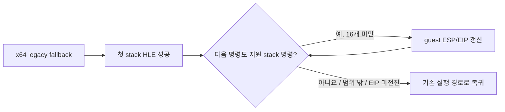

# Task 646 설계: Linux x64 legacy 연속 스택 명령 처리

## 한국어

### 문제

Task 645에서 Linux x64 legacy fallback의 `0x010F9211 PUSH ES`는 segment HLE가
guest `ESP`에 올바르게 반영하지만, 바로 다음 `0x010F9212 0F A0` (`PUSH FS`)는
x64 host에서 유효한 명령이므로 다음 fault 전에 host `RSP`를 변경한다는 사실을
확인했습니다. 한 번의 fault 또는 single-step에서 한 명령만 HLE하면, 서로 붙어 있는
32-bit guest 스택 명령 사이에서 host long-mode 의미가 다시 노출됩니다.

### 설계

`instruction_emulation`에 이미 지원하는 스택 명령만 연속 처리하는 공용 helper를
추가합니다. 대상은 `PUSH/POP r32`와 현재 HLE가 지원하는 segment push/pop입니다.
호출자는 첫 스택 명령을 정상적으로 처리한 뒤 helper로 뒤따르는 명령을 최대 16개까지
처리합니다.

helper는 각 반복 전에 guest code 범위를 확인하고, handler 성공 뒤 EIP가 증가했는지
확인합니다. 최대 처리 수는 16개로 제한하여 손상된 코드나 handler 오류가 예외
처리를 무한 점유하지 못하게 합니다. 적용 범위는 x64 host의
`aot_legacy_fallback`뿐이며 AOT cache 실행과 i386 원본 실행은 바꾸지 않습니다.

### 검증

공용 core probe에 일반 register push, `PUSH ES`, `PUSH FS`, 비스택 명령으로 끝나는
연속열과 처리 개수 제한 검증을 추가합니다. Linux x64 실행 파일과 core probe를
빌드하고 전체 probe를 실행한 뒤, 실제 게임에서 `0x010F9211` 이후 guest ESP와 다음
frontier를 다시 측정합니다.

## English

### Problem

Task 645 confirmed that segment HLE correctly applies `0x010F9211 PUSH ES` to
guest `ESP` during Linux x64 legacy fallback, but the following
`0x010F9212 0F A0` (`PUSH FS`) is valid in host long mode and therefore changes
host `RSP` before another fault can occur. Handling only one instruction per
fault or single-step exposes host semantics between adjacent 32-bit guest stack
instructions.

### Design

Add a shared `instruction_emulation` helper that consumes only already-supported
stack instructions: `PUSH/POP r32` and the supported segment push/pop forms.
After a caller successfully handles the first stack instruction, it invokes the
helper for up to 16 following instructions.

Before each iteration the helper validates the guest code range, and after a
successful handler it requires EIP to advance. The 16-instruction bound prevents
corrupt code or a handler defect from monopolizing exception handling. The call
sites remain limited to x64 host `aot_legacy_fallback`; AOT-cache execution and
native i386 execution are unchanged.

### Verification

Extend the shared core probe with a sequence containing a general-register push,
`PUSH ES`, `PUSH FS`, and a terminating non-stack instruction, plus a processing
limit check. Build the Linux x64 executable and core probe, run the full suite,
then remeasure guest ESP and the next frontier after `0x010F9211` in the real
game path.
