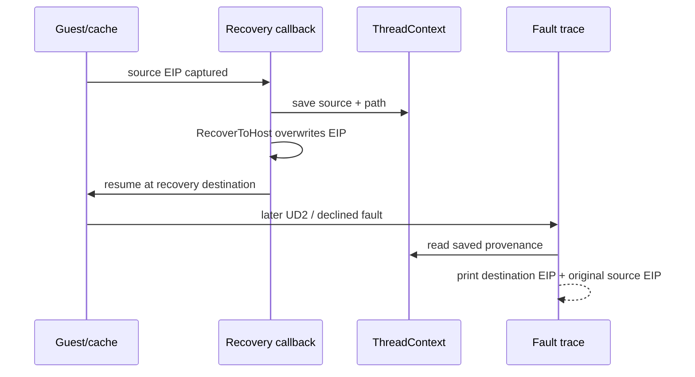

# Task 647 설계: Linux x64 복구 전 원래 fault 귀속

## 한국어

### 문제

Linux x64 실행에서 종료 시 guest 또는 AOT cache 위치를 복구 가능한 위치로
판정한 뒤 `RecoverToHost`가 `GuestCpuContext::Eip`를
`RecoverGuestStackException`으로 바꿀 수 있습니다. x64 stub은 의도적으로
`UD2`를 실행하므로, 그 다음 `SIGILL`과 `REPIU_FAULT_EXIT_TRACE`만 보면
복구가 시작된 원래 guest fault EIP가 아니라 recovery destination만 보입니다.
현재 shutdown 요청의 `last_eip`는 요청 객체 안에만 있어 후속 signal callback이
읽을 수 없습니다.

### 설계

`ThreadContext`에 bounded recovery provenance를 추가합니다. 복구 callback은
`RecoverToHost`를 호출하기 직전에 다음을 한 번 기록합니다.

* 복구 전 source EIP
* source가 guest image인지 AOT cache인지
* 복구가 shutdown interruption에서 시작됐는지, fault callback에서 시작됐는지

이 정보는 guest 실행을 변경하지 않는 plain diagnostic state입니다. 동일한
thread에서 복구 callback과 후속 fault callback이 실행되고, thread join 뒤
attempt가 관찰하므로 별도 동기화나 동적 할당은 필요하지 않습니다. source가
guest/cache 범위 밖이면 복구하지 않으므로 provenance도 기록하지 않습니다.

기존 `REPIU_FAULT_EXIT_TRACE` 출력에 `recovery_source`와
`recovery_path`를 추가합니다. 복구 destination에서 발생한 최종 exit line은
현재 `eip`에 destination을, 새 필드에 복구 전 source를 함께 표시합니다.
환경 변수가 없을 때 출력과 실행 경로는 유지합니다. 실제 복구 정책, x64
`RecoverGuestStackException`의 `UD2`, guest bytes, AOT map은 변경하지 않습니다.

### 검증 범위

공용 core probe에 provenance 저장·경로명·초기 상태 및 source 범위 밖 무기록
조건을 검증하는 작은 순수 helper 테스트를 추가합니다. Linux x64 `repiu`와
`repiu_core_probe`를 빌드하고 전체 probe를 실행합니다. 실제 실행에서는
`REPIU_FAULT_EXIT_TRACE=1`을 사용하여 최종 `RecoverGuestStackException` line이
recovery destination과 원래 source EIP를 함께 출력하는지 확인합니다.

## English

### Problem

During Linux x64 shutdown or fault recovery, a guest or AOT-cache location may be
accepted as recoverable and `RecoverToHost` may replace
`GuestCpuContext::Eip` with `RecoverGuestStackException`. The x64 stub then
intentionally executes `UD2`, so the following `SIGILL` and
`REPIU_FAULT_EXIT_TRACE` expose only the recovery destination, not the original
guest fault EIP. The shutdown request's `last_eip` currently lives only in the
request object and cannot be read by the later signal callback.

### Design

Add bounded recovery provenance to `ThreadContext`. Immediately before a
recovery callback calls `RecoverToHost`, record:

* the pre-recovery source EIP;
* whether the source is in the guest image or the AOT cache; and
* whether recovery began from shutdown interruption or from a fault callback.

This is plain diagnostic state and does not alter guest execution. The recovery
callback and the later fault callback run on the same thread, and the attempt is
observed after thread join, so no extra synchronization or dynamic allocation is
needed. If the source lies outside both guest and cache ranges, no recovery and
no provenance record are produced.

Extend the existing `REPIU_FAULT_EXIT_TRACE` line with `recovery_source` and
`recovery_path`. A final exit at the recovery destination then shows the current
destination in `eip` and the pre-recovery source in the new fields. With the
environment variable unset, output and execution remain unchanged. Do not alter
recovery policy, the x64 `RecoverGuestStackException` `UD2`, guest bytes, or the
AOT map.

### Verification scope

Add a small pure-helper test to the shared core probe covering provenance storage,
path names, the initial state, and rejection of a source outside both ranges.
Build Linux x64 `repiu` and `repiu_core_probe`, then run the full probe suite. In
the real run, use `REPIU_FAULT_EXIT_TRACE=1` and verify that the final
`RecoverGuestStackException` line includes both the recovery destination and the
original source EIP.
