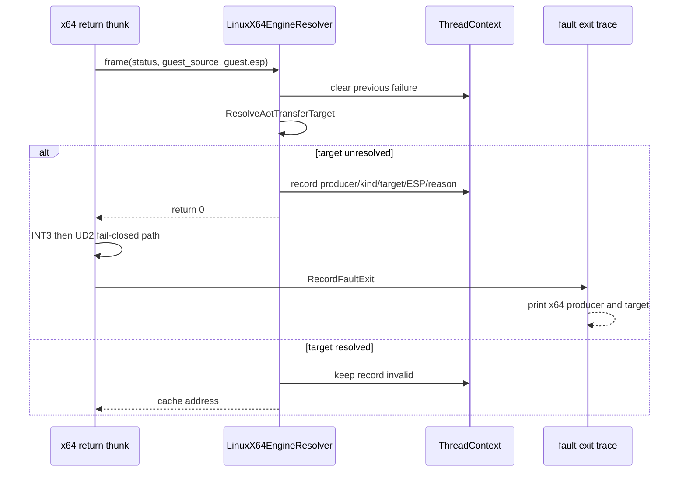

# Task 648 설계: Linux x64 unresolved return provenance

## 한국어

### 배경

Task 647의 실제 `pumpit2a` 실행은 복구 callback을 거치지 않고 Linux x64
return resolver가 `guest_source=0`을 받아 `0`을 반환한 뒤 fail-closed
unresolved thunk의 `INT3`에 도달하는 경계를 확인했습니다. frame에는
`producer=0x010F1E56`, `guest_esp=0x0158CC5C`, `RET`라는 유용한 정보가
있지만 resolver 호출이 끝나면 최종 `[repiu-exit]` 줄에는 이 정보가 남지
않습니다.

### 목표

resolver가 x64 transfer target을 해석하지 못한 바로 그 시점의 다음 정보를
bounded per-thread record로 보존합니다.

* producer guest EIP
* 선택된 guest target EIP — `0`도 유효한 관측값으로 보존
* transfer 직후의 guest ESP
* `ret` 또는 `indirect-call` 종류
* `translation-failed` 또는 `policy-refused` 실패 이유

`REPIU_FAULT_EXIT_TRACE=1`이면 최종 fault 줄에 이 record를 추가하여
unresolved `INT3/UD2`와 원래 producer/target을 한 줄로 연결합니다. 기록이
없거나 producer tag가 유효하지 않으면 `valid=0`과 `none`을 출력합니다.

### 설계

1. `LinuxX64TransferFailureProvenance`를 별도 공용 header/source pair로
   둡니다. `ThreadContext`는 이 고정 크기 값 하나만 소유하며 문자열이나
   동적 메모리를 포함하지 않습니다.
2. x64 resolver 진입 시 이전 실패 record를 먼저 무효화합니다. 따라서
   최종 fault가 뒤늦게 발생했을 때 이전 실행의 실패를 잘못 연결하지 않고,
   현재 실행에서 가장 최근에 관측된 transfer 실패만 남깁니다.
3. `ResolveAotTransferTarget()`이 실패한 경우에만 frame의 `status` high bit와
   low 31 bits를 분리하여 kind와 producer EIP를 만들고, `guest_source`와
   `guest.esp`를 함께 기록합니다. target이 0이어도 producer가 유효하면
   record는 유효합니다.
4. 기존 resolver의 `return 0`, unresolved thunk의 `INT3`, 뒤따르는 `UD2`,
   guest register/stack 및 AOT policy는 변경하지 않습니다.
5. core probe는 invalid 기본값, zero target RET 실패, indirect-call 실패,
   이름 변환을 검증합니다.

### 경계와 미해결 문제

이 설계는 `0x010F1E56 RET`가 왜 zero word를 소비했는지 결정하지 않습니다.
stack writer, return semantics, 원본 executable bytes, resolver policy를
수정하지 않고 관측 provenance만 추가합니다. zero target의 원인은 별도
stack-writer 분석 작업의 입력으로 남깁니다.

### 검증 전략

* Linux x64 Debug `repiu_core_probe`가 실패 없이 통과해야 합니다.
* `REPIU_FAULT_EXIT_TRACE=1`과 기존 return trace를 켠 `pumpit2a` 실행에서
  `[repiu-exit]`가 `producer_eip=0x010F1E56`, `target_eip=0x00000000`,
  `kind=ret`, `failure=translation-failed`, `guest_esp=0x0158CC5C`를
  보여야 합니다.
* unresolved thunk의 `INT3/UD2` 경계와 프로세스 종료 동작은 변경되지
  않아야 합니다.

## English

### Background

Task 647's real `pumpit2a` run established a Linux x64 boundary that does not
enter the recovery callback: the return resolver receives `guest_source=0`,
returns zero, and reaches the fail-closed unresolved thunk's `INT3`. The frame
still contains `producer=0x010F1E56`, `guest_esp=0x0158CC5C`, and `RET`, but
that evidence is not present in the final `[repiu-exit]` line after the resolver
returns.

### Goal

Preserve a bounded per-thread record at the exact point where the x64 resolver
fails to resolve a transfer target:

* producer guest EIP;
* selected guest target EIP — including zero as a valid observation;
* guest ESP immediately after the transfer producer;
* `ret` or `indirect-call` kind; and
* `translation-failed` or `policy-refused` reason.

When `REPIU_FAULT_EXIT_TRACE=1`, append the record to the final fault line so
the unresolved `INT3/UD2` is connected to its original producer and target.
When no record exists or the producer tag is invalid, print `valid=0` and
`none`.

### Design

1. Keep `LinuxX64TransferFailureProvenance` in a dedicated public
   header/source pair. `ThreadContext` owns one fixed-size value; it contains
   no strings or dynamic memory.
2. Invalidate the previous failure record at x64 resolver entry. A later fault
   therefore cannot accidentally reuse a failure from an earlier execution,
   and the current run retains only its most recent observed transfer failure.
3. Only when `ResolveAotTransferTarget()` fails, split the frame `status` high
   bit and low 31 bits into kind and producer EIP, and record them with
   `guest_source` and `guest.esp`. A zero target remains valid when the
   producer is valid.
4. Leave the existing resolver `return 0`, the unresolved thunk `INT3`, the
   following `UD2`, guest registers/stack, and AOT policy unchanged.
5. The core probe covers the invalid default, a zero-target RET failure, an
   indirect-call failure, and name conversion.

### Boundaries and unresolved question

This design does not determine why `RET` at `0x010F1E56` consumed a zero word.
It adds observation provenance without changing stack writers, return
semantics, original executable bytes, or resolver policy. The cause of the zero
target remains input to a separate stack-writer analysis task.

### Verification strategy

* Linux x64 Debug `repiu_core_probe` must pass without failures.
* A `pumpit2a` run with `REPIU_FAULT_EXIT_TRACE=1` and the existing return trace
  must show `producer_eip=0x010F1E56`, `target_eip=0x00000000`, `kind=ret`,
  `failure=translation-failed`, and `guest_esp=0x0158CC5C` on `[repiu-exit]`.
* The unresolved thunk `INT3/UD2` boundary and process termination behavior
  must remain unchanged.
