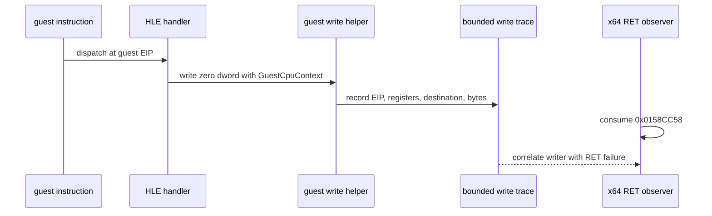

# 20260909-649 설계: Linux x64 zero return slot writer provenance

## 한국어

### 배경

Task 648의 실제 `pumpit2a` 실행은 `0x010F1E56`의 `RET`가 `guest_esp=0x0158CC5C`에서
`0x0158CC58`의 zero word를 소비했음을 확인했습니다. LE 분석상 이 주소는 stack object 4의
`virtual_size=0x0047CC90` 끝에서 0x38바이트 앞이며, 파일 데이터가 복사된
`0x00098000` 범위 밖의 zero-initialized tail입니다.

기존 `REPIU_GUEST_WRITE_TRACE=0x0158CC58` page watch는 실행 중 해당 주소에 대한
`event=hle`, `size=0x00000004`, `bytes=00000000` 쓰기를 포착했습니다. 그러나 공용 HLE
write helper가 `execution=0`, `source=0`, 레지스터 없음으로 기록하여 실제 HLE 명령의
게스트 EIP와 값의 레지스터 출처를 잃고 있습니다.

### 목표

공용 HLE 게스트 쓰기 helper에 선택적인 `GuestCpuContext` 진단 인자를 전달하여 다음을
bounded trace에 보존합니다.

* 쓰기를 요청한 게스트 EIP를 `execution`과 `source`로 기록한다.
* 쓰기 직전의 게스트 레지스터를 기록한다.
* 기존 page watch, ring buffer, 쓰기 의미 및 원본 guest code 실행 경로는 유지한다.

이 정보로 다음 실제 실행에서 zero word writer가 `PUSH`인지, 일반 memory store인지,
다른 HLE 경계 동작인지 원본 주소와 함께 판별합니다.

### 설계

1. `WriteGuestUInt8/16/32`에 optional guest CPU context를 추가합니다. 기본값은 null로
   유지하여 DOS/boundary utility와 기존 호출부의 의미를 바꾸지 않습니다.
2. `instruction_emulation.cpp`의 HLE 명령 호출부와 AOT dispatch/Glide 호출부처럼 현재
   `GuestCpuContext`를 가진 경로는 이를 전달합니다. 컨텍스트가 없는 host utility는
   기존처럼 zero provenance를 남깁니다.
3. `guest_memory_access.cpp`는 context가 있을 때 현재 `Eip`를 execution/source로
   기록하고 register pointer를 함께 넘깁니다. 이는 진단 기록만 바꾸며 실제 memcpy,
   보호 속성, 반환값은 바꾸지 않습니다.
4. 기존 `RecordGuestMemoryStore()` 기록은 유지하여 source kind와 destination/value를
   교차 검증합니다.
5. zero target 보정, RET semantics 변경, stack 초기화 변경, 원본 실행 파일 수정은
   이 작업 범위에 포함하지 않습니다.

### 경계와 미확정 사항

현재까지 확인된 HLE write는 zero word를 실제로 기록했지만, 변경 전 trace만으로는 호출
게스트 EIP가 보이지 않습니다. 이 작업은 writer provenance를 추가할 뿐이며, writer가
확정된 뒤에도 그 쓰기가 원래 의도된 동작인지와 zero target이 왜 남았는지는 별도 분석
사항입니다.

### 검증 전략

* Linux x64 Debug `repiu_core_probe`가 기존과 동일하게 통과해야 합니다.
* `REPIU_GUEST_WRITE_TRACE=0x0158CC58`로 `pumpit2a`를 실행하여 exact HLE record가
  non-zero `execution/source`와 레지스터를 갖는지 확인합니다.
* `[repiu-exit]`의 Task 648 x64 transfer provenance와 unresolved `INT3/UD2` 경계가
  변경되지 않아야 합니다.

## English

### Background

Task 648's real `pumpit2a` run established that `RET` at `0x010F1E56` consumed the
zero word at `0x0158CC58` with `guest_esp=0x0158CC5C`. LE analysis places this address
0x38 bytes before the end of stack object 4 (`virtual_size=0x0047CC90`) and outside
the `0x00098000` range copied from file data, so it is in the zero-initialized tail.

The existing `REPIU_GUEST_WRITE_TRACE=0x0158CC58` page watch captured an exact
`event=hle`, `size=0x00000004`, `bytes=00000000` write to the slot. The shared HLE
write helper currently records `execution=0`, `source=0`, and no registers, losing
the guest EIP and register provenance of the HLE instruction that performed it.

### Goal

Pass an optional `GuestCpuContext` diagnostic argument to the shared HLE guest-write
helpers and preserve in the bounded trace:

* the guest EIP that requested the write as `execution` and `source`;
* the guest registers immediately before the write;
* the existing page watch, ring buffer, write semantics, and original guest-code path.

This allows the next real run to classify the zero-word writer as `PUSH`, a normal
memory store, or another HLE boundary operation with an original guest address.

### Design

1. Add an optional guest CPU context to `WriteGuestUInt8/16/32`. Keep null as the
   default so DOS/boundary utilities and existing callers retain their behavior.
2. Pass the context from HLE instruction paths and from AOT dispatch/Glide paths that
   already have a `GuestCpuContext`. Host utilities without one continue to emit zero
   provenance.
3. When context is available, `guest_memory_access.cpp` records its current `Eip` as
   execution/source and passes the register pointer. This changes diagnostics only;
   memcpy, protection, return values, and guest semantics are unchanged.
4. Keep `RecordGuestMemoryStore()` so source kind and destination/value can be
   cross-checked.
5. Do not repair the zero target or change RET semantics, stack initialization, or the
   original executable in this task.

### Boundaries and unresolved questions

The existing HLE watch proves that a zero dword was written, but the pre-change trace
does not expose the calling guest EIP. This task adds writer provenance only. Whether
the writer's behavior is intended, and why the zero target remains at return time,
remain separate analysis questions.

### Verification strategy

* Linux x64 Debug `repiu_core_probe` must continue to pass.
* Run `pumpit2a` with `REPIU_GUEST_WRITE_TRACE=0x0158CC58` and confirm the exact HLE
  record has non-zero execution/source and registers.
* Confirm Task 648's `[repiu-exit]` x64 transfer provenance and unresolved `INT3/UD2`
  boundary remain unchanged.
